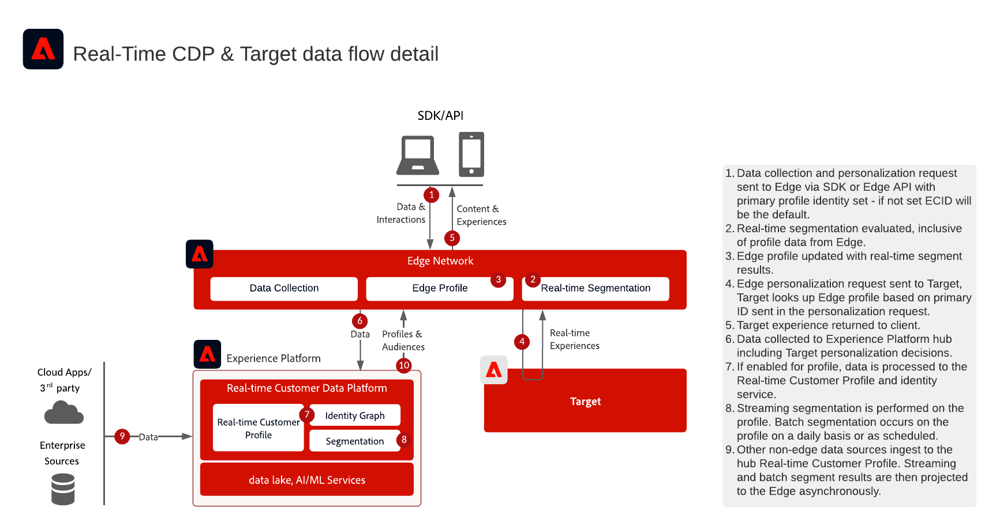

# Intégration d’Adobe Real-Time CDP et d’Adobe Target

Cette architecture montre comment [!DNL Real-Time Customer Data Platform] et [!DNL Adobe Target] s’intégrer via Edge Network. Il vous permet de choisir entre l’évaluation des audiences en temps réel à la périphérie et le partage d’audiences par lots ou en flux continu avec Target.

## Applications

* [!DNL Real-Time Customer Data Platform]
* [!DNL Adobe Target]
* [!DNL Experience Platform] Edge Network
* API Experience Platform Web SDK ou Edge Network Server

## Choisir une approche d’intégration

### Évaluation des audiences en temps réel à la périphérie

Utilisez cette approche lorsque [!DNL Adobe Target] avez besoin d’audiences évaluées par Edge et d’attributs de profil pour la personnalisation de la même page ou de la page suivante. Implémentez l’API Web SDK ou Edge Network Server et configurez un flux de données en activant les services [!DNL Adobe Target] et [!DNL Experience Platform].

### Partage d’audiences par lots et en flux continu vers Target

Utilisez cette approche lorsque les audiences évaluées dans [!DNL Real-Time Customer Data Platform] doivent être disponibles dans [!DNL Adobe Target] sans évaluation Edge en temps réel. Configurez la destination [!DNL Adobe Target] dans le sandbox de production par défaut. L’implémentation de l’API Web SDK ou Edge Network Server est requise uniquement pour l’évaluation Edge en temps réel ou les recherches d’espaces de noms d’identité personnalisés.

## Diagramme d’architecture

Ce diagramme montre les points d’intégration principaux entre la collecte de données, Edge Network, [!DNL Real-Time Customer Data Platform] et [!DNL Adobe Target].

{zoomable="yes"}

## Diagramme de flux de données

Cette séquence montre comment une requête client atteint Edge Network, évalue les audiences et le contexte du profil, envoie une requête de personnalisation à [!DNL Adobe Target] et renvoie l’expérience résultante au client.

{zoomable="yes"}

## Considérations relatives à la mise en œuvre

* [!DNL Adobe Target] et [!DNL Real-Time Customer Data Platform] doivent utiliser la même organisation IMS.
* La destination [!DNL Adobe Target] prend en charge le sandbox de production par défaut dans [!DNL Real-Time Customer Data Platform].
* Pour les recherches d’espace de noms d’identité personnalisées Edge, utilisez Web SDK ou l’API du serveur Edge Network et incluez chaque identité dans le mappage d’identité.
* Si vous utilisez at.js, l’intégration de profil ne prend en charge que l’espace de noms d’identité ECID.

## Documentation connexe

### Configuration de l’intégration

* [Connexion Adobe Target pour Real-time Customer Data Platform](https://experienceleague.adobe.com/docs/experience-platform/destinations/catalog/personalization/adobe-target-connection.html?lang=fr)
* [Configuration du flux de données Edge](https://experienceleague.adobe.com/docs/experience-platform/edge/fundamentals/datastreams.html?lang=fr)

### Implémentation à la périphérie

* [Documentation Experience Platform Web SDK](https://experienceleague.adobe.com/docs/experience-platform/edge/home.html?lang=fr)
* [Documentation Experience Platform Tags](https://experienceleague.adobe.com/docs/experience-platform/tags/home.html?lang=fr)
* [Documentation du service Experience Cloud ID](https://experienceleague.adobe.com/docs/id-service/using/home.html?lang=fr)

### Évaluer les audiences

* [Présentation de la segmentation Experience Platform](https://experienceleague.adobe.com/docs/experience-platform/segmentation/home.html?lang=fr)
* [Segmentation en temps réel](https://experienceleague.adobe.com/docs/experience-platform/segmentation/ui/edge-segmentation.html?lang=fr)
* [Segmentation par flux](https://experienceleague.adobe.com/docs/experience-platform/segmentation/api/streaming-segmentation.html?lang=fr)
* [Configuration de la politique de fusion](https://experienceleague.adobe.com/docs/experience-platform/profile/merge-policies/ui-guide.html?lang=fr#create-a-merge-policy)
