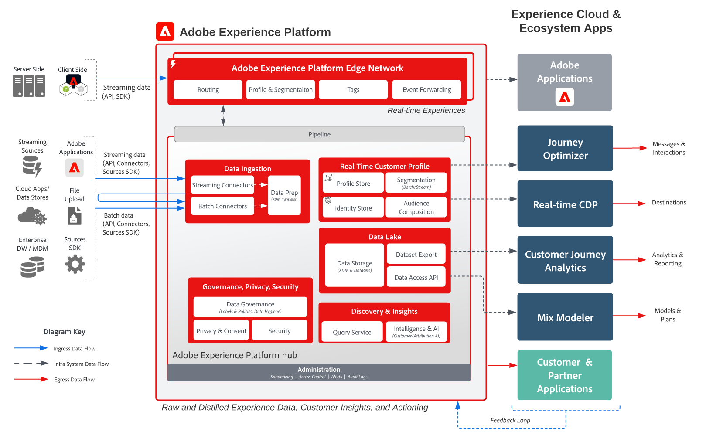

# Diagrammes d’architecture

Les diagrammes d’architecture sont des références visuelles et techniques qui montrent comment Adobe Experience Platform et les applications s’intègrent (points d’intégration du système, flux de données et de contenu et séquence d’opérations). Utilisez-les pour comprendre la conception de solution avant de passer aux conseils détaillés dans [modèles de cas d’utilisation](/help/blueprints/use-case-patterns/overview.md).

Les diagrammes sont organisés dans les catégories suivantes. Sélectionnez une carte pour accéder à la page de destination ou au diagramme de prospect de cette catégorie. Utilisez le volet de navigation de gauche pour parcourir tous les diagrammes d’une catégorie.

<table style="table-layout:fixed; width:100%;">
<tr>
  <td style="width:33%; vertical-align:top; padding:10px; box-sizing:border-box;">
    
    

      <a href="architecture-overviews/overview.md">
        <strong>Aperçu de l’architecture</strong>
      </a>
      
Comment les applications Experience Cloud, Experience Platform et les SDK de déploiement s’intègrent, ainsi que les mécanismes de sécurisation et les latences.

    

  </td>
  <td style="width:33%; vertical-align:top; padding:10px; box-sizing:border-box;">
    
    

      <a href="audience-profile-activation/overview.md">
        <strong>Activation des audiences et des profils</strong>
      </a>
      
comment les audiences et les profils sont créés dans Adobe Real-Time CDP et activés vers les destinations et les applications ;

    

  </td>
  <td style="width:33%; vertical-align:top; padding:10px; box-sizing:border-box;">
    
    

      <a href="b2b-activation-marketing/overview.md">
        <strong>Activation et marketing B2B</strong>
      </a>
      
Activation des audiences basées sur des comptes et des personnes avec Real-Time Customer Data Platform B2B edition sur plusieurs canaux et destinations.

    

  </td>
</tr>
<tr>
  <td style="width:33%; vertical-align:top; padding:10px; box-sizing:border-box;">
    
    

      <a href="customer-insights/overview.md">
        <strong>Informations sur le client</strong>
      </a>
      
Comment Customer Journey Analytics unifie et analyse les données comportementales cross-canal et s’intègre à Real-Time CDP et Journey Optimizer.

    

  </td>
  <td style="width:33%; vertical-align:top; padding:10px; box-sizing:border-box;">
    
    

      <a href="customer-journeys/journey-optimizer/journey-optimizer-overview.md">
        parcours client</strong><strong>
      </a>
      
Orchestration des parcours basée sur les événements avec Journey Optimizer, prise de décision sur le serveur Edge et le hub, et orchestration par lots avec Adobe Campaign.

    

  </td>
  <td style="width:33%; vertical-align:top; padding:10px; box-sizing:border-box;"></td>
</tr>
</table>

## Contenu associé

* [Modèles de cas d’utilisation](/help/blueprints/use-case-patterns/overview.md) : approches d’implémentation répétables qui s’appuient sur ces architectures
* [Principaux objectifs commerciaux](/help/blueprints/business-objectives/overview.md) : les résultats commerciaux que ces architectures vous aident à atteindre
* [Cas d’utilisation du secteur](/help/blueprints/industry-use-cases/use-case-catalog.md) — applications verticales spécifiques de ces modèles
