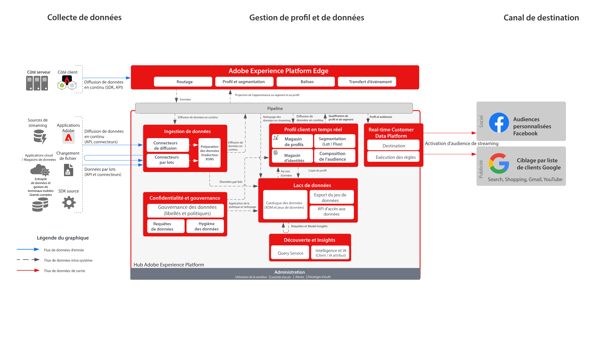

# Audience Activation vers les destinations sociales et Advertising

>[!TIP]
>Ce plan directeur est également disponible en tant que [modèle de cas d’utilisation](/help/blueprints/use-case-patterns/audience-building-activation/audience-activation-to-destinations.md) sous Création et activation d’audience.

Ingérez des données client à partir de plusieurs sources afin de créer une vue de profil unique du client. Vous pouvez segmenter ces profils afin de créer des audiences pour le marketing et la personnalisation. Partagez ensuite ces audiences avec les réseaux publicitaires tels que Facebook et Google pour cibler et personnaliser les campagnes par rapport à ces audiences.

## Cas d’utilisation

* Ciblage d’audience pour des audiences connues sur les réseaux sociaux et les destinations publicitaires.
* Personnalisation en ligne avec des attributs en ligne et hors ligne.

## Applications

* Real-time Customer Data Platform

## Architecture

## Garde-fous

[Mécanismes de sécurisation des profils et de la segmentation](https://experienceleague.adobe.com/docs/experience-platform/profile/guardrails.html?lang=fr)

## Documentation connexe

Activation des audiences personnalisées Facebook - [Configuration de la destination](https://experienceleague.adobe.com/docs/experience-platform/destinations/catalog/social/facebook.html?lang=fr)

Activation du ciblage par liste de clients Google - [Configuration de la destination](https://experienceleague.adobe.com/docs/experience-platform/destinations/catalog/advertising/google-customer-match.html?lang=fr)