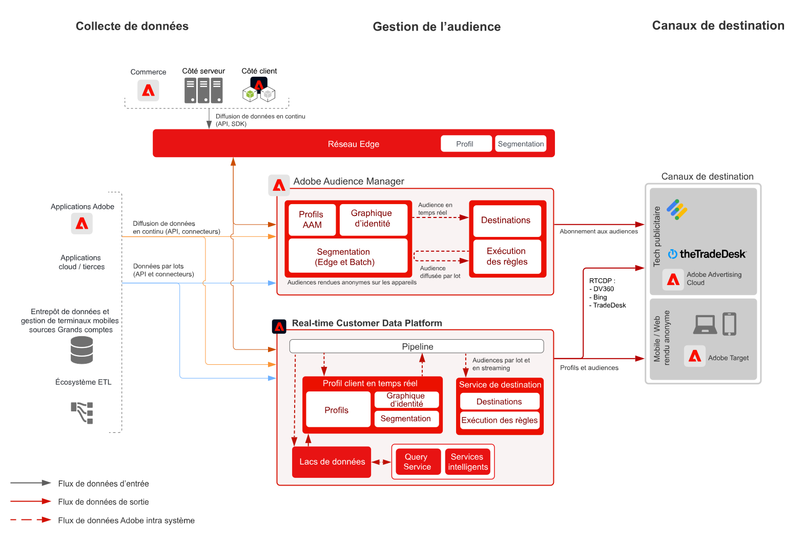

# Plan directeur pour l’activation d’audience anonyme

Vous pouvez cibler des audiences sur le web et les canaux publicitaires en fonction de données client anonymes et comportementales. Cette capacité permet des expériences client en temps réel personnalisées et cohérentes sur tous les appareils.

## Cas d’utilisation

* Effectuer un ciblage et une personnalisation d’audience digitale anonyme.
* Créer des audiences à cibler sur les réseaux publicitaires pris en charge.

## Applications

* Adobe Audience Manager

## Architecture

## Étapes d’implémentation

<!-- These steps should link to help. -->

1. [Implémentation d’Audience Manager](https://experienceleague.adobe.com/docs/audience-manager/user-guide/implementation-integration-guides/implement-audience-manager.html?lang=fr#implementation-integration-guides)
1. Collectez les données vers Audience Manager.
1. Configurez les signaux et les traits à utiliser dans les définitions de segments.
1. Créez des segments dans Audience Manager.
1. Configurez des destinations dans Audience Manager pour le partage d’audiences.

## Documentation connexe

* [Audience Manager](https://experienceleague.adobe.com/docs/audience-manager.html?lang=fr)
* [[!UICONTROL Audiences] Experience Cloud](https://experienceleague.adobe.com/docs/core-services/interface/audiences/audience-library.html?lang=fr)
* [Intégration d’Audience Manager à Target](https://experienceleague.adobe.com/docs/audience-manager/user-guide/implementation-integration-guides/integration-other-solutions/aam-target-integration.html?lang=fr)
* [Partage de segments Adobe Analytics via Adobe Audience Manager](https://experienceleague.adobe.com/docs/analytics/components/segmentation/segmentation-workflow/seg-publish.html?lang=fr)
