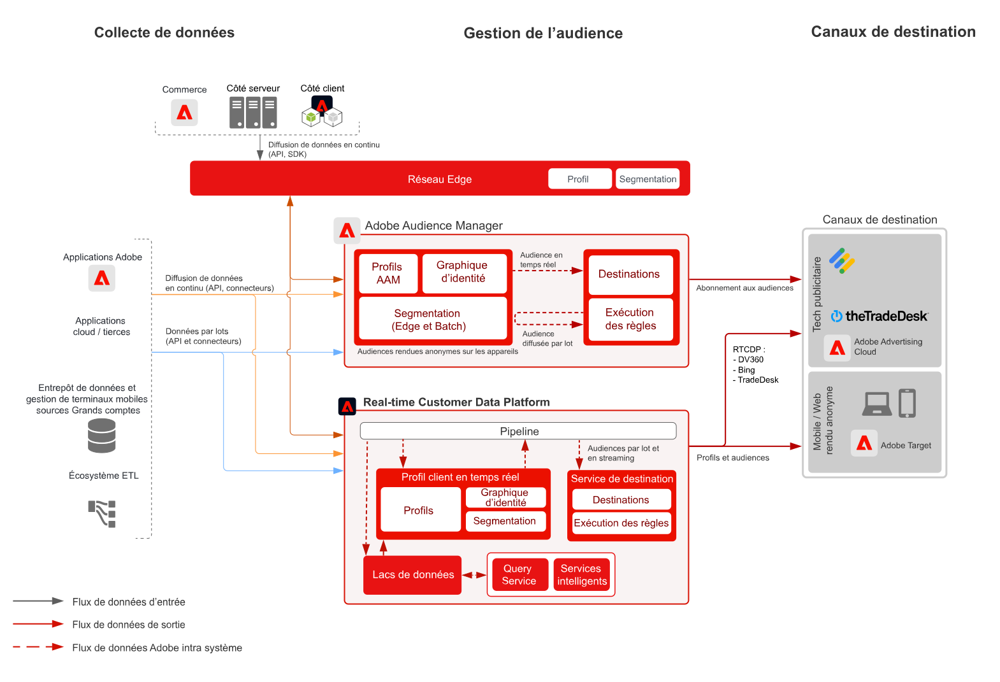

# Basé sur l’appareil - Ciblage d’audience anonyme avec Audience Manager

>[!TIP]
>Ce plan directeur est également disponible en tant que [&#x200B; modèle de cas d’utilisation &#x200B;](/help/blueprints/use-case-patterns/personalization/anonymous-visitor-web-personalization.md) sous Personalization.

L’activation de l’audience anonyme permet de cibler et de personnaliser des audiences sur des canaux web, mobiles et publicitaires basés sur un appareil et des données comportementales anonymes.

## Cas d’utilisation

* Effectuez un ciblage et une personnalisation anonymes de l’audience numérique sur un site web, une application mobile ou sur les canaux publicitaires pris en charge.
* Optimisez les expériences de page de destination et de pré-authentification en fonction des caractéristiques connues de l’appareil et du comportement.
* Tirez parti du réseau de données tiers d’Audience Manager pour affiner et développer davantage vos audiences en vue du ciblage.

## Applications

* Audience Manager
* Real-time Customer Data Platform

Audience Manager et Real-time Customer Data Platform peuvent être utilisés pour alimenter l’activation d’audience anonyme pour les destinations sur site et publicitaires. Notez que Real-time Customer Data Platform ne prend en charge qu’un sous-ensemble de destinations publicitaires avec des identifiants d’appareil anonymes, tels que listés dans la [documentation sur les destinations](https://experienceleague.adobe.com/docs/experience-platform/destinations/catalog/advertising/overview.html?lang=fr).

## Architecture

 

## Procédure de mise en œuvre d’Audience Manager

* Pour plus d’informations sur la mise en œuvre d’Audience Manager, consultez la [documentation](https://experienceleague.adobe.com/docs/audience-manager/user-guide/implementation-integration-guides/implement-audience-manager.html?lang=fr) suivante.