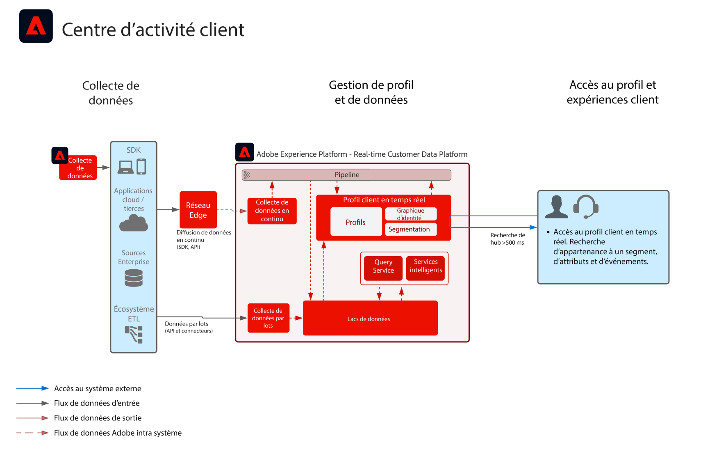

# Accès au profil en temps réel pour les scénarios d’assistance et de vente

Le plan directeur Accès au profil en temps réel pour les scénarios d’assistance et de vente montre comment les applications externes peuvent accéder à Adobe Experience Platform [!UICONTROL profil client en temps réel].

Les applications externes peuvent accéder aux profils à travers une requête GET d’API. Les attributs, événements, abonnements aux segments, et fonctionnalités basées sur des modèles stockés dans le profil peuvent ensuite être utilisés dans ces applications externes.

Avec cette fonctionnalité, vous pouvez faire apparaître un contexte riche lorsqu’un client contacte votre centre d’appel. Les agents du service clientèle peuvent avoir une visibilité sur la valeur de durée de vie du client, sa propension au désabonnement ou son exposition à des campagnes marketing, par exemple. Les agents commerciaux peuvent également bénéficier de plus de contexte ou d’une meilleure compréhension de leur client.

>[!NOTE]
>
>La recherche de profil sur le hub n’est pas destinée aux cas d’utilisation à débit élevé et à faible latence, tels que la personnalisation entrante web/mobile. La recherche de profil sur le hub est destinée aux scénarios de faible latence tels que l’assistance assistée par un agent ou les interactions de vente. Pour les scénarios à faible latence et à débit élevé, tels que la personnalisation web/mobile ou la prise de décision sur les offres en temps réel, le profil Edge doit être exploité. Le profil Edge permet un accès en temps réel via la [connexion Personalization personnalisée](https://experienceleague.adobe.com/en/docs/experience-platform/destinations/catalog/personalization/custom-personalization) de Real-time Customer Data Platform.

## Cas d’utilisation

* Fournissez un contexte client plus étoffé aux interactions prises en charge par l’agent, telles que les expériences vécues par le client en matière de service clientèle et de vente. À travers la recherche de profil dans Adobe Experience Platform, les agents peuvent recevoir plus de contexte sur le consommateur, comme les achats récents, les interactions de campagne, les propensions, les abonnements et d’autres attributs et informations stockés dans le profil client en temps réel.

## Architecture

## Garde-fous

* [Garde-fous pour les données de [!UICONTROL profil client en temps réel]](https://experienceleague.adobe.com/docs/experience-platform/profile/guardrails.html?lang=fr)

## Étapes de mise en œuvre

1. [Créez des schémas](https://experienceleague.adobe.com/?recommended=ExperiencePlatform-D-1-2021.1.xdm&lang=fr) pour les données à ingérer.
1. [Créez des jeux de données](https://experienceleague.adobe.com/docs/platform-learn/tutorials/data-ingestion/create-datasets-and-ingest-data.html?lang=fr) pour les données à ingérer.
1. [Configurez les identités et les espaces de noms d’identité corrects](https://experienceleague.adobe.com/docs/platform-learn/tutorials/identities/label-ingest-and-verify-identity-data.html?lang=fr) sur le schéma pour vous assurer que les données ingérées peuvent s’intégrer dans un profil unifié.
1. [Activez les schémas et les jeux de données pour le profil](https://experienceleague.adobe.com/docs/platform-learn/tutorials/profiles/bring-data-into-the-real-time-customer-profile.html?lang=fr).
1. [Ingérez des données](https://experienceleague.adobe.com/?recommended=ExperiencePlatform-D-1-2020.1.dataingestion&lang=fr) dans Experience Platform.
1. [Configurez des stratégies de fusion](https://experienceleague.adobe.com/docs/platform-learn/tutorials/profiles/create-merge-policies.html?lang=fr).
1. Utilisez l’API [ Entities pour rechercher un attribut de profil](https://experienceleague.adobe.com/docs/experience-platform/profile/api/entities.html?lang=fr).

## Documentation connexe

* [Description d’Adobe Experience Platform Activation](https://helpx.adobe.com/fr/legal/product-descriptions/adobe-experience-platform0.html)
* Documentation sur [[!UICONTROL le profil client en temps réel]](https://experienceleague.adobe.com/docs/experience-platform/profile/home.html?lang=fr)
* [Garde-fous pour le profil](https://experienceleague.adobe.com/docs/experience-platform/profile/guardrails.html?lang=fr)
* [API de recherche de profil](https://www.adobe.io/apis/experienceplatform/home/api-reference.html)
