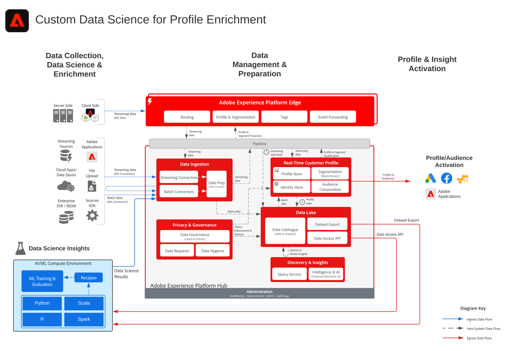

# Science des données personnalisées pour le plan directeur d’enrichissement des profils

>[!TIP]
>Ce plan directeur est également disponible en tant que [modèle de cas d’utilisation](/help/blueprints/use-case-patterns/audience-building-activation/data-science-profile-enrichment.md) sous Création et activation d’audience.

Le plan directeur personnalisé de science des données pour l’enrichissement des profils illustre la manière dont les données peuvent être utilisées pour entraîner, déployer et noter des modèles afin de fournir des informations de machine learning sur les [!DNL Experience Platform] et les [!DNL Real-Time Customer Data Platform] issus de la science des données et des outils de machine learning.

Les informations modélisées peuvent être ingérées dans [!DNL Experience Platform] pour enrichir le profil client en temps réel. Des exemples d’informations de machine learning incluent la valeur de durée de vie, l’affinité au produit et l’affinité catégorielle, la propension à convertir ou à se désabonner.

## Cas d’utilisation

* Extrayez des données et découvrez des modèles à partir de données client, et entrainez et notez des modèles à partir de ces données.
* Enrichir le [!UICONTROL profil client en temps réel] avec des informations et des attributs basés sur le modèle pour une personnalisation plus granulaire et une optimisation des parcours.
* Former et évaluer des modèles pour déterminer les informations sur les clients telles que la valeur durée de vie client, la propension à convertir ou à se désabonner, les affinités de produit et de contenu et les scores d’engagement.

## Architecture

## Garde-fous

* Pour obtenir des mécanismes de sécurisation détaillés et des latences de bout en bout sur l’ingestion de résultats de science des données dans [!DNL Experience Platform] et le profil client en temps réel, reportez-vous aux graphiques de latence et de mécanismes de sécurisation de l’ingestion de données référencés dans le document [&#x200B; Mécanismes de sécurisation de déploiement &#x200B;](../experience-platform/guardrails.md).

## Documentation connexe

* [Description  [!DNL Experience Platform]  produit Adobe Intelligence](https://helpx.adobe.com/fr/legal/product-descriptions/adobe-experience-platform-intelligence---product-description.html)
* [&#x200B; [!DNL Experience Platform] Query Service](https://experienceleague.adobe.com/docs/experience-platform/query/home.html?lang=fr)

## Articles de blog connexes

* [IA dédiée au contenu et à Commerce : personnaliser vos interactions avec les clients grâce à Content Intelligence](https://medium.com/adobetech/content-and-commerce-ai-personalizing-your-interactions-with-customers-through-content-intelligence-dc182601deab)
* [Présentation de l’analyse exploratoire des données sur  [!DNL Experience Platform]](https://medium.com/adobetech/an-introductory-look-at-exploratory-data-analysis-on-adobe-experience-platform-1bfce7501d9a)
* [Intégration de produits Adobe Experience grâce au machine learning à une expérience utilisateur élevée](https://medium.com/adobetech/cutting-across-adobe-experience-products-with-machine-learning-to-elevated-user-experience-7c85000510d1)
* [Segmentation.AI : Automated Audience-Clustering-as-a-Service dans  [!DNL Experience Platform]](https://medium.com/adobetech/segmentation-ai-automated-audience-clustering-as-a-service-in-adobe-experience-platform-261f4099462c)
