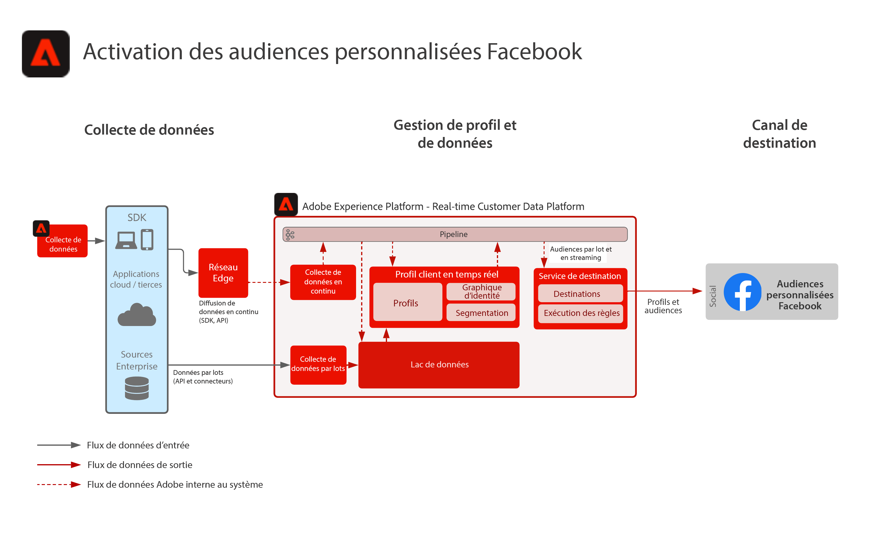

# Activation des audiences personnalisées Facebook

Ingérez des données client à partir de plusieurs sources afin de créer une vue de profil unique du client, de segmenter ces profils en audiences créées pour le marketing et la personnalisation, de partager ces audiences sur les réseaux publicitaires sociaux tels que Facebook afin de cibler et de personnaliser des campagnes en fonction de ces audiences.

## Cas d’utilisation

* Ciblage d’audience pour des audiences connues sur les réseaux sociaux et les destinations publicitaires.
* Personnalisation en ligne avec des attributs en ligne et hors ligne.
Applications
* Real-time Customer Data Platform

## Architecture

## Étapes d’implémentation

1. Configurez les espaces de noms d’identité à utiliser dans les sources de données Profile.
   * Utilisez les espaces de noms prêts à l’emploi tels que Email, Email SHA256 Hash, le cas échéant.
   * Facebook comporte une liste des identités prises en charge. Pour activer les audiences personnalisées Facebook, l’une des identités prises en charge doit être présente dans les profils à activer.
   * Les identités suivantes sont actuellement prises en charge par Facebook : GAID, IDFA, phone_sha256, email_lc_sha256, extern_id.
   * Pour plus d’informations, voir [Guide de destination facebook](https://experienceleague.adobe.com/docs/experience-platform/destinations/catalog/social/facebook.html?lang=en).
   * Créez des espaces de noms personnalisés dans lesquels les espaces de noms prêts à l’emploi ne sont pas disponibles pour les identités applicables.
1. Configurez les jeux de données et les schémas de source de données Profile.
   * Créez des schémas d’enregistrement de profil pour toutes les données de source d’enregistrement de profil.
      * Indiquez l’identité Principale et les identités secondaires de chaque schéma.
      * Activez le schéma pour l’ingestion des profils.
   * Créez des jeux de données d’enregistrement de profil pour toutes les données de source d’enregistrement de profil, en attribuant le schéma associé.
      * Activez le jeu de données pour l’ingestion de profils.
   * Créez des schémas d’événement d’expérience de profil pour toutes les données sources basées sur des séries temporelles de profil.
      * Indiquez l’identité Principale et les identités secondaires du schéma.
   * Activez le schéma pour l’ingestion des profils.
   * Créez des jeux de données d’événement d’expérience de profil pour toutes les données de source d’événement d’expérience de profil, en attribuant le schéma associé.
      * Activez le jeu de données pour l’ingestion de profils.
1. Ingérez les données source à l’aide d’un connecteur source dans le jeu de données associé configuré ci-dessus.
   * Configurez le compte du connecteur source avec les informations d’identification.
   * Configurez un flux de données pour ingérer les données du fichier source ou de l’emplacement du dossier selon une planification spécifiée dans le jeu de données spécifié.
   * Mappez tous les champs des données source au schéma cible.
   * Transformez tous les champs au format correct pour l’ingestion dans Experience Platform.
      * Conversion de dates
      * Effectuez la transformation en minuscules le cas échéant, par exemple en indiquant l’adresse électronique.
      * Transformations de modèle (numéro de téléphone, par exemple)
      * Ajoutez des identifiants d’enregistrement uniques pour les enregistrements d’événement d’expérience s’ils ne sont pas présents dans les données source.
      * Transformez les tableaux et les champs de type map pour assurer le mappage et la modélisation corrects des tableaux et des mappages pour la segmentation dans Experience Platform.
1. Configurez la stratégie de fusion de profils pour garantir la configuration correcte du graphique d’identités et des jeux de données à inclure dans la fusion des profils.
1. Une fois les flux de données exécutés, vérifiez que l’ingestion des données de profil s’est déroulée sans erreur.
   * Inspect le graphique d’identités de plusieurs profils afin d’assurer le traitement correct des relations d’identité.
   * Inspect les attributs et les événements de plusieurs profils pour garantir une ingestion correcte des attributs et des événements vers les profils.
1. Création de segments pour créer des audiences de profil
   * Créez des segments dans le créateur de segments à l’aide de règles par rapport aux attributs et aux événements.
   * Enregistrez le segment à des fins d’évaluation. Les segments sont évalués selon la planification spécifiée une fois par jour.
      * Si les règles de segment sont éligibles à la segmentation par flux, le segment est évalué lorsque de nouvelles données de diffusion en continu sont ingérées pour les profils. Les segments en flux continu seront également évalués une fois par jour lors de la segmentation par lots planifiée.
1. Assurez-vous que les résultats du segment sont comme prévu.
   * Examinez le nombre de résultats du segment pour les segments donnés.
   * Examinez le profil qui doit être inclus dans le segment pour vérifier que l’appartenance au segment est incluse dans la partie de l’appartenance au segment du profil.
1. Configurez la diffusion de l’audience vers la destination dans la configuration Destination .
   * Voir [Guide de destination facebook](https://experienceleague.adobe.com/docs/experience-platform/destinations/catalog/social/facebook.html?lang=en) pour plus d’informations sur la configuration de la destination Facebook.
   * Lors de la configuration d’une destination, sélectionnez l’audience que vous souhaitez activer vers la destination.
   * Déterminez la date de début planifiée à laquelle vous souhaitez que le flux de données de destination commence à diffuser l’audience vers la destination.
   * Chaque destination comporte des attributs obligatoires et facultatifs qui seront envoyés.
      * Pour Facebook, l’une des identités requises doit être incluse et est utilisée pour faire correspondre les profils des audiences dans Experience Platform à un profil pouvant être ciblé par Facebook.
   * Chaque destination possède également un type de diffusion spécifié, qu’il s’agisse d’une diffusion en continu ou par lots, d’une charge basée sur les fichiers ou d’une charge utile JSON.
      * Pour Facebook, les appartenances aux audiences sont diffusées en continu vers un point de terminaison Facebook au format JSON.
      * Les appartenances à l’audience seront diffusées en continu après l’évaluation de la segmentation par flux ou par lots dans Experience Platform.
1. Assurez-vous que le flux de destination a diffusé l’audience vers la destination comme prévu.
   * Vérifiez l&#39;interface de surveillance pour confirmer que l&#39;audience a été diffusée avec le nombre de profils attendu. La taille de l’audience doit refléter le nombre attendu de profils activés, en notant que des destinations spécifiques telles que Facebook requièrent certains champs, tels qu’une identité de hachage d’email. Si elles ne sont pas présentes dans le profil qui est membre de l’audience, elles ne sont pas activées vers la destination.
   * Recherchez les profils ignorés pour les identités de profil manquantes ou les attributs manquants qui étaient obligatoires.
   * Recherchez d’autres erreurs qui doivent être résolues.
1. Vérifiez que l’audience a été activée vers la destination de fin avec le nombre d’appartenances attendu à l’audience.
   * Connectez-vous au portail d’audience personnalisée Facebook pour vérifier que l’audience de Real-time Customer Data Platform a été diffusée et que le taux de correspondance des profils de l’audience de Facebook correspond raisonnablement au nombre de profils de l’audience de Real-time Customer Data Platform.

## Garde-fous

[Barrières de sécurité de profil et de segmentation](https://experienceleague.adobe.com/docs/experience-platform/profile/guardrails.html?lang=fr)

## Documentation connexe

Activation des audiences personnalisées Facebook - [Configuration de la destination](https://experienceleague.adobe.com/docs/experience-platform/destinations/catalog/social/facebook.html?lang=en)