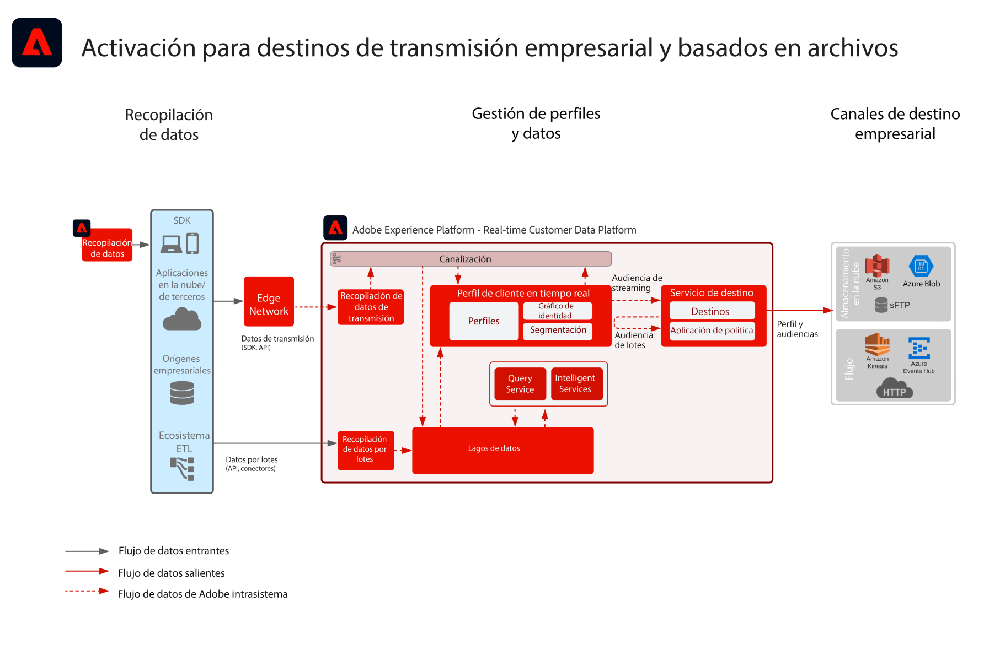

# Modèle d&#39;Activation des Audiences et des Profils aux destinations d&#39;entreprise

Partagez les modifications et les événements d’profil et d’audience en flux continu ou par lot de [!UICONTROL Plate-forme de données client en temps réel] vers les entrepôts de données et les applications d’entreprise. Ces événements d&#39;profil et d&#39;audience peuvent être utilisés pour lancer une action de vente ou d&#39;assistance au client, telle que le suivi d&#39;un processus de demande abandonné ou d&#39;un enregistrement de webinaire, ou pour mettre à jour les applications d&#39;entreprise avec les derniers attributs du client et les dernières informations de [!UICONTROL plate-forme de données client en temps réel].

## Cas d’utilisation

* Activation de profil et d’audience vers les destinations d’enregistrement en mode cloud ou les destinations de diffusion en flux continu pour le suivi d’entreprise, l’enregistrement, l’analyse et l’activation des données et des statistiques client.

## Applications

* Adobe Experience Platform Activation

## Architecture

## Garde-fous

[Reportez-vous aux garde-fous comme indiqué sur la page Aperçu de l&#39;Activation des Audiences et des Profils.](overview.md)

## Étapes d’implémentation

1. [Créez ](https://experienceleague.adobe.com/docs/platform-learn/tutorials/schemas/create-a-schema.html) des schémas pour que les données soient assimilées.
1. [Créez ](https://experienceleague.adobe.com/docs/platform-learn/tutorials/data-ingestion/create-datasets-and-ingest-data.html) des jeux de données pour que les données soient assimilées.
1. [Configurez les identités et les espaces de noms d’identité corrects sur le schéma pour vous assurer que les données ingérées peuvent s’intégrer dans un profil unifié.](https://experienceleague.adobe.com/docs/platform-learn/tutorials/identities/label-ingest-and-verify-identity-data.html)
1. [Activez les schémas et les jeux de données pour le profil](https://experienceleague.adobe.com/docs/platform-learn/tutorials/profiles/bring-data-into-the-real-time-customer-profile.html).
1. [Ingérez les données dans Experience Platform.](https://experienceleague.adobe.com/?recommended=ExperiencePlatform-D-1-2020.1.dataingestion)
1. [Fournissez un partage de segment Real-time Customer Data Platform entre Experience Platform et Audience Manager pour les audiences définies dans Experience Platform à partager avec Audience Manager.](https://www.adobe.com/go/audiences)
1. [Créez ](https://experienceleague.adobe.com/docs/platform-learn/tutorials/segments/create-segments.html?lang=fr) des segments dans l’Experience Platform. Le système détermine automatiquement si le segment est évalué en tant que lot ou en tant que flux continu.
1. [Configurez les destinations pour le partage des attributs de profil et des appartenances à une audience vers les destinations souhaitées.](https://experienceleague.adobe.com/docs/platform-learn/tutorials/destinations/create-destinations-and-activate-data.html)

## Documentation connexe

* [Documentation sur les destinations](https://experienceleague.adobe.com/docs/experience-platform/destinations/catalog/overview.html?lang=fr)
* [Présentation des destinations d’enregistrement dans le cloud](https://experienceleague.adobe.com/docs/experience-platform/destinations/catalog/cloud-storage/overview.html?lang=en#catalog)
* [Destination HTTP](https://experienceleague.adobe.com/docs/experience-platform/destinations/catalog/http-destination.html?lang=en#overview)
* [Description de Real-time Customer Data Platform](https://helpx.adobe.com/fr/legal/product-descriptions/real-time-customer-data-platform.html)
* [Directives sur le profil et la segmentation](https://experienceleague.adobe.com/docs/experience-platform/profile/guardrails.html?lang=fr)
* [Documentation sur la segmentation](https://experienceleague.adobe.com/docs/experience-platform/segmentation/api/streaming-segmentation.html?lang=fr)

## Vidéos et tutoriels connexes

* [Présentation de Real-time Customer Data Platform ](https://experienceleague.adobe.com/docs/platform-learn/tutorials/application-services/rtcdp/understanding-the-real-time-customer-data-platform.html?lang=fr)
* [[!UICONTROL Vidéo de démonstration de Real-time Customer Data Platform ]](https://experienceleague.adobe.com/docs/platform-learn/tutorials/application-services/rtcdp/demo.html?lang=fr)
* [Création de segments](https://experienceleague.adobe.com/docs/platform-learn/tutorials/segments/create-segments.html)
