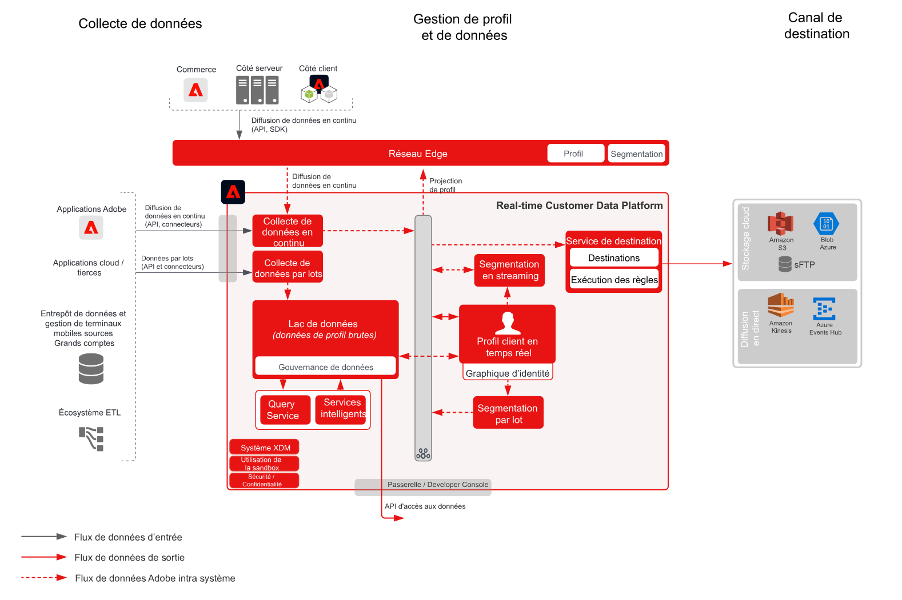

# Plan directeur pour l’activation d’audiences et de profils vers des destinations d’entreprise

Partagez les modifications et les événements de profil et d’audience en flux continu ou par lot de [!UICONTROL Real-time Customer Data Platform] vers les entrepôts de données et les applications d’entreprise. Ces événements de profil et d’audience peuvent être utilisés pour lancer une action de vente ou d’assistance client, telle que le suivi d’un processus de demande non finalisé ou d’enregistrement à un webinaire, ou pour mettre à jour les applications d’entreprise avec les derniers attributs du client et les dernières informations de [!UICONTROL Real-time Customer Data Platform].

## Cas d’utilisation

* Activation de profil et d’audience vers des destinations d’enregistrement en mode cloud ou des destinations de diffusion en flux continu pour le suivi, l’enregistrement, l’analyse et l’activation des données et des informations client au sein de l’entreprise.

## Applications

* Adobe Experience Platform Activation

## Architecture

## Garde-fous

[Reportez-vous aux garde-fous comme indiqué sur la page Aperçu de l&#39;Activation des Audiences et des Profils.](overview.md)

## Étapes d’implémentation

1. [Créez des schémas pour les données à ingérer.](https://experienceleague.adobe.com/docs/platform-learn/tutorials/schemas/create-a-schema.html)
1. [Créez des jeux de données pour les données à ingérer.](https://experienceleague.adobe.com/docs/platform-learn/tutorials/data-ingestion/create-datasets-and-ingest-data.html)
1. [Configurez les identités et les espaces de noms d’identité corrects sur le schéma pour vous assurer que les données ingérées peuvent s’intégrer dans un profil unifié.](https://experienceleague.adobe.com/docs/platform-learn/tutorials/identities/label-ingest-and-verify-identity-data.html)
1. [Activez les schémas et les jeux de données pour le profil](https://experienceleague.adobe.com/docs/platform-learn/tutorials/profiles/bring-data-into-the-real-time-customer-profile.html).
1. [Ingérez les données dans Experience Platform.](https://experienceleague.adobe.com/?recommended=ExperiencePlatform-D-1-2020.1.dataingestion)
1. [Réalisez un partage de segments de [!UICONTROL Real-time Customer Data Platform] entre Experience Platform et Audience Manager pour les audiences définies dans Experience Platform à partager avec Audience Manager.](https://www.adobe.com/go/audiences)
1. [Créez ](https://experienceleague.adobe.com/docs/platform-learn/tutorials/segments/create-segments.html?lang=fr) des segments dans l’Experience Platform. Le système détermine automatiquement si le segment est évalué en tant que lot ou en tant que flux continu.
1. [Configurez les destinations pour le partage des attributs de profil et des appartenances à une audience vers les destinations souhaitées.](https://experienceleague.adobe.com/docs/platform-learn/tutorials/destinations/create-destinations-and-activate-data.html)

## Documentation connexe

* [Documentation sur les destinations](https://experienceleague.adobe.com/docs/experience-platform/destinations/catalog/overview.html?lang=fr)
* [Présentation des destinations d’espace de stockage](https://experienceleague.adobe.com/docs/experience-platform/destinations/catalog/cloud-storage/overview.html?lang=fr#catalog)
* [Destination HTTP](https://experienceleague.adobe.com/docs/experience-platform/destinations/catalog/http-destination.html?lang=fr#overview)
* Description de [[!UICONTROL Real-time Customer Data Platform]](https://helpx.adobe.com/fr/legal/product-descriptions/real-time-customer-data-platform.html)
* [Lignes directrices relatives au profil et à la segmentation](https://experienceleague.adobe.com/docs/experience-platform/profile/guardrails.html?lang=fr)
* [Documentation sur la segmentation](https://experienceleague.adobe.com/docs/experience-platform/segmentation/api/streaming-segmentation.html?lang=fr)

## Vidéos et tutoriels connexes

* Présentation de [[!UICONTROL Real-time Customer Data Platform]](https://experienceleague.adobe.com/docs/platform-learn/tutorials/application-services/rtcdp/understanding-the-real-time-customer-data-platform.html?lang=fr)
* [Vidéo de démonstration de [!UICONTROL Real-time Customer Data Platform ]](https://experienceleague.adobe.com/docs/platform-learn/tutorials/application-services/rtcdp/demo.html?lang=fr)
* [Création de segments](https://experienceleague.adobe.com/docs/platform-learn/tutorials/segments/create-segments.html)
