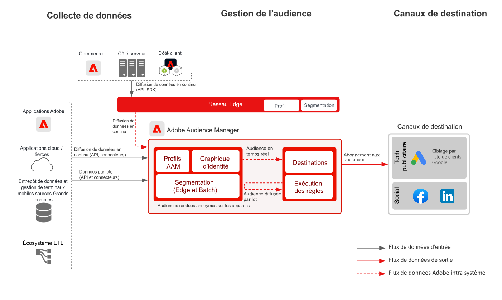

# Plan directeur d’activation du client connu

Utilisez les attributs et les événements hors ligne tels que les commandes hors ligne, les transactions, la gestion de la relation client (CRM) ou les données sur la fidélité, combinés avec le comportement en ligne pour le ciblage et la personnalisation en ligne.

Les identifiants étendus dotés de contrôles de gouvernance intégrés offrent davantage d’opportunités de communication avec les clients connus. Activez des audiences vers des destinations connues basées sur le profil telles que les fournisseurs de messagerie électronique, les réseaux sociaux et les destinations publicitaires

Plus de précisions sont fournies dans le [plan directeur pour l’activation de profil et d’audience avec les applications Experience Cloud](platform-and-applications.md) spécifiques aux intégrations entre les applications Experience Platform et Experience Cloud.

## Cas d’utilisation

* Ciblage d’audience pour des audiences connues sur les réseaux sociaux et les destinations publicitaires.
* Personnalisation en ligne avec des attributs en ligne et hors ligne.
* Activez des audiences vers des canaux connus, tels que la messagerie électronique et les SMS.

## Applications

* [!UICONTROL Real-time Customer Data Platform]
* Les destinations basées sur les personnes d’Audience Manager peuvent également être utilisées pour l’activation des personnes dans Facebook, LinkedIn et le ciblage par liste de clients (Customer Match) de Google.

## Architecture

### Activation du client connu dans Real-time Customer Data Platform

 

### Activation du client connu à l’aide des destinations basées sur les personnes d’Audience Manager

 

## Garde-fous

[Référez-vous aux garde-fous tels que décrits sur la page de présentation de l’activation d’audience et de profil](overview.md).

## Procédure de mise en œuvre de Real-time Customer Data Platform

1. [Créez des schémas](https://experienceleague.adobe.com/?recommended=ExperiencePlatform-D-1-2021.1.xdm) pour les données à ingérer.
1. [Créez des jeux de données](https://experienceleague.adobe.com/docs/platform-learn/tutorials/data-ingestion/create-datasets-and-ingest-data.html?lang=fr) pour les données à ingérer.
1. [Configurez les identités et les espaces de noms d’identité corrects](https://experienceleague.adobe.com/docs/platform-learn/tutorials/identities/label-ingest-and-verify-identity-data.html?lang=fr) sur le schéma pour vous assurer que les données ingérées peuvent s’intégrer dans un profil unifié.
1. [Activez les schémas et les jeux de données pour le profil](https://experienceleague.adobe.com/docs/platform-learn/tutorials/profiles/bring-data-into-the-real-time-customer-profile.html?lang=fr).
1. [Ingérez des données](https://experienceleague.adobe.com/?recommended=ExperiencePlatform-D-1-2020.1.dataingestion&amp;lang=fr) dans Experience Platform.
1. [Réalisez un partage de segments [!UICONTROL Real-time Customer Data Platform]](https://www.adobe.com/go/audiences) entre Experience Platform et Audience Manager pour les audiences définies dans Experience Platform à partager avec Audience Manager.
1. [Créez des segments](https://experienceleague.adobe.com/docs/platform-learn/tutorials/segments/create-segments.html?lang=fr) dans Experience Platform. Le système détermine automatiquement si le segment est évalué en tant que lot ou en tant que flux continu.
1. [Configurez les destinations](https://experienceleague.adobe.com/docs/platform-learn/tutorials/destinations/create-destinations-and-activate-data.html?lang=fr) pour le partage des attributs de profil et des abonnements à une audience vers les destinations souhaitées.

## Considérations de mise en œuvre

* Le partage des données de profil avec les destinations nécessite que vous incluiez la valeur d’identité spécifique utilisée par la destination dans la payload de destination. Toute identité nécessaire pour une destination cible doit être ingérée dans Platform et configurée en tant qu’identité pour le [!UICONTROL profil client en temps réel].

* Consultez [Activation d’audience et de profil avec le plan directeur des applications Experience Cloud](platform-and-applications.md) pour plus d’informations sur le partage d’audiences de Real-time Customer Data Platform vers Audience Manager, Analytics, Target, Campaign et Journey Optimizer.

## Procédure de mise en œuvre des destinations basées sur les personnes d’Audience Manager

* Pour plus d’informations sur la mise en œuvre d’Audience Manager, consultez la [documentation](https://experienceleague.adobe.com/docs/audience-manager/user-guide/implementation-integration-guides/implement-audience-manager.html?lang=fr) suivante.

* Pour plus d’informations sur l’implémentation des destinations basées sur les personnes dans Audience Manager, consultez la [documentation](https://experienceleague.adobe.com/docs/audience-manager/user-guide/faqs/faq-people-based-destinations.html?lang=fr) suivante.

## Documentation connexe

* Description de [[!UICONTROL Real-time Customer Data Platform]](https://helpx.adobe.com/fr/legal/product-descriptions/real-time-customer-data-platform.html)
* [Lignes directrices relatives au profil et à la segmentation](https://experienceleague.adobe.com/docs/experience-platform/profile/guardrails.html?lang=fr)
* [Documentation sur la segmentation](https://experienceleague.adobe.com/docs/experience-platform/segmentation/api/streaming-segmentation.html?lang=fr)
* [Documentation sur les destinations](https://experienceleague.adobe.com/docs/experience-platform/destinations/catalog/overview.html?lang=fr)

## Vidéos et tutoriels connexes

* Présentation de [[!UICONTROL Real-time Customer Data Platform]](https://experienceleague.adobe.com/docs/platform-learn/tutorials/application-services/rtcdp/understanding-the-real-time-customer-data-platform.html?lang=fr)
* [Vidéo de démonstration de [!UICONTROL Real-time Customer Data Platform ]](https://experienceleague.adobe.com/docs/platform-learn/tutorials/application-services/rtcdp/demo.html?lang=fr)
* [Création de segments](https://experienceleague.adobe.com/docs/platform-learn/tutorials/segments/create-segments.html)
