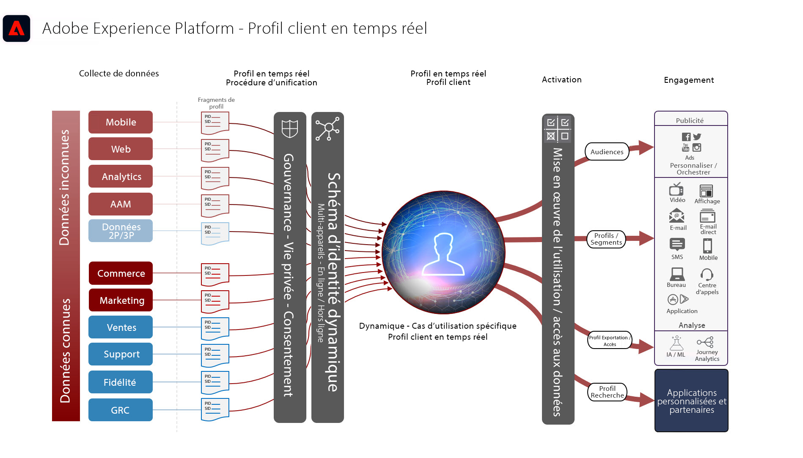

# Plans directeurs de l’activation de profil et d’audience

L’activation d’audience et de profil est la clé du succès dans un environnement de marketing piloté par les données. Cependant, de nombreuses marques concentrent toujours leurs efforts sur l’activation axée sur le canal en premier, qui offre souvent une portée et une personnalisation incohérentes.

Avec une approche axée sur le canal, chaque canal agit comme un silo dans lequel les efforts de personnalisation ne ciblent que les clients interagissant avec la marque sur ce canal. Cette approche ne reflète pas la réalité selon laquelle les clients interagissent avec les marques sur de nombreux points de contact différents. L’activation d’audience et de profil permet aux marques de connecter les interactions des clients sur plusieurs canaux, afin de fournir un profil et une audience centralisés qui peuvent être activés sur tous les canaux.

Plans directeurs dans Audience et Activation de profil

- [Activation d’audience anonyme ](/help/blueprints/audience-activation/anonymous.md)
- Activation de client connue (RTCDP)
   - [Présentation](/help/blueprints/audience-activation/known.md)
   - [Activation des canaux sociaux et publicitaires](/help/blueprints/audience-activation/advertising-activation.md)
   - [Activation vers des destinations de diffusion en continu de fichiers et d’entreprise](/help/blueprints/audience-activation/enterprise-destinations.md)
   - [Centre d’activités client](/help/blueprints/audience-activation/customer-activity.md)
   - [Correspondance de segment](/help/blueprints/audience-activation/segment-match.md)
   - [Activation avec des applications Experience Cloud](/help/blueprints/audience-activation/platform-and-applications.md)

## Architecture du profil client en temps réel

Le schéma ci-dessous présente les principaux composants du profil client en temps réel d’Experience Platform.

Pour plus d’informations sur les profils, la segmentation et l’activation, consultez la [documentation de présentation de la plateforme RTCDP](https://experienceleague.adobe.com/en/docs/experience-platform/rtcdp/home) et la [ présentation de Real-time Customer Profile](https://experienceleague.adobe.com/en/docs/experience-platform/profile/home) .

## Mécanismes de sécurisation pour les plans directeurs d’activation d’audience et de profil

Pour des garde-fous détaillés et des latences de bout en bout, consultez le [document sur les garde-fous de déploiement](../experience-platform/deployment/guardrails.md) et la section [Garde-fous de segmentation et de profil](https://experienceleague.adobe.com/docs/experience-platform/profile/guardrails.html?lang=fr).
