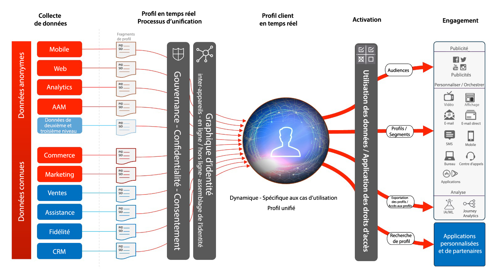
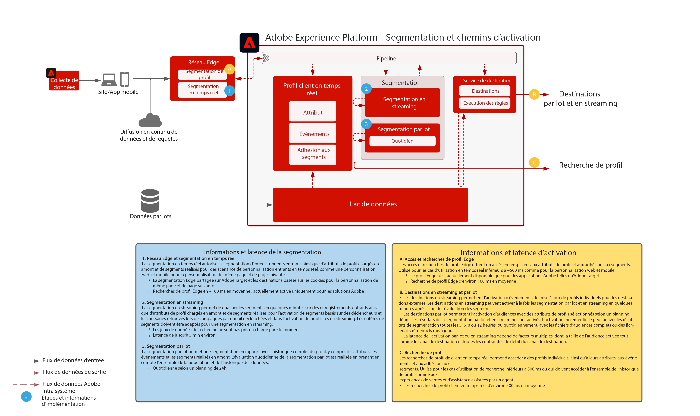

# Plans directeurs de l’activation de profil et d’audience

L’activation d’audience et de profil est la clé du succès dans un environnement de marketing piloté par les données. Cependant, de nombreuses marques concentrent toujours leurs efforts sur l’activation axée sur le canal en premier, qui offre souvent une portée et une personnalisation incohérentes.

Avec une approche axée sur le canal, chaque canal agit comme un silo dans lequel les efforts de personnalisation ne ciblent que les clients interagissant avec la marque sur ce canal. Cette approche ne reflète pas la réalité selon laquelle les clients interagissent avec les marques sur de nombreux points de contact différents. L’activation d’audience et de profil permet aux marques de connecter les interactions des clients sur plusieurs canaux, afin de fournir un profil et une audience centralisés qui peuvent être activés sur tous les canaux.

| Plan directeur | Description | Applications Experience Cloud |
|---|---|---|
| **[Activation d’audience anonyme](anonymous.md)** | <ul><li>Ciblez des audiences sur le web et les canaux publicitaires pour des données client anonymes et comportementales.</li><li>Intégrez des données d’audience tierces pour une personnalisation accrue.</li></ul> | <ul><li>Adobe Audience Manager</li></ul> |
| **[Activation du client connu](known.md)** | <ul><li>Activez vers des destinations connues basées sur le profil telles que les fournisseurs de messagerie électronique, les réseaux sociaux et les destinations publicitaires. </li><li>Utilisez les attributs et les événements hors ligne tels que les commandes hors ligne, les transactions, la gestion de la relation client (CRM) ou les données sur la fidélité, combinés avec le comportement en ligne pour le ciblage et la personnalisation en ligne.</li></ul> | <ul><li>Adobe Experience Platform</li><li> [!UICONTROL Real-time Customer Data Platform]</li><li>Adobe Audience Manager (facultatif)</li></ul> |
| **[Activation de profil et d’audience avec les applications Experience Cloud](platform-and-applications.md)** | <ul><li>Gérez les profils et les audiences dans Experience Platform et partagez-les avec les applications Experience Cloud.</li><li>Créez et diffusez des segments et des informations clients richement fournis dans Experience Platform et partagez-les avec les applications Experience Cloud.</li></ul> | <ul><li>Adobe Experience Platform</li><li>[!UICONTROL Real-time Customer Data Platform]</li><li>Experience Platform Activation</li><li>Applications Experience Cloud</li></ul> |
| **[Correspondance de segment](segment-match.md)** | <ul><li>Grâce à de meilleurs systèmes de gouvernance, d’autorisations et de gestion des préférences, les marketeurs peuvent améliorer davantage leurs audiences authentifiées propriétaires par des partenaires clés.</li></ul> | <ul><li>Adobe Experience Platform </li></ul> |

## Architecture du profil client en temps réel

Le schéma ci-dessous présente les principaux composants du profil client en temps réel d’Experience Platform.

Les premières sources de données sont ingérées dans Experience Platform. Si la source de données est configurée pour le traitement de profil, elle sera intégrée au profil client en temps réel. Un seul fragment ou document de profil est créé pour chaque source de données et chaque enregistrement d’identifiant principal configuré pour chaque source de données. En outre, lorsque des données sont ingérées dans le profil, elles sont également traitées par le service d’identité. Tout enregistrement provenant des sources de données dont plusieurs identités sont marquées dans le schéma et dont les valeurs correspondantes sont renseignées dans l’enregistrement sera traité comme une relation d’identité au sein du service d’identité.

Notez que les enregistrements qui n’ont qu’une seule identité ne sont pas traités par le service d’identité, car ces enregistrements n’ont pas de liens d’identité pour compléter le graphique. Notez également que le service d’identité ne fait pas la distinction entre les identités principales et les identités secondaires. Il s’agit simplement de traiter les relations d’identité entre les identités.

La fusion de fragments de profil se produit lorsque le schéma d’identité fournit les relations entre les différents fragments de profil source qui ont été liés. La stratégie de fusion détermine quels fragments source et quel schéma d’identité seront utilisés lors de la fusion des fragments. Lorsque le profil est l’accès, la fusion des fragments de profil se produit pour assurer la vue combinée la plus à jour du profil. Les règles de gouvernance et de stratégie garantissent que seuls les segments et attributs autorisés peuvent être activés vers les destinations spécifiées.

## Présentation de la segmentation et de la destination

L’illustration ci-dessous présente les différentes méthodes de segmentation et les différents modèles d’activation de profil et d’audience.

## Mécanismes de sécurisation pour les plans directeurs d’activation d’audience et de profil

* Pour des garde-fous détaillés et des latences de bout en bout, consultez le [document sur les garde-fous de déploiement](../experience-platform/deployment/guardrails.md) et la section [Garde-fous de segmentation et de profil](https://experienceleague.adobe.com/docs/experience-platform/profile/guardrails.html?lang=fr).

### Activation des attributs et des identités

* [!UICONTROL Real-time Customer Data Platform] peut activer les adhésions aux audiences, ainsi que les modifications d’attribut et d’identité survenant pour les profils membres de segments sélectionnés pour l’activation. Si votre objectif est d’activer des attributs ou des identités, vous devez définir un segment global qui inclut tous les profils auxquels des mises à jour d’attributs et d’identités sont envoyées. À ce stade, vous pouvez sélectionner le segment et les attributs souhaités à activer dans le cadre de la configuration de destination.
* Notez que les destinations par lots ne prennent pas en charge l’activation d’événements de modification d’attribut uniquement. Des adhésions complètes ou incrémentielles à des audiences peuvent être envoyées avec les attributs sélectionnés pour l’activation.

### Activation de segments par lots vers des destinations de diffusion en continu

* L’activation de segment par lots vers des destinations de diffusion en continu est prise en charge. Lorsque des profils se qualifient pour une adhésion à une audience à partir de tâches de segmentation par lots, ces réalisations peuvent être activées par le biais d’une diffusion en continu.

### Activation de segments en flux continu vers des destinations par lots

* L’activation des segments en flux continu vers des destinations par lots est prise en charge. Le planning de destination du lot exporte les adhésions de segment de profil en fonction du planning de destination du lot. Cela inclut les adhésions aux segments déterminées par les méthodes de diffusion en continu et par lots.

### Activation des événements d’expérience

* L’activation d’événements d’expérience bruts n’est pas prise en charge. Pour être activé par rapport aux événements d’expérience, un segment doit être créé avec les règles nécessaires qui incluent ou excluent la logique de l’événement d’expérience. Cela crée un segment défini par rapport aux événements d’expérience et l’adhésion au segment peut être activée en tant que proxy pour activer les événements d’expérience bruts. Envisagez également d’utiliser [!UICONTROL Platform Launch côté serveur] pour activer les événements d’expérience bruts collectés via le SDK.

## Articles de blog connexes

* [[!DNL Blueprints for Audience Activation in Adobe Experience Platform]](https://medium.com/adobetech/a-blueprint-for-audience-activation-in-adobe-experience-platform-b2b30fae90fd)
* [[!DNL Adobe Experience Platform Web SDK for Audience Management]](https://medium.com/adobetech/adobe-experience-platform-web-sdk-for-audience-management-751fa6d063bc)
