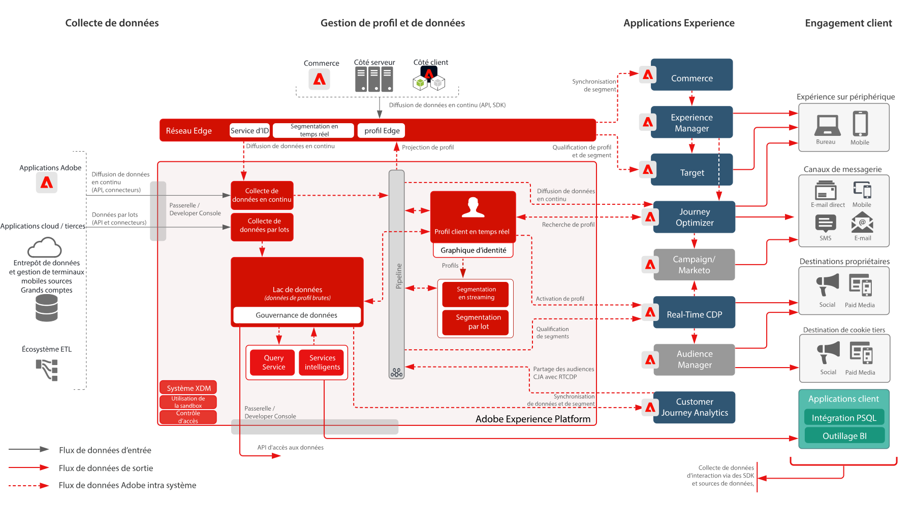

# Plan directeur pour l’activation de profil et d’audience avec les applications Experience Cloud

Gérez les profils et les audiences dans Experience Platform et partagez-les avec les applications Experience Cloud. Créez et diffusez des segments et des informations riches sur les clients dans Experience Platform et partagez-les avec les applications Experience Cloud.

L’activation avec les applications Experience Cloud s’aligne étroitement sur le [plan directeur d’Audience Activation en ligne / hors ligne](online-offline.md).

## Cas d’utilisation

* Personnalisez et ciblez sur différents canaux d’interaction client optimisés par Experience Cloud.
* Partagez les données d’audience et de profil entre les applications Experience Platform et Experience Cloud.

## Applications

* Adobe Experience Platform
* [!UICONTROL Real-time Customer Data Platform]
* Activation d’Experience Platform
* Applications Experience Cloud
   * Adobe Audience Manager
   * Adobe Target
   * Adobe Campaign
   * Journey Optimizer

## Architecture

[Voir la section Architecture des Experience Platform et des applications pour obtenir des diagrammes d&#39;architecture supplémentaires relatifs aux intégrations Experience Platform avec les applications Experience Cloud.](https://experienceleague.adobe.com/docs/blueprints-learn/architecture/architecture-overview/platform-applications.html?lang=fr)

### Plan directeur pour l’activation de profil et d’audience avec les applications Experience Cloud

 

## Garde-fous

Référez-vous aux [garde-fous décrits sur la page de présentation d’Audience et Profil Activation](overview.md)

## Documentation connexe

* Description de [[!UICONTROL Real-time Customer Data Platform]](https://helpx.adobe.com/fr/legal/product-descriptions/real-time-customer-data-platform.html)
* [Lignes directrices relatives au profil et à la segmentation](https://experienceleague.adobe.com/docs/experience-platform/profile/guardrails.html?lang=fr)
* [Documentation sur la segmentation](https://experienceleague.adobe.com/docs/experience-platform/segmentation/api/streaming-segmentation.html?lang=fr)
* [Documentation sur les destinations](https://experienceleague.adobe.com/docs/experience-platform/destinations/catalog/overview.html?lang=fr)

## Vidéos et tutoriels connexes

* Présentation de [[!UICONTROL Real-time Customer Data Platform]](https://experienceleague.adobe.com/docs/platform-learn/tutorials/application-services/rtcdp/understanding-the-real-time-customer-data-platform.html?lang=fr)
* [Vidéo de démonstration de [!UICONTROL Real-time Customer Data Platform ]](https://experienceleague.adobe.com/docs/platform-learn/tutorials/application-services/rtcdp/demo.html?lang=fr)
* [Création de segments](https://experienceleague.adobe.com/docs/platform-learn/tutorials/segments/create-segments.html?lang=fr)
