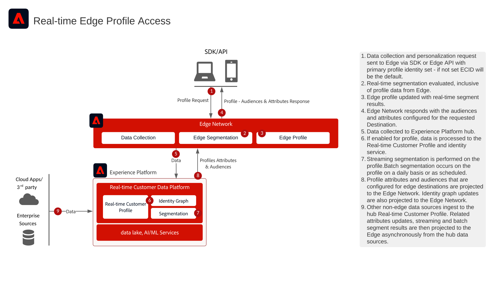

# Accès au profil Edge en temps réel pour les Personalization web et mobiles

>[!TIP]
>Ce plan directeur est également disponible en tant que [ modèle de cas d’utilisation ](/help/blueprints/use-case-patterns/personalization/edge-profile-access.md) sous Personalization.

Le plan directeur Accès au profil Real-time Edge pour le Web et Mobile Personalization montre comment les applications web et mobiles peuvent accéder à Adobe Experience Platform [!UICONTROL profil client en temps réel] à la périphérie pour une personnalisation à débit élevé et à faible latence.

Les applications peuvent accéder aux attributs de profil en temps réel et aux audiences à la périphérie avec une latence en millisecondes. Les attributs, les appartenances aux audiences et les fonctionnalités pilotées par les modèles stockés dans le profil en tant qu’attributs sont accessibles en temps réel pour la personnalisation de la même page et de la page suivante sur les canaux web et mobiles.

Grâce à cette fonctionnalité, vous pouvez proposer des expériences hautement personnalisées sur vos sites web et applications mobiles en fonction du profil client en temps réel, notamment des audiences dérivées de comportements en temps réel, des attributs ingérés par le profil client en temps réel et des informations calculées.

>[!NOTE]
>
>L’accès au profil Edge est spécialement conçu pour les cas d’utilisation à débit élevé et à faible latence, tels que la personnalisation entrante web/mobile et la prise de décision d’offres en temps réel. Pour les scénarios de débit inférieur, tels que l’assistance assistée par un agent ou les interactions de vente, l’API de recherche de profil Hub est plus appropriée. Consultez le [plan directeur de l’accès au profil en temps réel pour les scénarios d’assistance et de vente](customer-activity.md) pour obtenir un accès au profil basé sur le hub.

## Applications

* Real-time Customer Data Platform
* Collecte de données Adobe Experience Platform (Web SDK / Mobile SDK)
* API du serveur Edge Network

## Cas d’utilisation

* Personnalisation en temps réel sur les canaux web et mobiles pour les expériences client connues
* Personnalisation de la même page et de la page suivante en fonction des attributs de profil et des audiences en temps réel
* Personnalisation du contenu et des offres basée sur les profils clients, y compris les données comportementales en temps réel, les attributs et les informations calculées
* Intégration aux moteurs de personnalisation, aux systèmes de gestion de contenu et aux applications externes pour une prise de décision en temps réel
* Tests et optimisation du contenu avec le contexte de profil en temps réel

## Diagramme d’architecture

## Garde-fous

* [Mécanismes de sécurisation pour les données [!UICONTROL profil client en temps réel]](https://experienceleague.adobe.com/docs/experience-platform/profile/guardrails.html?lang=fr)
* [Mécanismes de sécurisation d’Edge Network](https://experienceleague.adobe.com/docs/experience-platform/edge-network-server-api/guardrails.html)
* Les profils Edge ont une durée de vie (TTL) de 14 jours. Si un utilisateur n’est pas actif sur Edge depuis 14 jours, le profil Edge peut expirer et doit être récupéré depuis le hub, ce qui peut avoir un impact sur la personnalisation de première page.
* La personnalisation Edge prend en charge l’évaluation de l’appartenance à une audience en temps réel pour les audiences qui répondent aux critères de segmentation Edge. Les audiences par lots et en flux continu à partir du hub sont également disponibles en périphérie avec la configuration appropriée.

## Documentation connexe

### Configurations de destination

* [Connexion Personalization personnalisée](https://experienceleague.adobe.com/en/docs/experience-platform/destinations/catalog/personalization/custom-personalization) - Guide de mise en œuvre du Principal
* [Présentation des destinations Personalization](https://experienceleague.adobe.com/en/docs/experience-platform/destinations/catalog/personalization/overview)
* [Activer les audiences vers des destinations de personnalisation Edge](https://experienceleague.adobe.com/en/docs/experience-platform/destinations/ui/activate/activate-edge-personalization-destinations)
* [Recherche d’attributs de profil sur le serveur Edge en temps réel](https://experienceleague.adobe.com/en/docs/experience-platform/destinations/ui/activate/activate-edge-profile-lookup)

### Documentation du SDK

* [Documentation Experience Platform Web SDK](https://experienceleague.adobe.com/docs/experience-platform/web-sdk/home.html)
* [Documentation Experience Platform Mobile SDK](https://developer.adobe.com/client-sdks/home/)
* [Documentation de l’API du serveur Edge Network](https://experienceleague.adobe.com/docs/experience-platform/edge-network-server-api/overview.html?lang=fr)
* [Documentation Experience Platform Tags](https://experienceleague.adobe.com/docs/experience-platform/tags/home.html?lang=fr)
* [Réponses des commandes dans Web SDK](https://experienceleague.adobe.com/docs/experience-platform/web-sdk/commands/command-responses.html)

### Documentation sur les profils et la segmentation

* [Documentation [!UICONTROL Real-time Customer Profile]](https://experienceleague.adobe.com/docs/experience-platform/profile/home.html)
* [Mécanismes de sécurisation de profil](https://experienceleague.adobe.com/docs/experience-platform/profile/guardrails.html?lang=fr)

### Tutoriels

* [Personnalisation des accès suivants avec Real-Time CDP et Adobe Target](https://experienceleague.adobe.com/docs/platform-learn/tutorials/experience-cloud/next-hit-personalization.html)
* [Configuration du flux de données](https://experienceleague.adobe.com/docs/experience-platform/datastreams/configure.html?lang=fr)
