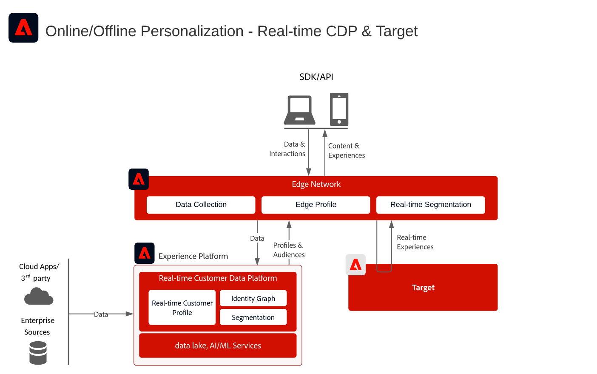
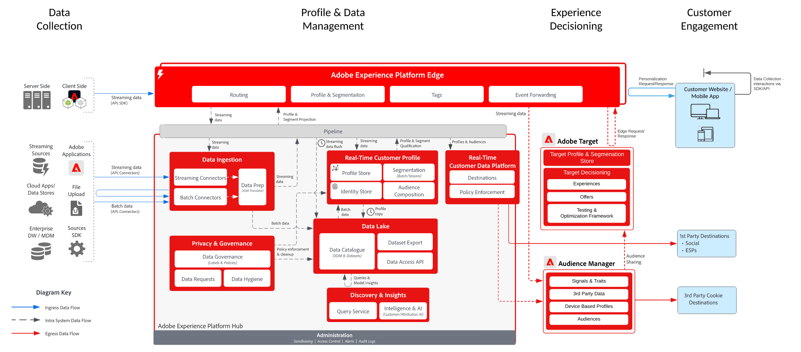

# Personalization client connu avec Target

>[!TIP]
>Ce plan directeur est également disponible en tant que [&#x200B; modèle de cas d’utilisation &#x200B;](/help/blueprints/use-case-patterns/personalization/audience-sharing-with-target.md) sous Personalization.

## Cas d’utilisation

* Personnalisation en ligne avec des données client connu
* Optimisation de la page de destination
* Personnalisation en fonction des vues précédentes de produit ou de contenu, de l’affinité produit/contenu, des attributs environnementaux et des données démographiques, en plus des informations hors ligne telles que les transactions, les données de fidélité et de gestion de la relation client (CRM), ainsi que des informations modélisées
* Partager et cibler des audiences définies dans Real-time Customer Data Platform sur des sites web et des applications mobiles à l’aide d’Adobe Target

## Applications

* [!UICONTROL Real-time Customer Data Platform]
* Adobe Target

### Documentation de référence

* [Connexion Adobe Target pour Real-time Customer Data Platform](https://experienceleague.adobe.com/docs/experience-platform/destinations/catalog/personalization/adobe-target-connection.html?lang=fr)
* [Configuration du flux de données Edge](https://experienceleague.adobe.com/docs/experience-platform/edge/fundamentals/datastreams.html?lang=fr)

## Modèles d’intégration

| Motif d’intégration | Fonctionnalité | Conditions préalables |
|--------------------|------------|---------------|
| **Évaluation des segments en temps réel sur Edge, partagée de Real-time Customer Data Platform vers Target** | - Évaluez les audiences en temps réel pour la personnalisation de la même page ou de la page suivante sur Edge.  - Tous les segments évalués en flux continu ou par lots seront également projetés dans Edge Network pour être inclus dans l’évaluation et la personnalisation des segments Edge. | - Web/Mobile SDK doit être implémenté pour l’API Edge Network Server.  - Le flux de données doit être configuré dans Experience Edge avec l’extension Target et Experience Platform activée.  - La destination cible doit être configurée dans les destinations Real-time Customer Data Platform.  - L’intégration à Target requiert la même organisation IMS que pour l’instance Experience Platform. |
| **Partage d’audiences par lots et en flux continu depuis Real-time Customer Data Platform vers Target via l’approche Edge** | - Partagez des audiences en continu et par lots à partir de Real-time Customer Data Platform vers Target par le biais d’Edge Network.  - Les audiences évaluées en temps réel nécessitent l’implémentation de Web SDK et d’Edge Network. | - L’implémentation de l’API Web/Mobile SDK ou Edge de Target n’est pas nécessaire pour partager des audiences RTCDP en flux continu et par lots vers Target, mais elle est nécessaire pour permettre l’évaluation des segments Edge en temps réel.  - Si vous utilisez AT.js, seule la recherche de profil par rapport à l’ECID est prise en charge.  - Pour les recherches d’espace de noms d’identité personnalisées sur Edge, le déploiement de l’API Web SDK/Edge est obligatoire et chaque identité doit être définie comme identité dans le mappage d’identités.  - La destination cible doit être configurée dans les destinations de Real-time Customer Data Platform. Seul le sandbox de production par défaut dans RTCDP est pris en charge.  - L’intégration à Target requiert la même organisation IMS que pour l’instance Experience Platform. |
| **Partage d’audiences par lots et en flux continu depuis Real-time Customer Data Platform vers Target et Audience Manager via l’approche du service de partage d’audience** | - Ce modèle d’intégration peut être utilisé lorsque vous souhaitez un enrichissement supplémentaire à partir de données et d’audiences tierces dans Audience Manager. | - Le SDK web/mobile n’est pas nécessaire pour partager des audiences par lots et en flux continu avec Target, mais il est nécessaire pour activer l’évaluation des segments Edge en temps réel.  - Si vous utilisez AT.js, seule la recherche de profil par rapport à l’ECID est prise en charge.  - Pour les recherches d’espace de noms d’identité personnalisées sur Edge, le déploiement de l’API Web SDK/Edge est obligatoire et chaque identité doit être définie comme identité dans le mappage d’identités.  - La projection d’audience via le service de partage d’audience doit être configurée.  - L’intégration à Target requiert la même organisation IMS que pour l’instance Experience Platform.  - Seules les audiences du sandbox de production par défaut prennent en charge le service principal de partage d’audiences. |

## Partage d’audiences en temps réel, en flux continu et par lots vers Adobe Target

Architecture

Détails de la séquence

Architecture d’aperçu

## Documentation connexe

### Documentation du SDK

* [Documentation Experience Platform Web SDK](https://experienceleague.adobe.com/docs/experience-platform/edge/home.html?lang=fr)
* [Documentation Experience Platform Tags](https://experienceleague.adobe.com/docs/experience-platform/tags/home.html?lang=fr)
* [Documentation du service Experience Cloud ID](https://experienceleague.adobe.com/docs/id-service/using/home.html?lang=fr)

### Documentation sur la segmentation

* [Présentation de la segmentation Experience Platform](https://experienceleague.adobe.com/docs/experience-platform/segmentation/home.html?lang=fr)
* [Segmentation en temps réel](https://experienceleague.adobe.com/docs/experience-platform/segmentation/ui/edge-segmentation.html?lang=fr)
* [Segmentation par flux](https://experienceleague.adobe.com/docs/experience-platform/segmentation/api/streaming-segmentation.html?lang=fr)
* [Partage de segments Adobe Analytics via Adobe Audience Manager](https://experienceleague.adobe.com/docs/analytics/components/segmentation/segmentation-workflow/seg-publish.html?lang=fr)
* [Configuration de la politique de fusion](https://experienceleague.adobe.com/docs/experience-platform/profile/merge-policies/ui-guide.html?lang=fr#create-a-merge-policy)

### Tutoriels

* [Personnalisation des accès suivants avec Real-Time CDP et Adobe Target](https://experienceleague.adobe.com/docs/platform-learn/tutorials/experience-cloud/next-hit-personalization.html?lang=fr)
