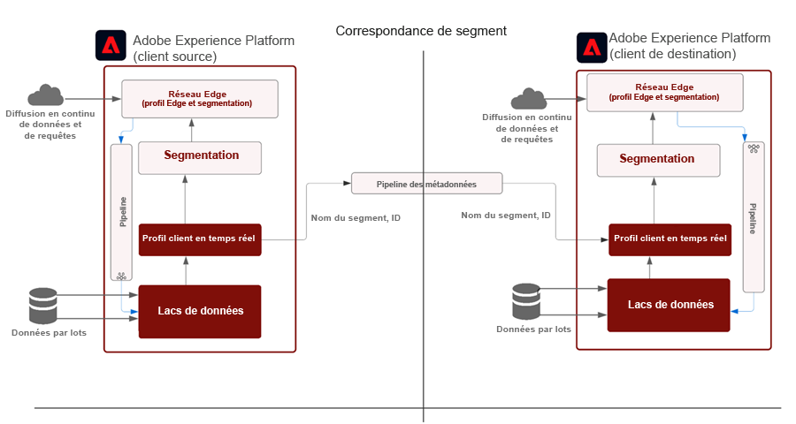
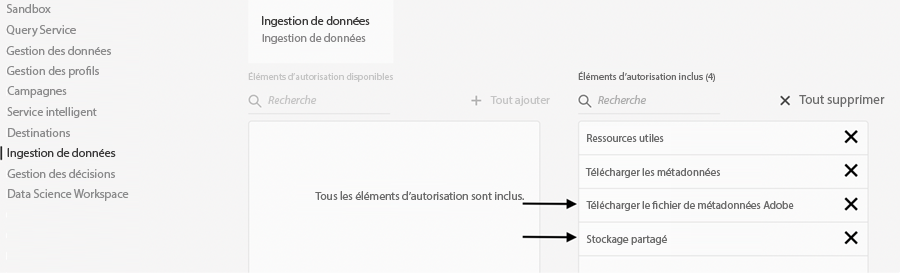
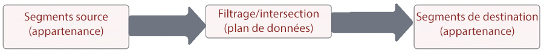
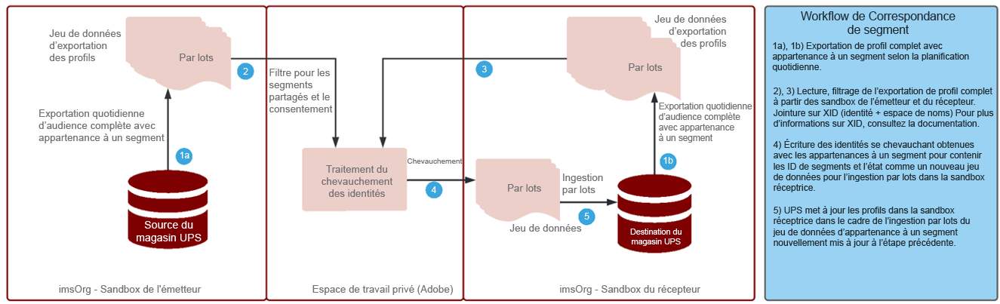

# Plan directeur de la correspondance de segments

La correspondance de segments permet aux marques partenaires de partager des audiences entre leurs environnements Experience Platform respectifs. L’essentiel pour les marques est d’interagir avec les clients en fonction des données collectées à partir de leurs relations directes avec les consommateurs. Grâce à de meilleurs systèmes de gouvernance, d’autorisations et de gestion des préférences, les marketeurs peuvent améliorer davantage leurs audiences authentifiées propriétaires par des partenaires clés.

Le service [!UICONTROL Correspondance de segment] est un service de collaboration en matière de données qui permet aux clients Experience Platform (AEP) (appelés _partenaires_) d’échanger des données de segment selon des identifiants de secteur communs d’une manière sécurisée, régie et respectueuse de la vie privée.

Le service permet aux clients d’identifier en toute sécurité et de manière neutre les identifiants correspondants sans avoir à dévoiler l’intégralité de leur base de données. Les partenaires ne reçoivent que des attributs désignés (nom de segment) pour les identifiants qui se chevauchent, ce qui permet un partage plus rapide et plus facile d’une manière contrôlable et régie par le consentement.

Le service [!UICONTROL Correspondance de segment] utilise la gouvernance des données AEP et le cadre de consentement comme épine dorsale. Il est disponible pour tous les clients B2C et B2P Real-time Customer Data Platform. Les fonctionnalités clés du service [!UICONTROL [!UICONTROL Correspondance de segment]] sont les suivantes :

* Partage de segments pour les clients consentants qui se chevauchent
* Rapports sur le chevauchement avant le partage pour avoir un aperçu du volume de correspondances estimé
* Politique DULE entièrement intégrée et application des autorisations
* Épine dorsale du cadre de consentement au partage des données
* Flux de données pour l’organisation des segments et des partenaires

## Applications

Marque vers éditeur :

L’obsolescence des cookies tiers et des données d’ID de publicité mobile a le plus d’impact sur le « cas pratique de l’éditeur ». Ce cas pratique a un impact majeur sur le secteur des médias et du divertissement, dont le modèle commercial repose sur la vente de publicité. Le service [!UICONTROL Correspondance de segment] est une voie pour les éditeurs disposant de vastes audiences propriétaires qui souhaitent collaborer directement avec leurs annonceurs. Les annonceurs peuvent collaborer directement avec les éditeurs pour faire de la publicité auprès d’audiences correspondantes sur les propriétés des éditeurs pour des campagnes de ciblage ou de prospection granulaires.

### Marque à marque

Les parcours des consommateurs ne sont jamais linéaires. Par exemple, un client peut être fidèle à une compagnie aérienne et à la société émettrice de sa carte de crédit. En utilisant le service [!UICONTROL Correspondance de segment], la compagnie aérienne et la société de cartes de crédit peuvent créer un partenariat de données pour comprendre les audiences qui se chevauchent, puis personnaliser les expériences pour les clients fidèles de chacune des entreprises.

### Unité commerciale à unité commerciale

Les multinationales doivent relever le défi de la collaboration en matière de données entre des unités commerciales indépendantes. Il n’est pas toujours possible de regrouper les données dans une seule sandbox en raison de la diversité des politiques de protection de la vie privée, des acquisitions ou de la gestion des autorisations entre les unités commerciales.

Le service [!UICONTROL Correspondance de segment] permet aux équipes marketing disparates des grandes entreprises de collaborer plus efficacement, tout en continuant à fonctionner de manière indépendante.

## Architecture

{zoomable=&quot;yes&quot;}

Le service [!UICONTROL Correspondance de segment] n’est pas une place de marché de données où les données peuvent être achetées. Il s’agit plutôt d’une fonctionnalité AEP qui fonctionne avec des données propriétaires et des partenaires sélectionnés, en utilisant des contrôles de confidentialité et de consentement pour faciliter la collaboration. Le service [!UICONTROL Correspondance de segment] permet de concentrer les efforts sur l’amélioration des relations avec les clients et le développement de la marque. Il est bénéfique est bénéfique lorsqu’il existe des marques ou des relations de partenariat préexistantes. L’expérience [!UICONTROL Correspondance de segment] est facile à gérer, évolutive et permet aux administrateurs de partager des segments de manière consentie et contrôlable.

Le service [!UICONTROL Correspondance de segment] offre les avantages suivants :

* Transfert en toute sécurité des données d’appartenance à un segment d’une organisation à une autre à l’aide d’identifiants de personnes standard, tels que l’adresse e-mail hachée ou le numéro de téléphone haché.
* Interface utilisateur de partage d’audience et workflows avec notifications
* Estimations de chevauchement prépartagées
* Configuration des partenaires en libre-service
* Chevauchements sur certains espaces de noms normalisés (adresse e-mail hachée, téléphone haché, ECID, IDFA, GAID)
* Application du consentement au partage des données
* Gestion du cycle de vie des audiences partagées
* Application de DULE dans le processus de partage
* Mises à jour par lots quotidiennes

Le service [!UICONTROL Correspondance de segment] permet de créer une expérience client interconnectée. Les identifiants durables pris en charge sont les adresses e-mail hachées, les numéros de téléphone hachés et les identifiants comme ECID, IDFA et GAID. Les clients peuvent créer des flux qui correspondent aux données d’audience et les déplacent entre les sandbox des marques, avec de fortes capacités de gouvernance, de transparence et de révocation pour une utilisation dans les activités publicitaires et marketing.

## Conditions préalables

Les conditions préalables pour le service [!UICONTROL Correspondance de segment] sont les suivantes :

* RT-CDP actif sous licence
* Les identifiants hachés standard pris en charge sont les adresses e-mail hachées SHA256, numéros de téléphone hachés, ECID, Apple IDFA et GAID
* Cadre de confidentialité et stratégie de consentement
* Accords de partage de données en place entre les clients

## Sécurité

### RBAC

Le flux de gestion des partenaires du service [!UICONTROL Correspondance de segment] est sécurisé par RBAC. Seules les personnes disposant des autorisations adéquates peuvent initier, accepter ou gérer des partenaires. Cette opération peut être effectuée dans la section Ingestion de données du profil de produit. Les autorisations suivantes sont requises :

{zoomable=&quot;yes&quot;}

| Autorisation | Description |
|---|---|
| **Gérer les connexions du partage d’audience** | Cette autorisation vous permet d’effectuer le processus d’établissement de liaison avec les partenaires, qui connecte deux organisations IMS pour permettre les flux du service [!UICONTROL Correspondance de segment]. |
| **Gérer les partages d’audience** | Cette autorisation vous permet de créer, de modifier et de publier des flux (le package de données utilisé pour le service [!UICONTROL Correspondance de segment]) avec des partenaires actifs (partenaires qui ont été connectés par l’utilisateur administrateur avec l’accès **Connexions du partage d’audience**). |

Pour en savoir plus sur les autorisations, consultez la [documentation officielle](https://experienceleague.adobe.com/docs/experience-platform/segmentation/ui/segment-match/overview.html?lang=fr#understanding-segment-match-permissions).

### Connect ID

Le processus de connexion des partenaires est géré par le **[!UICONTROL Connect ID],** qui est un identifiant généré de manière aléatoire correspondant à une sandbox AEP spécifique. Cet identifiant Connect ID est nécessaire pour lancer et gérer les sandbox des partenaires. Il est également possible de générer à nouveau l’identifiant Connect ID pour reconfigurer une connexion de partenaire, si nécessaire.

### Gouvernance

Tout jeu de données ou attribut de données associé au libellé de contrat *C11* est limité pour le service [!UICONTROL Correspondance de segment]. Les segments utilisant ces attributs ne peuvent pas être utilisés pour le service [!UICONTROL Correspondance de segment]. Vous pouvez ainsi contrôler les segments qui peuvent ou ne peuvent pas être utilisés pour le service [!UICONTROL Correspondance de segment]. En outre, les politiques personnalisées et les actions marketing créées sont également appliquées. Par défaut, les politiques sont désactivées et doivent être activées pour être appliquées. Les restrictions telles que le marketing par e-mail et la publicité sur site qui sont sélectionnées lors du partage des segments sont également propagées et partagées avec les partenaires.

### Consentement

Les paramètres de consentement pour le service [!UICONTROL Correspondance de segment] peuvent être gérés de la manière suivante :

* Au niveau de l’organisation, lors de l’intégration, en utilisant le paramètre d’exclusion ou d’inclusion pour les vérifications de consentement.

   Ce paramètre détermine si les données de l’utilisateur peuvent être partagées ou non. La valeur par défaut est définie sur exclusion, ce qui indique que les données de l’utilisateur peuvent être partagées en supposant que le client AEP possède déjà le consentement requis pour l’utilisation du partage de données. Ce paramètre peut être changé en inclusion en contactant le gestionnaire de compte Adobe et en mettant en place un contrôle supplémentaire pour forcer les clients AEP à suivre explicitement le consentement.

* En définissant l’attribut de partage spécifique aux identités (idSpecific) à l’aide de [Groupe de champs Consentements et Préférences](https://experienceleague.adobe.com/docs/experience-platform/xdm/field-groups/profile/consents.html?lang=fr).

   Ce groupe de champs fournit un champ de type objet unique, consentements, pour capturer les informations de consentement et de préférence. Par défaut, le service [!UICONTROL Correspondance de segment] inclut toutes les identités qui n’ont pas été explicitement exclues, par exemple :

   ```
   "share": {
   `                `"val": "n"
   `     `}
   ```

   Ce paramètre peut être modifié en contactant le gestionnaire de compte Adobe afin d’inclure uniquement les identités avec inclusion explicite, par exemple :

   ```
   "share": {
   `                `"val": "y"
   `     `}
   ```

### Alertes

Des alertes sont générées lorsqu’une connexion avec un partenaire est lancée ou lorsque des flux de segments sont partagés avec des partenaires.

## Workflow de configuration

Le workflow de configuration de la connexion des partenaires est géré avec RBAC, comme mentionné ci-dessus. Une fois les autorisations appropriées en place, la connexion à la sandbox d’un partenaire requiert l’identifiant Connect ID de cette sandbox/instance au sein de l’organisation du partenaire en vue du partage.

Une fois qu’une connexion est demandée par le partenaire émetteur, elle doit être approuvée par le récepteur afin de garantir une configuration sûre et sécurisée du partenaire. L’établissement d’une liaison avec le partenaire garantit l’existence d’un accord entre les deux organisations et permet à Adobe de faciliter le processus de [!UICONTROL Correspondance de segment] au nom de l’organisation. Une fois la connexion approuvée et dans un état actif, le processus de partage de segments peut être lancé de part et d’autre.

### Partage de segments

Le partage de segments avec le partenaire ne s’effectue que lorsqu’il existe une correspondance avec l’identifiant sélectionné. Il peut y avoir une relation de partenaire de type « un à plusieurs », ce qui signifie que les segments peuvent être partagés avec plusieurs partenaires.

Pour lancer le partage de segments une fois la connexion du partenaire configurée, le partenaire émetteur doit créer un flux. Il doit ensuite sélectionner les cas pratiques ou les actions marketing dont les données de segment doivent être exclues, ainsi que les identifiants durables. Les segments pertinents peuvent ensuite être ajoutés au flux pour le partage.

Dans le cadre de ce workflow de partage de segments, le partenaire émetteur peut découvrir des segments à forte valeur ajoutée potentielle par le biais des chevauchements estimés avant tout transfert de données.

Le flux du processus global est le suivant :

{zoomable=&quot;yes&quot;}

Ces estimations de chevauchement offrent des informations clés, la découverte de partenaires et des données pour alimenter les accords de collaboration en matière de données. Aucune donnée sur les clients ou les segments n’est déplacée d’une sandbox vers une autre pour obtenir ces mesures d’estimation de chevauchement. Les identités applicables sélectionnées par le client et préhachées dans une sandbox donnée sont ajoutées à une structure de données probabiliste qui permet à Adobe d’effectuer des opérations d’union et d’intersection entre elles. Ces opérations permettent au service [!UICONTROL Correspondance de segment] d’obtenir l’intersection estimée de deux structures de données composées d’identités provenant de deux sandbox différentes sans avoir à comparer les valeurs réelles.

Le processus de chevauchement d’identités dépend du jeu de données d’**exportation quotidienne de profil complet** des sandbox de l’émetteur et du récepteur afin d’identifier les profils communs qui appartiennent aux segments partagés. Le flux détaillé du processus de chevauchement est illustré ci-dessous :

{zoomable=&quot;yes&quot;}

Une fois le partage de segments terminé par le partenaire émetteur, le partenaire récepteur reçoit une notification sur le flux de segments partagé. Ce flux de segments doit être activé pour le profil au niveau du récepteur pour lancer le flux de données d’appartenance à un segment. Seule l’appartenance à un segment est ingérée dans les fragments de profil se chevauchant de l’organisation IMS réceptrice et aucune identité supplémentaire n’est transférée de l’émetteur vers le récepteur.

Le segment partagé est disponible dans la section `AEPSegmentMatch` de l’onglet **[!UICONTROL Audiences]** du **[!UICONTROL Créateur de segments]** et peut être utilisé pour l’inclusion ou la suppression d’audiences lors de la création de segments dans la sandbox réceptrice.

Le processus de chevauchement quotidien maintient l’appartenance à un segment synchronisé entre l’émetteur et le récepteur. Le récepteur peut désactiver le profil du flux de segments reçu pour suspendre le processus de partage de segments.

#### Sortie/entrée de segment

Dans le cadre de l’exportation de profils complets, l’état des ID de segments partagés sous l’appartenance à un segment pour les profils a l’une des valeurs correspondantes : _realized_, _exited_ ou _existing_ pour refléter l’état actuel.

Pendant le processus quotidien de chevauchement des identités, si une identité correspondante existe dans la sandbox réceptrice, ces états d’appartenance à un segment pour les segments partagés sont envoyés au récepteur pour être ingérés.

#### Révocation de segments

La révocation/suppression de segments par l’émetteur est un processus à la demande où la liste de tous les profils avec les ID de segments révoqués est obtenue du récepteur. Les ID de segments sont supprimés de l’appartenance à un segment de ces identités et réingérés par le récepteur. Cette action remplace le fragment d’appartenance à un segment existant, ce qui supprime l’adhésion pour ce segment.

## Informations supplémentaires

* [Correspondance de segment](https://experienceleague.adobe.com/docs/experience-platform/segmentation/ui/segment-match/overview.html?lang=fr#)
* [Autorisations](https://experienceleague.adobe.com/docs/experience-platform/access-control/home.html?lang=fr)
* [Résolution des problèmes](https://experienceleague.adobe.com/docs/experience-platform/segmentation/ui/segment-match/troubleshooting.html?lang=fr)
* [XID](https://experienceleague.adobe.com/docs/experience-platform/identity/api/list-native-id.html?lang=fr)
