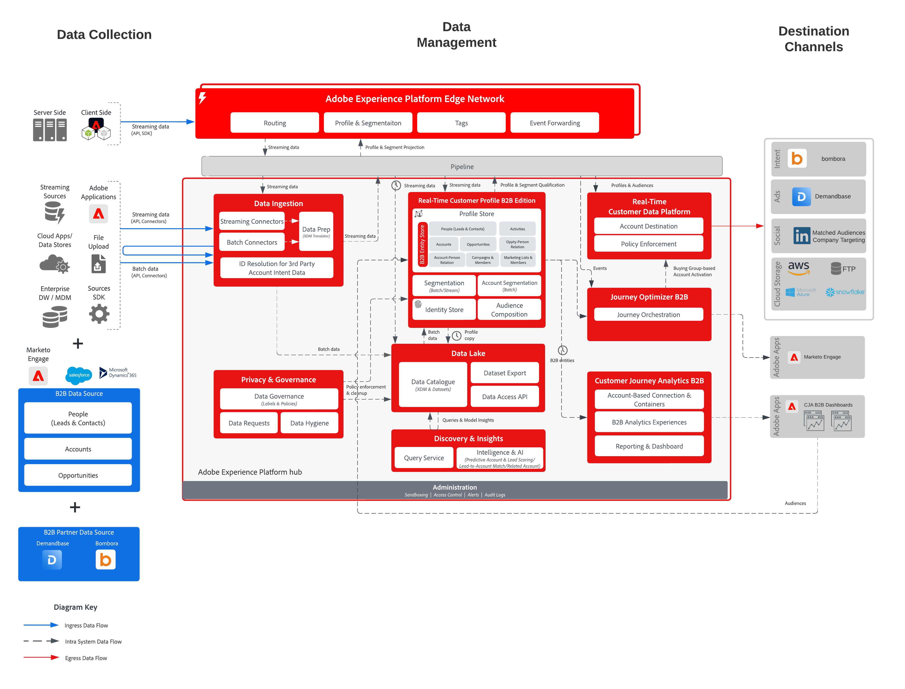

# Activation du compte B2B vers des destinations publicitaires et des destinations de fichiers

L’engagement basé sur les comptes permet aux spécialistes du marketing B2B de créer des audiences de comptes (listes de sociétés) dans **Real-Time Customer Data Platform B2B edition** et d’activer ces audiences de comptes vers des destinations publicitaires telles que LinkedIn Matched Audiences, Bombora et Demandbase, ainsi que vers des destinations d’espace de stockage dans le cloud. Ces audiences de compte peuvent être utilisées pour le ciblage, la portée des ventes et les analyses en aval.

## Cas d’utilisation

Grâce à l’engagement basé sur les comptes, les spécialistes marketing peuvent déverrouiller trois cas d’utilisation clés :

- **Combler les lacunes du groupe d’achat :** un spécialiste marketing peut faire de la publicité pour des comptes où il n’a pas encore de contacts pour les rôles de directeur marketing ou de directeur informatique. Ils peuvent d’abord créer une audience de comptes sans contact avec le titre « CMO » ou « CIO », puis activer l’audience sur les audiences correspondantes LinkedIn ou d’autres destinations publicitaires prises en charge. Au sein de la destination, ils peuvent ensuite lancer une campagne ciblant cette audience et des personnes spécifiques avec des titres de poste « CMO » ou « CIO » pour atteindre ces nouveaux contacts et mettre en évidence les avantages de leurs offres.
- **Vente incitative ou croisée à d’autres divisions d’une société qui est un client existant :** un spécialiste marketing peut créer une audience de compte qui a acheté le produit X il y a entre 3 et 9 mois, mais qui ne possède pas encore le produit Y. Ils peuvent ensuite activer cette audience de compte, en soulignant les avantages du produit Y pour cette audience cible via les audiences correspondantes LinkedIn, d’autres plateformes publicitaires ou des exportations de stockage dans le cloud pour les ventes et la sensibilisation marketing.
- **Cibler les entreprises qui utilisent des produits concurrents :** un spécialiste marketing peut commercialiser sur des comptes pour remplacer les produits d’un concurrent, même s’il n’a aucun contact sur ces comptes. Ils peuvent créer une audience de comptes basée sur les données de partenaire ou d’intention indiquant la propriété ou l’utilisation du produit d’un concurrent, puis l’activer via les audiences correspondantes LinkedIn ou d’autres destinations publicitaires prises en charge pour trouver des contacts auprès des comptes cibles en vue de leur expansion.

## Applications

- Real-Time Customer Data Platform B2B edition
- (Facultatif) Customer Journey Analytics B2B edition

## Modèles d’intégration

Les modèles d’intégration standard de ce plan directeur incluent :

- **Engagement B2B et sources CRM → → les audiences → destinations de compte RTCDP B2B edition**

  L’engagement B2B et les systèmes CRM tels que Marketo Engage, Salesforce et Microsoft Dynamics envoient des prospects/contacts, des comptes et des opportunités dans **Real-Time CDP B2B edition** à l’aide des schémas et des relations B2B standard. Les audiences de compte sont créées sur ce modèle de données B2B unifié et activées pour les destinations publicitaires et de fichiers.

- **Sources d’intention et d’événement B2B → → audiences → destinations de compte RTCDP B2B edition**

  Les sources d’intention et d’événement B2B telles que l’intention de Bombora et l’intention de Demandbase envoient les événements d’intention et d’engagement dans Experience Platform. Ces jeux de données sont mappés aux schémas B2B standard, ce qui permet aux spécialistes marketing de créer des audiences de compte (par exemple, des comptes qui font un bond sur les sujets concurrents) et de les activer vers des destinations de publicité et de stockage dans le cloud. Les audiences de compte peuvent ensuite être activées pour les partenaires publicitaires tels que Bombora et Demandbase, le cas échéant.

## Architecture

## Destinations d’audience de compte

- **Audiences correspondantes LinkedIn**
- **Bombora**
- **Demandbase**
- **Destinations de stockage dans le cloud**
  - Azure Data Lake Storage Gen2
  - Zone de destination des données
  - SFTP
  - Azure Blob
  - AWS S3

Consultez la documentation sur les destinations pour obtenir la dernière liste des destinations qui prennent en charge les audiences de compte.

## Garde-fous

Reportez-vous aux mécanismes de sécurisation suivants lors de la conception et de l’activation des audiences de compte :

- [Mécanismes de sécurisation pour Real-Time Customer Data Platform B2B edition](https://experienceleague.adobe.com/en/docs/experience-platform/rtcdp/intro/rtcdpb2b-intro/b2b-guardrails?lang=en)
- [Audiences de compte](https://experienceleague.adobe.com/en/docs/experience-platform/segmentation/ui/account-audiences?lang=en)
- [Activer les audiences de compte](https://experienceleague.adobe.com/en/docs/experience-platform/destinations/ui/activate/activate-account-audiences?lang=en)
- [Mécanismes de sécurisation des profils et de la segmentation](https://experienceleague.adobe.com/en/docs/experience-platform/profile/guardrails)
- [Mise à jour des critères d’éligibilité de la segmentation en flux continu](https://experienceleague.adobe.com/en/docs/experience-platform/segmentation/eligibility-criteria-update)

## Étapes d’implémentation de Real-Time Customer Data Platform B2B edition, création et activation d’une audience de compte

- Pour connaître les étapes d’implémentation de Real-Time Customer Data Platform B2B edition, consultez la documentation : [Prise en main de Real-Time Customer Data Platform B2B edition](https://experienceleague.adobe.com/en/docs/experience-platform/rtcdp/intro/rtcdpb2b-intro/b2b-tutorial?lang=en).
- Pour connaître les étapes de création d’une audience de compte, consultez la documentation [Audiences de compte](https://experienceleague.adobe.com/en/docs/experience-platform/segmentation/ui/account-audiences?lang=en).
- Pour connaître les étapes d’activation des audiences de compte, consultez la documentation [&#x200B; Activer les audiences de compte &#x200B;](https://experienceleague.adobe.com/en/docs/experience-platform/destinations/ui/activate/activate-account-audiences?lang=en) :

  - Mappage obligatoire pour la [destination LinkedIn Matched Audiences](https://experienceleague.adobe.com/en/docs/experience-platform/destinations/ui/activate/activate-account-audiences?lang=en#required-mappings).

## Considérations relatives à la mise en œuvre

Les audiences correspondantes LinkedIn ont une taille minimale requise pour l’audience (par exemple, 300 membres correspondants). Si l’audience de compte activée pour les audiences appariées LinkedIn ne répond pas à cette exigence, vous devrez peut-être élargir la définition de l’audience pour augmenter la taille de l’audience appariable avant de lancer une campagne.

## Documentation connexe

- [Plan directeur d’activation des audiences et des profils B2B](b2bactivation.md) — Plan directeur parent couvrant l’activation B2B au niveau des personnes et des comptes.
- [B2B edition de Real-Time Customer Data Platform](https://experienceleague.adobe.com/en/docs/experience-platform/rtcdp/intro/rtcdpb2b-intro/b2b-overview?lang=en)
- [Créer et activer une audience de compte - tutoriel vidéo](https://experienceleague.adobe.com/en/docs/platform-learn/tutorials/audiences/create-audiences-with-b2b-data?lang=en)
- [Créer des audiences de compte](https://experienceleague.adobe.com/en/docs/experience-platform/segmentation/ui/account-audiences?lang=en)
- [Activer les audiences de compte](https://experienceleague.adobe.com/en/docs/experience-platform/destinations/ui/activate/activate-account-audiences?lang=en)
- [Adobe Experience Platform - Connecteur de destination LinkedIn](https://experienceleague.adobe.com/en/docs/experience-platform/destinations/catalog/social/linkedin?lang=en)
- [Schémas dans Real-Time CDP B2B edition](https://experienceleague.adobe.com/en/docs/experience-platform/rtcdp/schemas/b2b)
- [Mises à niveau de l’architecture vers Real-Time CDP B2B edition](https://experienceleague.adobe.com/en/docs/experience-platform/rtcdp/intro/rtcdpb2b-intro/b2b-architecture-upgrade)
- [Garde-fous de destination](https://experienceleague.adobe.com/en/docs/experience-platform/destinations/guardrails)
