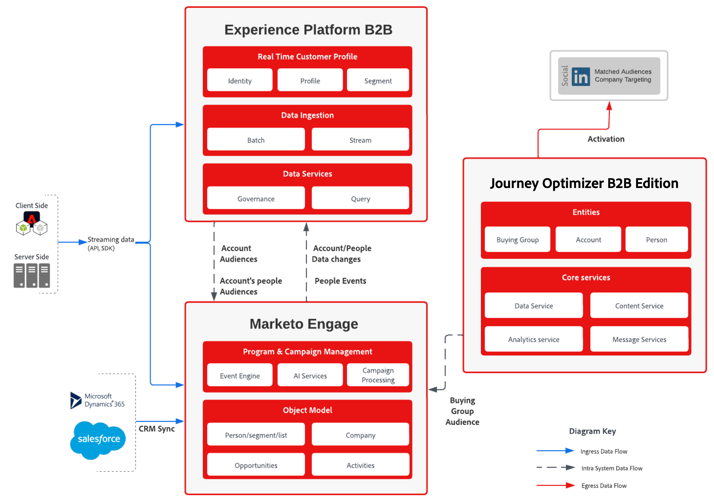

# Plan directeur Marketing et gestion des Parcours basés sur les groupes d’achat

Les équipes marketing sont actuellement confrontées à de nombreux défis en ce qui concerne la fourniture de pistes qualifiées par les équipes commerciales. L&#39;un de ces défis est de travailler avec les personnes appropriées de l&#39;organisation et est généralement évident en termes d&#39;effort et d&#39;exactitude. Avec _score de piste_, le groupe est trop étroit et les équipes peuvent manquer les bonnes personnes. Avec la _notation de compte_, un effort plus important est nécessaire pour identifier la bonne personne avec une vue aussi large d’un compte.

C&#39;est là que le concept de **_groupe d&#39;achat_** est introduit. Un groupe d’achat permet aux marketeurs de trouver le bon groupe de personnes dans le compte et de travailler avec ces personnes à travers le prisme de la qualification des pistes et de l’identification de leur rôle dans le groupe.

## Utilisation des groupes d’achat pour qualifier les prospects et les comptes

La création et les efforts visant à compléter un groupe d’achat accroissent l’efficacité de l’activité marketing dans la qualification des prospects aux opportunités de vente. Les groupes d’achat dépendent des prospects correspondants pour des modèles de rôles liés à l’intention de la solution.

Un exemple de groupe d’achat peut être _Acme Corp Seeds Buying Group_, qui a un intérêt de solution de _AI Driven Seeds_.

Les groupes d’achats représentent un groupe de personnes de l’entreprise qui s’intéressent à une solution par le biais d’une intention de solution. Et un groupe d’achat peut être identifié pour plusieurs centres d’intérêt de solution et les individus apparaissent dans plusieurs groupes d’achat.

Grâce aux nouvelles fonctionnalités B2B fournies par Journey Optimizer B2B edition, vous pouvez à présent relever ces défis :

* Absence de campagnes marketing _customer-first_.
* Conversion de piste qualifiée (MQL) en piste qualifiée de vente incohérente (SQL), nécessitant un alignement des initiatives avec les ventes pour alimenter MQL
* Absence de mécanisme vendable pour identifier et cibler des comptes _concurrent_.
* Risque de concentration dans les recettes et le pipeline.

Les indicateurs de performance clés suivants correspondent parfaitement à la mesure du succès des cas d’utilisation :

* **Sensibilisation** : les clients cibles voient-ils vos publicités et cela les conduit-ils à un taux plus élevé qu’auparavant sur votre site web ?
* **Engagement** : les clients cibles qui se rendent sur votre site web et qui s’impliquent dans le contenu ?
* **Temps** : combien de temps faut-il à l’équipe de vente pour trouver et ajouter des contacts de divers outils à l’opportunité ?
* **Cost** : Combien coûte chaque prospect sur chaque plateforme ?

## Marketing basé sur les comptes

Un cas d’utilisation courant, et l’objectif de ce plan directeur, est une initiative marketing basée sur un compte. Ce cas d’utilisation explore le point où votre groupe d’achats créé est renseigné avec un prospect lorsqu’il est associé à un rôle et à un intérêt de solution.

Lorsque vous dirigez une personne via le parcours, vous collectez plus d’informations sur le prospect (processus de groupe d’achat), par le biais de formulaires, de synchronisation CRM et d’activation de LinkedIn.

Lorsqu’un prospect indique clairement l’intérêt de la solution, il indique un événement commercial défini par un objectif commercial. A ce stade, l&#39;entreprise est persuadée que cette piste est vraiment intéressée par un produit. Dans Journey Optimizer B2B edition, le prospect est associé à un groupe d’achat pour cette solution dans un modèle de rôles (comme les influenceurs, les décideurs, les champions et les sponsors).

Comme l’illustre le diagramme suivant, vous pouvez collecter des détails dans les formulaires ou par le biais de l’activation de LinkedIn et déterminer l’intention d’une solution lors de l’interaction avec un robot de discussion.

{zoomable="yes"}

Lorsque le pourcentage d’achat est suffisamment élevé, vous partagez le groupe avec l’équipe des ventes via SQL ou un SOL pour convertir les pistes du compte en vente terminée.

## Solution axée sur le compte

La gestion des pistes B2B est axée sur les comptes et leurs pistes. La couche technique est configurée pour prendre en charge les données qui représentent ces caractéristiques, ce qui est une exigence pour une segmentation de compte et une gestion des parcours réussie.

### Conditions

La solution axée sur les comptes nécessite les applications et services suivants :

* Adobe Journey Optimizer B2B edition
* Adobe Real-time Customer Data Platform (RTCDP) B2B edition
* Adobe Marketo Engage

>[!NOTE]
>
>L’obtention de licences pour Journey Optimizer B2B edition doit inclure les éléments suivants :
><ul><li>Instance B2B edition Journey Optimizer connectée à l’Experience Platform B2B</li><li>Instance de Marketo Engage synchronisée avec RTCDP</li></ul>
&gt; 
&gt;Pour les clients Marketo Engage existants, une connexion à l’instance existante est l’approche recommandée.
&gt;  
&gt;D’autres extensions sont disponibles pour la solution afin d’améliorer la richesse des profils :
&gt;<ul><li>Sources supplémentaires vers la plateforme RTCDP pour enrichir le profil</li><li>Destination RTCDP vers Marketo Engage</li></ul>

La mise en oeuvre de cette solution nécessite également une compréhension claire du concept de _compte_ et de _groupe d’achats_, ainsi que de la manière dont ils amplifient et accélèrent votre qualification de piste de vente. Grâce à cette compréhension, vous devez également identifier le score d’exhaustivité de groupe d’achats souhaité.

### Architecture

{zoomable="yes"}

### Schéma de données

Dans toute mise en oeuvre de l’automatisation du marketing axée sur les données, la conception des schémas est essentielle au succès de la mise en oeuvre. Avant de concevoir votre schéma, passez en revue les [espaces de noms et schémas B2B](https://experienceleague.adobe.com/en/docs/experience-platform/sources/connectors/adobe-applications/marketo/marketo-namespaces) et assurez-vous de bien comprendre l’utilitaire de génération automatique disponible pour générer un nouveau schéma dans un nouveau scénario d’implémentation.

Les schémas sont spécifiquement enrichis avec des éléments de données B2B afin de prendre en charge la relation riche dans les profils et d’inclure la perspective de compte par le biais de l’ `sourceKey` pour lier les événements et les profils au schéma de compte. Les schémas sont une représentation des exigences de votre organisation, ainsi que des données collectées et profilées. Pour répondre à ces besoins, les schémas B2B sont flexibles et constituent une extension des éléments B2B requis.

Lors de la conception du schéma de données pour votre organisation, il est recommandé de représenter et d’étiqueter les principales entités de votre ERD avec les entités de haut niveau. (Reportez-vous au premier diagramme de la [documentation sur le schéma RTCDP B2B](https://experienceleague.adobe.com/en/docs/experience-platform/xdm/tutorials/relationship-b2b)). Ce processus est très utile pour comprendre les éléments de données requis que vous devez définir dans chaque schéma.

À ce stade, les événements d’expérience ne sont pas encore en mesure d’influencer les parcours. Outre les schémas d’événement d’expérience, il est recommandé d’ajouter des propriétés au compte qui représentent les décisions importantes en fonction des activités de l’utilisateur. Ces propriétés sont utilisées pour séparer les éléments de chemin dans le concepteur de parcours.

>[!NOTE]
>
>Actuellement, la seule relation prise en charge par Journey Optimizer B2B edition est les relations directes via l’attribut `personComponents[0].sourceAccountKey.sourceKey` sur l’entité `Person`. Une extension future est prévue pour s’adapter à l’objet de relation compte-personne dans le schéma B2b.

### Connecteur source Marketo Engage

Pour enrichir les éléments de données du compte, vous pouvez utiliser Marketo Engage et ses données B2B afin d’enrichir la vue Compte RTCDP et Journey Optimizer B2B edition. La configuration du connecteur Source Marketo Engage et le mappage des données du Marketo Engage sur les attributs de schéma RTCDP permettent aux données d’aller de Marketo Engage à RTCDP, et si elles sont désignées, vers le profil.

Pour plus d’informations sur la configuration du connecteur et le mappage des champs requis sur le schéma, reportez-vous à la [documentation du connecteur Marketo Engage](https://experienceleague.adobe.com/en/docs/experience-platform/sources/connectors/adobe-applications/marketo/marketo).

### Garde-fous

Les barrières de sécurité de Journey Optimizer B2B edition sont détaillées dans la [page de description du produit](https://helpx.adobe.com/legal/product-descriptions/adobe-journey-optimizer-b2b.html).

Barrières de sécurité liées à l’implémentation

* Tous les garde-fous d’audience B2B sont décrits dans le [plan directeur d’activation d’audience B2B et de profil](https://experienceleague.adobe.com/en/docs/blueprints-learn/architecture/architecture-overview/deployment/guardrails) sont directement transposés vers la réussite de Journey Optimizer B2B edition.
* Si l’activation est requise par le biais de canaux de Marketo Engage dans le parcours de compte ou lorsque la synchronisation CRM est utilisée pour enrichir le compte, les [barrières de sécurité liées au Marketo Engage](https://helpx.adobe.com/legal/product-descriptions/adobe-marketo-engage---product-description.html#performance-guardrails) sont pertinentes.

Pour plus d’informations sur les barrières RTCDP, consultez la [documentation sur les protections Real-Time CDP](https://experienceleague.adobe.com/en/docs/experience-platform/rtcdp/guardrails/overview) .

### Attribution des privilèges d’accès

* Toutes les instances doivent se trouver sur la même organisation IMS.
* Une seule instance Journey Optimizer B2B edition peut être liée à un environnement de test Experience Platform.
* Nous vous recommandons vivement de mettre en oeuvre le [connecteur Source Marketo vers Real-time Customer Data Platform](https://experienceleague.adobe.com/en/docs/experience-platform/sources/connectors/adobe-applications/marketo/marketo).

## Implémentation

Les étapes suivantes fournissent des conseils pour activer les groupes d’achat dans votre instance Journey Optimizer B2B edition, y compris l’activation de l’audience pour prendre en charge l’extension de votre base de compte en mettant l’accent sur l’absence de modèles de rôle de groupe d’achat.

### Étapes préalables

1. Définissez le schéma XDM qui va représenter votre vue d’entreprise de comptes et de pistes.

   Dans un premier temps, vous définissez et créez un schéma d’expérience conçu pour répondre aux besoins des cas d’utilisation B2B et couvrant les sources de données, à la fois en temps réel et par lot. Cette conception doit représenter la manière dont l’entreprise conçoit les entités de compte et de personne, ainsi que les cas pratiques que vous souhaitez prendre en charge. Pour que le schéma soit un schéma B2B, il doit suivre les structures disponibles dans la [documentation du schéma B2B RTCDP](https://experienceleague.adobe.com/en/docs/experience-platform/xdm/tutorials/relationship-b2b).

   Une pratique utile consiste à extraire les noms des entités du diagramme et à les identifier dans votre schéma en les étiquetant de la même manière. Notez que certains schémas nécessitent des clés spécifiques, telles que `sourceKey`, pour fonctionner dans RTCDP B2B. À court terme, la relation _Multiple-à-multiple_ entre le compte et la personne par le biais de la relation entre la personne du compte n’est pas prise en charge dans Journey Optimizer B2B. Utilisez les scripts de l’accélérateur pour le meilleur point de départ :

   * Utilisez le [script de création de schéma RTCDP B2B](https://github.com/adobe/experience-platform-postman-samples/tree/master/Postman%20Collections/CDP%20Namespaces%20and%20Schemas%20Utility) pour générer le schéma initial.
   * Ajoutez des champs spécifiques au cas d’utilisation aux schémas générés pour compléter le schéma en fonction des besoins de l’organisation.

   À ce stade, vous disposez de la connexion entre Marketo Engage et RTCDP et la structure du schéma pour accepter les données de compte et de personne afin de renseigner les jeux de données pour les segments de compte. L’étape suivante consiste à connecter RTCDP à Marketo Engage et Journey Optimizer B2B edition.

1. Configurez le connecteur du Marketo Engage, y compris le mappage de Marketo Engage à la structure XDM.

   Une fois la structure et les champs XDM en place, connectez Marketo Engage à la plateforme de données régionale à l’aide du connecteur, qui alimente les jeux de données avec les données de Marketo Engage et de Journey Optimizer B2B. Commencez par organiser le mappage des champs de Marketo Engage aux classes RTCDP. Utilisez les informations de la [documentation sur le connecteur](https://experienceleague.adobe.com/en/docs/experience-platform/sources/connectors/adobe-applications/marketo/marketo#field-mapping-from-marketo-engage-to-xdm) pour identifier les champs que vous souhaitez inclure dans votre mise en oeuvre de Marketo Engage.

### Configuration du groupe d’achats

1. Création d’audiences de compte dans Journey Optimizer B2B edition ou la plateforme RTCDP.

   Activez l’option Planification de toutes les audiences dans la page Audiences → client → Parcourir pour activer les audiences de compte. (Dans les cas où cela ne fonctionne pas, vous devez créer un segment Profil client pour pouvoir activer la création des audiences de compte.)

   Pour créer un segment, suivez les étapes de la [documentation sur les audiences de compte](https://experienceleague.adobe.com/en/docs/journey-optimizer-b2b/user/account-audiences/account-audience-overview). L’utilisation du créateur de segments avec les champs de données que vous avez identifiés comme clés pour l’audience de votre compte serait l’activité clé lors de la définition de l’audience.

   À ce stade, vous savez que le compte mène à la concentration via la plateforme RTCDP et à utiliser pour les blocs de création du groupe d’achat.

1. Définissez le modèle de rôles.

   Dans chaque groupe d’achat, identifiez les rôles représentant le rôle que les individus jouent dans le groupe que vous souhaitez affecter. Par exemple, vous pouvez utiliser _décideur_, _influenceur_ et _champion_. Définissez également le poids et les conditions de ce rôle dans le groupe d’achat.

   La [documentation sur les modèles de rôles](https://experienceleague.adobe.com/en/docs/journey-optimizer-b2b/user/buying-groups/buying-groups-role-templates) décrit ce processus et comment définir des conditions spéciales.

1. Définissez l’intérêt de la solution.

   Un intérêt pour une solution est un moyen d’indiquer la cible d’action des groupes d’achat pour vos activités marketing et votre stratégie.

   Pour définir un intérêt pour une solution, suivez les étapes de la [documentation sur les intérêts de la solution](https://experienceleague.adobe.com/en/docs/journey-optimizer-b2b/user/buying-groups/solution-interests). Gardez à l’esprit que vous l’utilisez pour faire correspondre le groupe d’achat à une initiative de vente de l’entreprise.

1. Configurez le groupe d’achats.

   Les blocs de création du groupe d’achat étant prêts, configurez le groupe d’achat en fonction de l’intérêt de la solution et configurez l’audience du compte avec une cible pour compléter le modèle de rôles avec les membres appropriés du compte. Avec cette configuration, affectez un intérêt de solution au modèle de rôles que vous avez identifié et vous attribuez à chaque rôle un poids dans le succès commercial de ce produit spécifique.

   Pour créer le groupe d’achat, suivez les étapes de la [documentation sur les groupes d’achat](https://experienceleague.adobe.com/en/docs/journey-optimizer-b2b/user/buying-groups/buying-groups-create).

   À ce stade, vous êtes prêt à [créer un parcours](https://experienceleague.adobe.com/en/docs/journey-optimizer-b2b/user/account-journeys/journey-overview#get-started-with-a-journey) et à commencer à travailler avec l’audience du compte pour créer le groupe d’achat et le qualifier pour l’intérêt de la solution.

### Activation de l’audience

Augmentez l’exhaustivité des groupes d’achats grâce à l’activation de l’audience.

1. Définissez une audience de compte mise en correspondance de publicité LinkedIn.

   Outre les activités de remplissage de formulaires et de courriers électroniques, Journey Optimizer B2B edition offre une fonctionnalité de publicité LinkedIn pour augmenter la largeur de votre compte et prendre en charge l’effort visant à compléter un groupe d’achats grâce à l’extension des prospects de compte et à l’augmentation de la portée de vos activités marketing.

   Pour utiliser les médias payants LinkedIn pour communiquer avec les comptes où les groupes d’achat ne sont pas suffisamment terminés ou engagés, développer ou interagir avec l’audience du compte, utilisez la [fonctionnalité Audiences mises en correspondance de compte LinkedIn](https://experienceleague.adobe.com/en/docs/journey-optimizer-b2b/user/account-audiences/linkedin-account-matched-audiences) pour générer des audiences de publicité LinkedIn par le biais d’audiences mises en correspondance de compte.

1. Activez l’audience pour les groupes d’achat.

>[!TIP]
>
>Quelques conseils pour réussir les campagnes :
>
>* Une campagne doit comporter des filtres de rôle pour s’adapter aux groupes d’achat dont les rôles sont manquants afin d’augmenter le retour sur investissement.
>* Pour capturer des pistes, dirigez les pistes vers les formulaires à remplir (formulaires LinkedIn ou Marketo Engage) et reciblez les pertes de formulaire.
