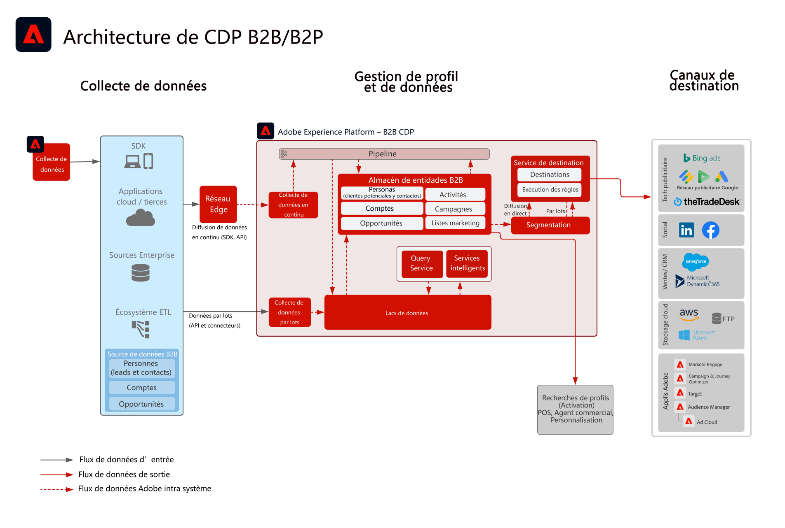

# Audience B2B et activation de profil

Utilisez les informations de compte, d’opportunités et de prospects liées à un client individuel pour créer des profils B2B exploitables afin d’améliorer la personnalisation et le ciblage sur l’ensemble des canaux.

## Cas d’utilisation

* Créez des audiences de personnes pour le ciblage et la personnalisation sur plusieurs canaux liées aux données B2B, parmi lesquelles des informations de comptes, d’opportunités et de prospects.
* Activez les audiences vers n’importe quelle destination Experience Platform à des fins de ciblage et de personnalisation.

## Applications

* Édition B2B Real-time Customer Data Platform

## Modèles d’intégration

* Sources de données B2B (Marketo, Salesforce, etc.) -> Real-time Customer Data Platform Édition B2B -> Destinations
Diverses sources de données B2B peuvent être utilisées pour mapper les données de compte, de prospects, d’opportunités et de personnes à l’édition B2B de Real-time Customer Data Platform.

## Architecture

 

## Garde-fous

Notez que les garde-fous de sécurité et les étapes de mise en œuvre liées à Marketo Engage ne sont pertinentes que lorsque Marketo Engage est utilisé comme source ou comme destination.

### Prise en charge de plusieurs instances et de l’organisation IMS :

Le tableau suivant décrit les modèles pris en charge pour mapper les instances Experience Platform et Marketo Engage.

#### Marketo en tant que source de données à destination d’Experience Platform :

* Prise en charge de plusieurs instances de Marketo Engage vers une instance d’Experience Platform.
* Non prise en charge de plusieurs instances de Marketo Engage vers de nombreuses instances d’Experience Platform.
* Non prise en charge d’une instance de Marketo Engage vers de nombreuses instances d’Experience Platform.
* Prise en charge d’une instance de Marketo Engage vers une instance d’Experience Platform et plusieurs environnements de test.

#### Marketo en tant que destination vers Experience Platform :

* Prise en charge d’Experience Platform vers de nombreuses instances de Marketo Engage
* Prise en charge de nombreuses instances d’Experience Platform vers une instance de Marketo Engage

#### Garde-fous de segmentation et de profil Experience Platform :

* Consultez les garde-fous de profil et de segmentation pour Experience Platform - [Instructions de profil et de segmentation](https://experienceleague.adobe.com/docs/experience-platform/profile/guardrails.html?lang=fr)
* Les segments B2B qui incluent des comptes, des prospects et des opportunités utilisent des relations multi-entités, ce qui fait que l’évaluation des segments est gérée par lot. La segmentation par flux est prise en charge pour les segments limités aux personnes et aux événements.

#### Experience Platform - Connecteur source Marketo Engage :

* Le renvoi historique peut prendre jusqu’à 7 jours, selon le volume de données.
* Les mises à jour et les modifications des données depuis Marketo sont envoyées en continu à Experience Platform via l’API de diffusion en continu, ce qui peut prendre jusqu’à 5 minutes environ pour le profil, et environ 15 minutes vers le lac de données, selon le volume traité.

#### Experience Platform - Connecteur de destination Marketo :

* Le partage de segments en flux continu de Real-time Customer Data Platform vers Marketo Engage peut prendre jusqu’à 5 minutes.
* La segmentation par lots est partagée une fois par jour selon le planning de segmentation d’Experience Platform. Les segments B2B comprenant des comptes, des prospects et des opportunités utilisent des relations multi-entités, ce qui entraîne le traitement par lot du segment.

#### Garde-fous Marketo Engage :

* Les contacts et les prospects doivent être ingérés et définis directement dans Marketo Engage pour que l’audience Real-time Customer Data Platform corresponde à un contact et à un prospect Marketo Engage.

#### Garde-fous de destination

* Reportez-vous à la documentation de destination pour obtenir des instructions spécifiques sur celles-ci. [Instructions de destination](https://experienceleague.adobe.com/docs/experience-platform/destinations/home.html?lang=fr)

## Étapes d’implémentation

Pour plus d’informations sur la mise en œuvre et la configuration de l’édition B2B de Real-time Customer Data Platform, consultez l’édition B2B de la documentation de Real-time Customer Data Platform. [Édition B2B de Real-time Customer Data Platform](https://experienceleague.adobe.com/docs/experience-platform/rtcdp/b2b-overview.html?lang=fr)

Il existe deux modèles de mise en œuvre possibles. La possibilité d’ingérer des données B2B et des profils à partir de Marketo Engage ou la possibilité d’ingérer des données B2B à partir d’autres sources de données CRM.

## Considérations de mise en œuvre

Recommandations sur les principales considérations et configurations du plan directeur.

* Intégration CRM avec et sans Marketo : si l’implémentation utilise Marketo Engage en tant que source et que Marketo Engage est connecté au CRM, utilisez le connecteur source Marketo dans Experience Platform pour ingérer les données CRM dans Experience Platform. Utilisez le connecteur source Experience Platform si des tableaux supplémentaires doivent être ingérés. Si l’implémentation n’utilise pas Marketo Engage comme source, connectez la source CRM directement à AEP à l’aide du connecteur source CRM d’Experience Platform.
* Il n’est pas recommandé de générer et d’entretenir des prospects uniquement à partir de l’édition B2B de Real-time Customer Data Platform. Dans ce cas précis, il est recommandé d’utiliser un outil de préparation de prospects (tel que Marketo Engage).
* Le connecteur de destination Marketo Engage pour AEP envoyant pour activation des audiences à Marketo Engage n’envoie que des adresses électroniques et des ECID. Il ne crée pas de nouveau prospect si le contact n’existe pas déjà. Il est donc nécessaire d’ingérer le profil et les données de piste dans Marketo Engage.

## Documentation connexe

* [Édition B2B de Real-time Customer Data Platform](https://experienceleague.adobe.com/docs/experience-platform/rtcdp/b2b-overview.html?lang=fr)
* [Adobe Experience Platform](https://experienceleague.adobe.com/docs/experience-platform.html?lang=fr)
* [Marketo Engage](https://experienceleague.adobe.com/docs/marketo/using/home.html?lang=fr)
* [Adobe Experience Platform - Connecteur source Marketo](https://experienceleague.adobe.com/docs/experience-platform/sources/connectors/adobe-applications/marketo/marketo.html?lang=fr)
* [Adobe Experience Platform - Connecteur de destination Marketo](https://experienceleague.adobe.com/docs/marketo/using/product-docs/core-marketo-concepts/smart-lists-and-static-lists/static-lists/push-an-adobe-experience-cloud-segment-to-a-marketo-static-list.html?lang=fr)
