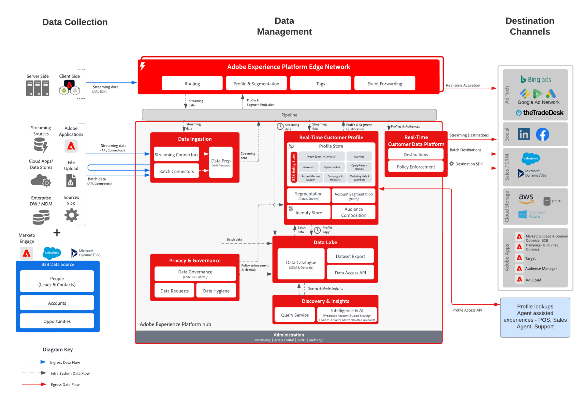

# Plan directeur de l’activation de profil et de l’audience B2B

Utilisez les informations de compte, d’opportunités et de prospects liées à un client individuel pour créer des profils B2B exploitables afin d’améliorer la personnalisation et le ciblage sur l’ensemble des canaux.

## Cas d’utilisation

* Créez des audiences de personnes pour le ciblage et la personnalisation sur plusieurs canaux liées aux données B2B, parmi lesquelles des informations de comptes, d’opportunités et de prospects.
* Activez les audiences vers n’importe quelle destination Experience Platform à des fins de ciblage et de personnalisation.
* Créez des audiences de comptes (par exemple, des listes d’entreprises) et ciblez ces entreprises via des destinations comme LinkedIn qui acceptent des listes d’entreprises comme entrées ou exportations vers des destinations d’espace de stockage pour le ciblage et la sensibilisation aux ventes.

## Applications

* Édition B2B Real-time Customer Data Platform

## Modèles d’intégration

* Sources de données B2B (Marketo, Salesforce, etc.) -> B2B edition Real-time Customer Data Platform -> Destinations
* Plusieurs sources de données B2B peuvent être utilisées pour mapper les données de compte, de prospect, d’opportunité et de personnes au B2B edition de Real-time Customer Data Platform.

## Architecture

## Garde-fous

* Notez que les garde-fous de sécurité et les étapes de mise en œuvre liées à Marketo Engage ne sont pertinentes que lorsque Marketo Engage est utilisé comme source ou comme destination.

* Pour plus d’informations et les mécanismes de sécurisation pour le modèle de données, la taille et la segmentation, reportez-vous au document [ Mécanismes de sécurisation de déploiement ](../experience-platform/deployment/guardrails.md)

### Prise en charge de plusieurs instances et de l’organisation IMS :

Le tableau suivant décrit les modèles pris en charge pour mapper les instances Experience Platform et Marketo Engage.

#### Marketo en tant que source de données à destination d’Experience Platform :

* Prise en charge de plusieurs instances de Marketo Engage vers une instance d’Experience Platform.
* Non prise en charge d’une instance de Marketo Engage vers de nombreuses instances d’Experience Platform.
* Prise en charge d’une instance de Marketo Engage vers une instance d’Experience Platform et plusieurs sandbox.

#### Marketo en tant que destination vers Experience Platform :

* Prise en charge d’Experience Platform vers de nombreuses instances de Marketo Engage
* Prise en charge de nombreuses instances d’Experience Platform vers une instance de Marketo Engage

#### Garde-fous de segmentation et de profil Experience Platform :

* Consultez les garde-fous de profil et de segmentation pour Experience Platform - [Garde-fous de profil et de segmentation](https://experienceleague.adobe.com/docs/experience-platform/profile/guardrails.html?lang=fr)
* Les segments B2B qui incluent des comptes, des prospects et des opportunités utilisent des relations multi-entités, ce qui fait que l’évaluation des segments est gérée par lot. La segmentation par flux est prise en charge pour les segments limités aux personnes et aux événements.
* Incluez un segment b2b par lot en entrée d’un segment de diffusion en continu ou Edge pour prendre en charge les cas d’utilisation de segment b2b en flux continu. L’appartenance à un segment par lots est basée sur le dernier résultat de l’évaluation de segmentation par lots quotidienne.

#### Experience Platform - Connecteur source Marketo Engage :

* Le renvoi historique peut prendre jusqu’à 7 jours, selon le volume de données.
* Les mises à jour et modifications continues des données depuis Marketo sont envoyées à Experience Platform par le biais de l’API de streaming, qui peut être latente jusqu’à 10 minutes environ pour le profil, et peut prendre jusqu’à 60 minutes pour le lac de données en fonction du volume.

#### Experience Platform - Connecteur de destination Marketo :

* Le partage de segments en flux continu de Real-time Customer Data Platform vers Marketo Engage peut prendre jusqu’à 15 minutes après l’évaluation des segments. Le renvoi des profils qui existaient déjà dans le segment avant la première activation peut prendre jusqu’à 24 heures.
* La segmentation par lots est partagée une fois par jour selon le planning de segmentation d’Experience Platform. Les segments B2B qui utilisent des relations à entités multiples, par exemple les segments qui utilisent des données dans les objets de compte et d’opportunité, sont toujours exécutés en mode batch.

#### Garde-fous Marketo Engage :

* Les contacts et les prospects doivent être ingérés et définis directement dans Marketo Engage pour que l’audience Real-time Customer Data Platform corresponde à un contact et à un prospect Marketo Engage.
* La destination Marketo de RTCDP peut éventuellement créer de nouveaux prospects dans Marketo pour les clients qui se trouvent dans un segment mais qui n’existent pas dans Marketo.

#### Garde-fous de destination

* Reportez-vous à la documentation de destination pour obtenir des instructions spécifiques sur celles-ci. [Garde-fous de destination](https://experienceleague.adobe.com/docs/experience-platform/destinations/guardrails.html?lang=fr)

## Étapes de mise en œuvre

Pour plus d’informations sur la mise en œuvre et la configuration de l’édition B2B de Real-time Customer Data Platform, consultez l’édition B2B de la documentation de Real-time Customer Data Platform. [Édition B2B de Real-time Customer Data Platform](https://experienceleague.adobe.com/docs/experience-platform/rtcdp/b2b-overview.html?lang=fr)

Il existe deux modèles de mise en œuvre possibles. La possibilité d’ingérer des données B2B et des profils à partir de Marketo Engage ou la possibilité d’ingérer des données B2B à partir d’autres sources de données CRM.

## Considérations relatives à la mise en œuvre

Recommandations sur les principales considérations et configurations du plan directeur.

* Intégration de CRM avec et sans Marketo :
Si l’implémentation utilise Marketo Engage comme source et que Marketo Engage est connecté au CRM, les données du CRM seront automatiquement transmises par la même connexion, éliminant la nécessité de connecter directement le CRM à Platform, sauf s’il existe d’autres objets de données CRM qui ne sont pas transmis par Marketo. Utilisez le connecteur source Experience Platform si des tableaux supplémentaires doivent être ingérés. Si l’implémentation ne prévoit pas d’utiliser Marketo Engage comme source, connectez directement la source CRM à Platform à l’aide du connecteur Experience Platform source CRM.
* Le connecteur de destination Marketo Engage pour Platform, qui envoie les audiences vers Marketo Engage pour activation, partage les membres de l’audience en fonction des adresses e-mail et des ECID correspondants. Il a la possibilité de créer un nouveau prospect si le contact n’existe pas déjà. Lors de la création d’un prospect, il est possible de mapper jusqu’à 50 attributs de profil (autres que les attributs de tableau ou de mappage) dans Real-time Customer Data Platform aux champs Personne dans Marketo.

## Documentation connexe

* [Édition B2B de Real-time Customer Data Platform](https://experienceleague.adobe.com/docs/experience-platform/rtcdp/b2b-overview.html?lang=fr)
* [Prise en main du B2B edition Real-time Customer Data Platform](https://experienceleague.adobe.com/fr/docs/experience-platform/rtcdp/intro/rtcdpb2b-intro/b2b-tutorial)
* [Mécanismes de sécurisation pour Real-time Customer Data Platform B2B edition](https://experienceleague.adobe.com/fr/docs/experience-platform/rtcdp/intro/rtcdpb2b-intro/b2b-guardrails)
* [Adobe Experience Platform](https://experienceleague.adobe.com/docs/experience-platform.html?lang=fr)
* [Marketo Engage](https://experienceleague.adobe.com/docs/marketo/using/home.html?lang=fr)
* [Adobe Experience Platform - Connecteur source Marketo](https://experienceleague.adobe.com/docs/experience-platform/sources/connectors/adobe-applications/marketo/marketo.html?lang=fr)
* [Adobe Experience Platform - Connecteur de destination Marketo](https://experienceleague.adobe.com/docs/marketo/using/product-docs/core-marketo-concepts/smart-lists-and-static-lists/static-lists/push-an-adobe-experience-cloud-segment-to-a-marketo-static-list.html?lang=fr)
