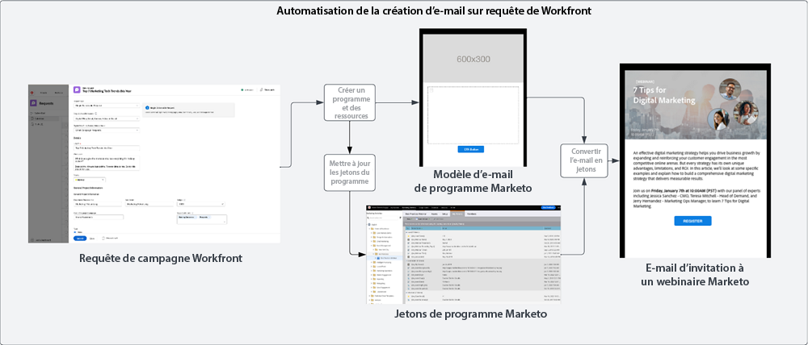
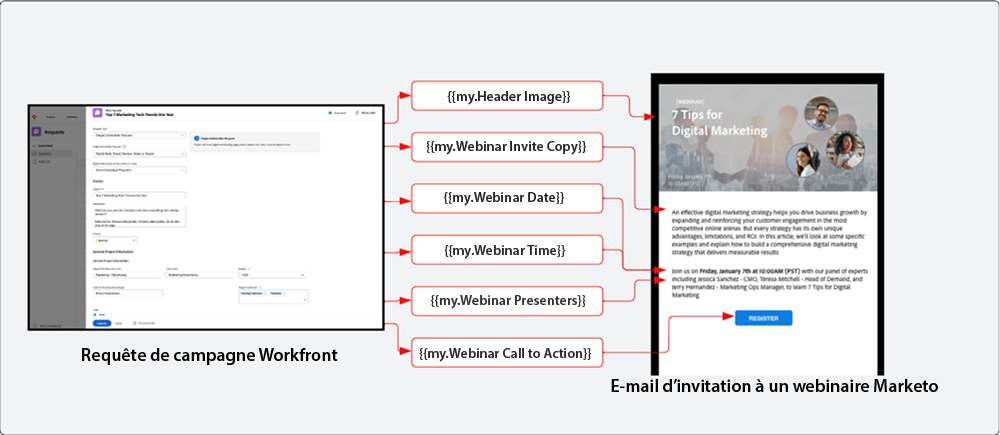
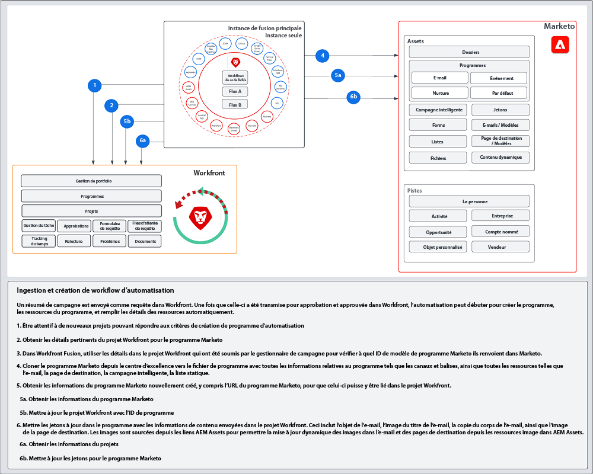

# Plan directeur d’ingestion et de création {#intake-and-create}

Le nombre de requêtes marketing qui entrent dans une équipe d’opérations marketing pour lancer de nouvelles campagnes peut transformer une équipe performante en un tourniquet de tâches répétitives, ce qui provoque un épuisement et une innovation stagnante.

À travers la mise en place d’un processus d’envoi de requêtes de campagne et l’automatisation de la création de campagnes marketing fréquemment demandées, vous pouvez : augmenter la vitesse de vos campagnes, réduire les erreurs, acheminer les requêtes vers le bon membre des opérations marketing, équilibrer et améliorer l’utilisation des ressources et concentrer davantage vos opérations marketing sur des tâches plus stratégiques.

Avec Workfront et Marketo Engage, une connexion entre les deux systèmes permet de consulter les détails d’un [formulaire de requête Workfront](https://experienceleague.adobe.com/docs/workfront/using/administration-and-setup/customize/custom-forms/create-or-edit-a-custom-form.html?lang=fr) pour créer un programme Marketo Engage. Il suffit ensuite de renseigner des variables clés telles que : lignes d’objet, copie d’e-mail, images, dates, heures, informations sur les événements, etc.{target="_blank"}

Pour réaliser cette intégration, il est nécessaire d’utiliser Workfront Fusion, un calque d’automatisation de travail qui vous permet d’automatiser les workflows entre Workfront et d’autres systèmes.

Le workflow ci-dessous présente une requête de webinaire envoyée par un gestionnaire de campagne à l’aide d’un formulaire de requête Workfront. Les détails envoyés dans la requête déclenchent ensuite la création d’un programme et d’un e-mail dans Marketo Engage pour le webinaire. En outre, des détails sont fournis à partir du formulaire de requête pour renseigner le contenu de l’e-mail.

{zoomable="yes"}

>[!TIP]
>
>Pour en savoir plus sur les différents types d’objets utilisés dans Workfront pour organiser le travail d’une campagne marketing et sur la façon dont ils sont mappés à un programme Marketo Engage, consultez la section [Présentation de Marketo et Workfront](/help/blueprints/b2b/marketo-engage-and-workfront-integration-blueprint/overview.md){target="_blank"}.

## Préparation de votre processus de développement de campagne pour automatisation {#prepare-your-campaign-development-process-for-automation}

Derrière chaque grande automatisation des workflows se trouve un processus défini qui garantit que les équipes et les parties prenantes tirent le meilleur parti de l’automatisation.

**Quels types de requêtes marketing allez-vous recevoir ?**

Pensez aux types de tactiques marketing que vous exécuterez tels que les e-mails, Nurture, les webinaires propriétaires et les événements. Exécutez-vous également des webinaires tiers ou des publicités display ? Chacune de ces requêtes doit être prise en compte, car elles peuvent nécessiter des champs de saisie spécifiques dans le formulaire de requête et chacune sera mappée à différents modèles de programme dans Marketo Engage qui seront clonés.

Il est également préférable de savoir si vous exécutez des campagnes dans plusieurs régions. Si tel est le cas, il vaudra mieux tenir compte d’un projet dans Workfront à travers la création de plusieurs programmes dans Marketo Engage, chaque programme représentant une prise en charge linguistique différente.

Il est important de savoir à l’avance quels types de requêtes marketing vous prévoyez de recevoir pour vous assurer que les requêtes peuvent être facilitées de manière automatisée.

**Quelles informations doivent être capturées dans la requête de campagne ?**

Pensez aux informations clés qui devront être capturées dans votre formulaire de requête pour chacune des différentes tactiques que vous exécutez. Vous trouverez ci-dessous quelques exemples d’informations que vous pouvez capturer dans un formulaire Workfront pour automatiser le développement de vos campagnes.

<table> 
  <tr> 
   <td><b>Tactique marketing</b></td>
   <td><b>Informations à capturer</b></td>
  </tr>
  <tr> 
   <td>E-mail</td>
   <td>・ Objet de l’e-mail 
・ Date planifiée 
・ Copie de l’e-mail 
・ Appel à l’action 
・ Image(s) : les URL AEM Assets peuvent être directement référencées pour une utilisation dans Marketo 
・ Critères de qualification de l’audience</td>
  </tr>
  <tr>
   <td>Webinaire / événement</td>
   <td>・ Nom de l’événement 
・ Date de l’événement 
・ Heure de l’événement 
・ Ville de l’événement 
・ Description de l’événement 
・ Page d’enregistrement du webinaire - PageURL OnDemand 
・ Noms du conférencier 
・ Titres du conférencier 
・ Photos du conférencier 
・ E-mails nécessaires (invitation, confirmation, rappel, suivi) 
・ Image(s) d’en-tête d’e-mail 
・ Critères de qualification de l’audience</td>
  </tr>
  <tr>
   <td>Nurture</td>
   <td>・ Nombre d’e-mails 
・ Copie de l’e-mail 
・ En-têtes d’e-mail 
・ Appel à l’action 
・ Critères de qualification de l’audience</td>
  </tr>
  </tbody>
</table>

>[!NOTE]
>
>Aujourd’hui, la création d’audiences par programmation grâce à l’automatisation est limitée dans Marketo Engage, car les jetons ne sont pas pris en charge dans les listes dynamiques. Cela signifie que les audiences devront être créées dans Marketo Engage par un utilisateur ou, si vous disposez d’une audience prédéterminée à laquelle vous communiquez en permanence, vous pouvez inclure une liste dynamique configurée dans votre modèle de programme, qui est clonée pendant le processus d’automatisation.

### Création de votre centre d’excellence {#establish-your-center-of-excellence}

Si vous voulez automatiser la création de programmes, vous aurez besoin d’un centre d’excellence dans Marketo Engage. Un centre d’excellence comprend des programmes et des ressources modélisés pour accélérer et normaliser le processus de développement des campagnes. Par exemple, vous pouvez disposer d’un modèle de programme pour vos différents besoins de campagne : e-mail, support, événement en présentiel et webinaire. En outre, vous pouvez avoir plusieurs modèles de programme de messagerie que vous utilisez pour différentes régions ou différents types d’annonces par e-mail.

Le fait de construire votre centre d’excellence avec des modèles de programme en Marketo Engage est l’une des premières étapes pour disposer d’une approche plus programmée de l’exécution des campagnes. En outre, ce dernier servira de base à l’automatisation des requêtes de campagne.

Une fois que vous disposez d’un ensemble de modèles de programme réutilisables, vous pouvez augmenter davantage vos efforts à l’aide de l’automatisation décrite dans ce plan directeur afin d’accélérer davantage le développement de vos campagnes.

Pour en savoir plus sur la création de votre propre centre d’excellence, consultez la [Communauté Marketo](https://nation.marketo.com/t5/product-blogs/marketo-master-class-center-of-excellence-with-chelsea-kiko/ba-p/243221){target="_blank"} afin de connaître les bonnes pratiques.

### Utilisation de jetons pour renseigner du contenu {#use-tokens-to-populate-content}

Avec Marketo Engage, les jetons peuvent être utilisés pour renseigner le contenu dans les ressources de votre campagne. Par exemple, après avoir cloné un modèle d’e-mail provenant de votre centre d’excellence, Workfront Fusion peut prendre les détails de la requête de campagne dans Workfront et les transmettre à Mes jetons dans le programme Marketo Engage. Les valeurs de jeton peuvent ensuite être héritées directement dans l’e-mail pour générer l’e-mail.

{zoomable="yes"}

### Renseignement d’images à partir d’AEM Assets {#populate-images-from-aem-assets}

Vous pouvez automatiser davantage le développement de vos e-mails et de vos pages de destination en utilisant des jetons de Marketo Engage, ainsi que des liens vers des ressources dans AEM Assets. Les personnes à l’origine de requêtes de campagne peuvent envoyer des liens d’image publiés à partir d’AEM Assets dans le cadre du processus de requête. Workfront Fusion peut ensuite prendre ces liens et les incorporer dans le HTML d’un e-mail à l’aide de jetons Marketo Engage.

N’oubliez pas que vous devrez créer vos programmes et modèles de programme dans Marketo Engage pour utiliser Mes jetons afin que Fusion puisse mettre à jour les valeurs de jeton avec les informations envoyées dans Workfront.

>[!NOTE]
>
>AEM Assets n’est pas nécessaire pour prendre en charge ce workflow, mais il peut permettre un processus plus rationnel de gestion des ressources de campagne dans la chaîne d’approvisionnement de développement de campagne.

### Assemblage d’une bibliothèque de recherche pour tous les types de requêtes de programme {#assemble-a-lookup-library-for-all-program-request-types}

Lors de l’automatisation de la création de nouveaux programmes de Marketo Engage à partir de requêtes Workfront, il est important d’inclure une étape dans votre automatisation de la fusion Workfront qui peut prendre des informations de la requête Workfront et rechercher les modèles de programme appropriés qui doivent être clonés dans Marketo Engage.

Pour ce faire, vous pouvez importer un jeu de données dans Workfront Fusion qui comprend la liste de tous les différents modèles de programme de votre centre d’excellence Marketo Engage.

Voici quelques informations de base à inclure dans votre bibliothèque de recherche de modèle de programme :

<table> 
  <tr> 
   <td><b>Colonne</b></td>
   <td><b>Description</b></td>
  </tr>
  <tr> 
   <td>Type de campagne</td>
   <td>Il peut s’agir d’un e-mail, d’un webinaire, d’un contenu pédagogique, d’un événement, d’un webinaire tiers, d’un import de liste, etc.Le type de campagne servira de description lisible de ce qui est demandé.</td>
  </tr>
  <tr> 
   <td>Type de requête Workfront</td>
   <td>Il s’agit du type de requête sélectionné dans le formulaire Workfront.Il peut s’agir du même type que le type de campagne, tel que e-mail, webinaire, matériel pédagogique ou événement. Elle permet de mapper l’ingestion sélectionnée dans le formulaire Workfront à un modèle de programme dans Marketo.</td>
  </tr>
  <tr> 
   <td>ID de formulaire Workfront</td>
   <td>L’ID unique du formulaire de requête Workfront utilisé pour valider la requête d’écriture est mappé au modèle de programme Marketo Engage.</td>
  </tr>
  <tr> 
   <td>ID de programme Marketo</td>
   <td>Il s’agit de l’identifiant du modèle de programme dans Marketo Engage, qui correspond à la requête en cours. Le fait d’avoir ces informations facilement disponibles dans Workfront Fusion permettra à Fusion d’adresser sa requête à Marketo Engage et de savoir exactement quel programme cloner.</td>
  </tr>
  </tbody>
</table>

## Flux d’automatisation de l’ingestion et de la création {#intake-and-create-automation-flow}

Voici un exemple de la manière dont la logique de workflow peut être assemblée dans Fusion à l’aide de modules [Workfront](https://experienceleague.adobe.com/docs/workfront/using/adobe-workfront-fusion/fusion-apps-and-modules/workfront-modules.html?lang=fr){target="_blank"} et [Marketo Engage](https://experienceleague.adobe.com/docs/workfront/using/adobe-workfront-fusion/fusion-apps-and-modules/marketo-modules.html?lang=fr){target="_blank"} prédéfinis qui vous permettent de fournir l’automatisation plus rapidement.

## Ressources {#resources}

* [Modules Adobe Marketo Engage](https://experienceleague.adobe.com/docs/workfront/using/adobe-workfront-fusion/fusion-apps-and-modules/marketo-modules.html?lang=fr){target="_blank"}

* [Modules Adobe Workfront](https://experienceleague.adobe.com/docs/workfront/using/adobe-workfront-fusion/fusion-apps-and-modules/workfront-modules.html?lang=fr){target="_blank"}

* [Présentation de Marketo et Workfront](/help/blueprints/b2b/marketo-engage-and-workfront-integration-blueprint/overview.md){target="_blank"}
