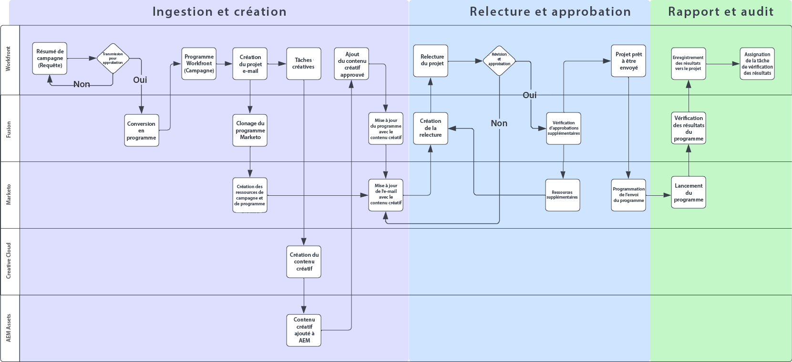
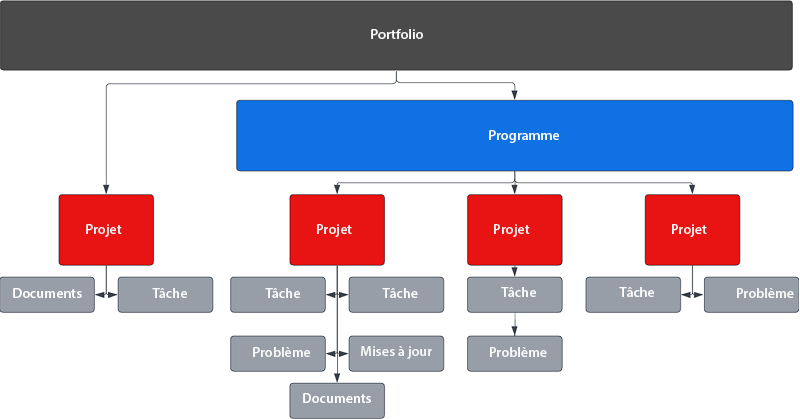
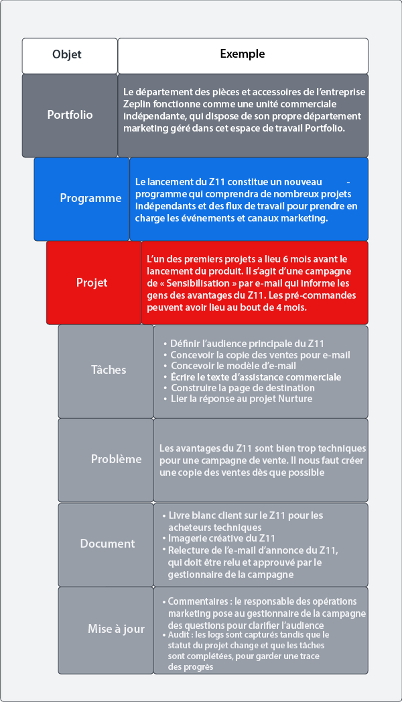

# Vue d’ensemble du plan directeur d’intégration de Marketo Engage et Workfront {#overview}

## Délai de mise sur le marché écourté avec Marketo Engage et Workfront {#achieve-faster-time-to-market-with-marketo-engage-and-workfront}

Le travail du marketing continue de croître avec de nouveaux canaux et de nouvelles façons de personnaliser les communications chaque jour. Les équipes marketing doivent pouvoir continuer à s’automatiser et à évoluer afin de prendre en charge l’évolution des requêtes marketing dans le monde entier.

**« Le retour sur investissement a toujours été le véritable objectif. Faire du chiffre, c’est super, mais pas à n’importe quel prix, surtout aujourd’hui. » - CMO, secteur des services aux entreprises**

Les entreprises qui obtiennent un meilleur retour sur investissement tout en augmentant leurs revenus le font en rationalisant leur processus de développement de campagne, en optimisant leur vitesse d’exécution de campagne et en améliorant la surveillance de l’ensemble de la fonction marketing.

Si votre entreprise cherche à atteindre des objectifs similaires à ceux décrits ci-dessous, ce document vous sera utile :

* Mettre à l’échelle les opérations de campagne pour soutenir le travail d’équipes marketing interfonctionnelles
* Accélérer le délai de mise sur le marché grâce à un processus de requête de campagne simplifié
* Créer un système d’enregistrement pour accroître la visibilité entre les parties prenantes de la campagne
* Vérifier et approuver les ressources de campagne (images, d’e-mail)

Les équipes d’opérations de campagne ont besoin de systèmes qui leur permettent de planifier et d’exécuter efficacement des campagnes marketing. Qu’il s’agisse d’un e-mail, d’un webinaire, d’un événement, d’un média payant, d’une formation ou d’une syndication de contenu, les équipes marketing ont besoin d’une solution centrale pour organiser les contributeurs à la campagne, les livrables et l’exécution.

À travers l’intégration du système d’activation marketing multicanal (Marketo Engage) à la planification marketing et au système d’enregistrement (Workfront), vous pouvez augmenter la vitesse de la campagne et offrir une meilleure visibilité aux parties prenantes.

Avec Workfront Fusion, les équipes d’opérations marketing peuvent en grande partie éliminer les étapes manuelles et susceptibles d’erreurs impliquées dans la traduction d’une description marketing en campagne. Workfront Fusion offre une couche d’intégration prête à l’emploi entre Workfront et Marketo Engage, ce qui permet une flexibilité et une efficacité dans le développement de workflows entre les systèmes. Vous pouvez en savoir plus sur la configuration de l’intégration et sur les actions à entreprendre pour automatiser les workflows [ici](https://experienceleague.adobe.com/docs/workfront/using/adobe-workfront-fusion/fusion-apps-and-modules/marketo-modules.html?lang=fr){target="_blank"}.

## Planification de campagne à exécuter - Cas d’utilisation de l’automatisation {#campaign-planning-to-execution-automation-use-cases}

* Soutien des équipes d’opérations marketing à travers l’automatisation de la création de campagnes dans Marketo Engage par le biais de requêtes d’ingestion dans Workfront
* Partage de brouillons d’e-mails et de pages de destination créés dans Marketo Engage vers Workfront pour obtenir la révision et l’approbation finales de la part des parties prenantes interfonctionnelles
* Partage des résultats de campagne de Marketo Engage vers Workfront pour démocratiser l’accès aux mesures de campagne

Vous trouverez ci-dessous un diagramme de workflow du processus de développement de campagne en cas de requête d’e-mail. De plus, vous pouvez découvrir comment Workfront Fusion peut jouer un rôle entre Workfront et Marketo Engage pour stimuler l’automatisation des processus et des processus tout au long du cycle de développement des campagnes.

{zoomable=&quot;yes&quot;}

Prenez note des différentes phases du processus de développement des campagnes.

1. Ingestion et création : la requête de campagne est effectuée et les ressources de campagne sont assemblées par programmation.

1. Bon à tirer et approbation : une fois la campagne assemblée, il est temps pour les parties prenantes de passer en revue et de valider les ressources de campagne telles que les e-mails et les pages de destination.

1. Rapport et audit : partager les résultats de la campagne avec Workfront afin de fournir une meilleure visibilité aux parties prenantes interfonctionnelles.

>[!NOTE]
>
>Dans l’exemple ci-dessus, Workfront gère et planifie les efforts de travail tout au long du cycle de vie du programme Marketo Engage. Cela dit, la flexibilité de Workfront peut s’étendre à la gestion de tous les efforts de votre équipe marketing. Il s’agit notamment du marketing basé sur les comptes, des chaînes d’approvisionnement de contenu marketing, de la gestion des agences, de la gestion des campagnes numériques et sur les réseaux sociaux, ainsi que des programmes d’assistance commerciale.

## Comprendre la présentation des initiatives marketing dans Workfront {#understanding-how-marketing-initiatives-are-represented-in-workfront}

Adobe Workfront permet aux entreprises de gérer le travail afin de générer une exécution plus efficace. Workfront contient une hiérarchie d’objets qui fournit un cadre pour la planification, la gestion des ressources et la collaboration entre les différentes équipes.

Il est important de comprendre comment mapper votre gestion commerciale à ces objets pour comprendre la relation entre Workfront et Marketo Engage.

{zoomable=&quot;yes&quot;}

### Définition de la hiérarchie de portfolio {#portfolio-hierarchy-defined}

<table> 
  <tr> 
   <td><b>Objet</b></td>
   <td><b>Définition</b></td>
  </tr>
  <tr> 
   <td>Portfolio</td>
   <td>Vous pouvez utiliser des portfolios et programmes dans Workfront pour organiser les projets. À travers l’organisation des projets, vous pouvez comparer des projets similaires et déterminer les ressources qui seront les mieux dépensées.  
   (Par exemple, un Portfolio est créé pour une unité opérationnelle au sein d’une entreprise qui vend des services et/ou des produits.)</td>
  </tr>
  <tr>
   <td>Programme</td>
   <td>Vous pouvez utiliser les programmes Workfront pour organiser les projets. À travers l’organisation des projets, vous pouvez comparer des projets similaires et déterminer les ressources qui seront les mieux dépensées.  
   (Par exemple, une stratégie marketing avec un objectif de haut niveau, comme la sensibilisation et la stimulation de la requête pour un nouveau lancement de produit.)</td>
  </tr>
  <tr>
   <td>Projet</td>
   <td>Les projets Workfront sont un ensemble d’éléments de travail qui doivent être remplis pour atteindre un objectif spécifique, un livrable, un produit, etc.  
   (Par exemple, une tactique marketing telle qu’un e-mail, une campagne pédagogique, un webinaire ou un événement en présentiel). Un projet unique peut également être plus complexe en englobant plusieurs tactiques, telles qu’un e-mail, une publicité display, une page de destination et un livre blanc téléchargeable, destinées à générer le même résultat.)</td>
  </tr>
  <tr>
   <td>Tâche</td>
   <td>Les tâches Workfront sont des tâches planifiées qui peuvent faire partie d’un projet ou d’une initiative. Les tâches sont attribuées aux utilisateurs ou aux équipes pour être exécutées.  
   (Par exemple, une tâche de création de segment d’audience ou de création de brouillon d’e-mail peut être associée à un projet pour développer un programme d’e-mail Marketo Engage.)</td>
  </tr>
  <tr>
   <td>Problème</td>
   <td>Les problèmes sont des éléments de travail non planifié dans Workfront. Il peut s’agir de problèmes survenant pendant un projet ou de requêtes envoyées par le biais d’une file d’attente des demandes.  
   (Par exemple, un problème est signalé car l’image de la bannière d’e-mail comporte des dimensions incorrectes.)</td>
  </tr>
  <tr>
   <td>Document</td>
   <td>Les documents peuvent être des documents traditionnels comme des documents écrits ou des présentations. Il peut également s’agir de fichiers image. Workfront permet la vérification des ressources au moyen de commentaires et d’annotations sur les documents et les images, afin de permettre la collaboration entre les équipes.  
   (Par exemple, une image d’en-tête d’e-mail qui doit être passée en revue.)</td>
  </tr>
  <tr>
   <td>Mise à jour</td>
   <td>Elle inclut des commentaires et des logs d’audit permettant de suivre le travail et de faciliter la collaboration dans Workfront.  
   (Par exemple, il peut s’agir du log d’audit de la nouvelle version d’image.)</td>
  </tr>
  </tbody>
</table>

## Exemple de gestion du travail dans le cadre d’une initiative marketing {#marketing-initiative-work-management-example}

Regardons comment la hiérarchie de portfolio Workfront se joue dans un exemple concret.

La société Zeplin sort une version mise à jour de l’une de ses pièces pour tracteurs utilitaires compacts, le Z11, qui surpasse le modèle Z10 précédent en offrant une plus grande durabilité et une meilleure personnalisation. L’entreprise doit ainsi planifier, développer et exécuter sa stratégie marketing afin de stimuler la demande et de sensibiliser la population à la nouvelle commercialisation de leur département en charge des tracteurs. Cette stratégie marketing doit inclure différentes tactiques marketing pour sensibiliser à la fois les nouveaux clients et les clients Z10 existants.

La hiérarchie ci-dessous indique comment la stratégie, les tactiques, les tâches et les ressources sont associées à Workfront pour cette campagne marketing.

{zoomable=&quot;yes&quot;}

## Mappage de Workfront vers Marketo {#mapping-workfront-to-marketo}

Avec Workfront comme système amont pour la planification marketing et l’organisation de projet, il est important de comprendre comment les informations peuvent être partagées entre Marketo Engage et Workfront.

Afin que ces systèmes fonctionnent en tandem au fur et à mesure du développement de nouvelles initiatives marketing, il est important de comprendre comment les différents types d’enregistrements dans Workfront mappent les types d’enregistrement dans Marketo Engage.

### Mappage de projets Workfront vers des programmes Marketo Engage {#mapping-workfront-projects-to-marketo-engage-programs}

En utilisant Workfront Fusion comme couche d’intégration, vous pouvez mapper vos projets dans Workfront vers un programme dans Marketo Engage. Par exemple, dans le cas ci-dessus, Zeplin veut sensibiliser le public au nouveau modèle Zeplin. Ils créent ainsi un nouveau programme dans Workfront qui héberge plusieurs tactiques marketing représentées sous la forme de projets. Une tactique consiste en un e-mail de sensibilisation qui doit être envoyé aux clients existants du modèle Z10 pour leur faire connaître le nouveau modèle Z11. Dans Workfront, un projet est créé pour représenter cette tactique e-mail avec un ensemble de tâches qui lui sont associées pour créer l’audience, créer des contenus créatifs pour les images d’e-mails et assembler l’e-mail dans Marketo Engage. Le projet dans Workfront peut correspondre à un programme e-mail dans Marketo Engage afin que les informations puissent être synchronisées entre les systèmes.

Vous trouverez ci-dessous un exemple de la manière dont un programme peut inclure plusieurs projets et en quoi ces projets Workfront peuvent être associés à des programmes dans Marketo Engage.

{zoomable=&quot;yes&quot;}

Vous pouvez lancer une grande initiative marketing qui nécessite que plusieurs projets Workfront soient hébergés dans un programme Workfront.Vous pouvez également avoir une requête ponctuelle pour un webinaire ou un e-mail qui nécessite la création d’un seul projet Workfront. Quels que soient vos besoins, avec Workfront, Workfront Fusion et Marketo Engage, votre équipe dispose de la flexibilité nécessaire pour intégrer harmonieusement votre processus de développement de campagne de la planification à l’exécution.

### Mappage de tâches Workfront vers des ressources Marketo Engage {#mapping-workfront-tasks-to-marketo-engage-assets}

Lorsque vous commencez à mapper votre processus de développement de campagne dans Workfront, vous pouvez également réfléchir aux tâches à effectuer dans Marketo Engage et à la manière dont vous pouvez capturer les informations dans Workfront, contribuer à accroître la cohérence, l’efficacité et la précision de la chaîne d’approvisionnement de développement de campagne.

Les projets Workfront peuvent être modélisés afin que votre processus puisse être clairement défini chaque fois que vous exécutez une tactique marketing spécifique. Par exemple, lors de l’exécution d’une campagne par e-mail, un ensemble standard de tâches doit être effectué pour votre organisation. Ces tâches peuvent impliquer une réunion de lancement avec les parties prenantes, l’obtention de ressources de création, la validation du contenu créatif, la création de l’audience cible, la création de l’e-mail, la traduction de l’e-mail, l’approbation de l’e-mail et le partage des résultats de campagne par e-mail avec les parties prenantes.

Certaines de ces tâches peuvent correspondre directement au travail à effectuer dans Marketo Engage. Par exemple, la tâche de création d’e-mail dans Workfront peut être personnalisée pour inclure des champs qui transmettront des informations à Marketo Engage afin d’automatiser l’assemblage de l’e-mail. Il peut s’agir de l’objet, de la copie et des images de l’e-mail.

## Étapes suivantes {#next-steps}

Maintenant que vous disposez d’une compréhension fondamentale de la manière dont Workfront et Marketo Engage peuvent déverrouiller de nouvelles fonctionnalités dans la chaîne d’approvisionnement de développement de campagne, consultez les documents et ressources suivants sur la manière d’automatiser les workflows et processus entre Marketo Engage et Workfront à l’aide de Workfront Fusion.

### Prise en main de l’intégration Workfront Fusion, Workfront et Marketo Engage {#getting-started-with-workfront-fusion}

* [Ingestion et création](/help/blueprints/b2b/marketo-engage-and-workfront-integration-blueprint/intake-and-create.md){target="_blank"} - Automatisation du développement de campagne avec Marketo Engage et Workfront

* Épreuve et approbation (bientôt disponible)

### Gestion des noms de campagne Marketo Engage et de leurs URL associées {#managing-marketo-engage-campaign-names}

La normalisation de vos conventions d’affectation de noms pour les campagnes et les URL est essentielle pour une gestion précise des programmes dans Marketo Engage. Cela contribue également à un processus plus cohérent dans le cycle de vie de développement des campagnes. Si vous recherchez des outils pour vous y aider, nous vous recommandons de consulter certains outils Open Source gratuits des [services de succès Adobe](https://main--marketo-campaign-tools--dr-adobe.hlx.live/){target="_blank"} qui vous permettent de créer une approche cohérente pour créer et gérer des campagnes Marketo Engage et leurs URL associées.

### Ressources {#resources}

* [Workfront Fusion pour Marketo Engage](https://experienceleague.adobe.com/docs/workfront/using/adobe-workfront-fusion/fusion-apps-and-modules/marketo-modules.html?lang=fr){target="_blank"}

* [Workfront Fusion pour Workfront](https://experienceleague.adobe.com/docs/workfront/using/adobe-workfront-fusion/fusion-apps-and-modules/workfront-modules.html?lang=fr){target="_blank"}
