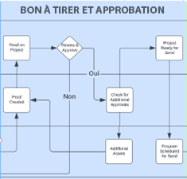
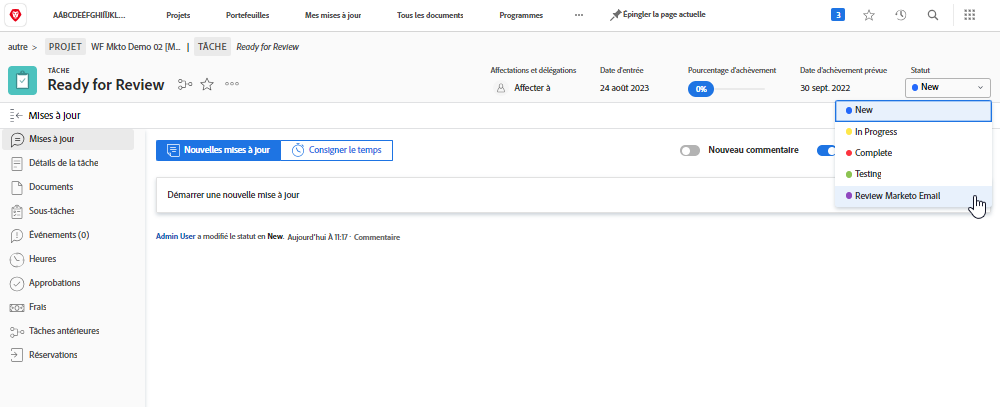
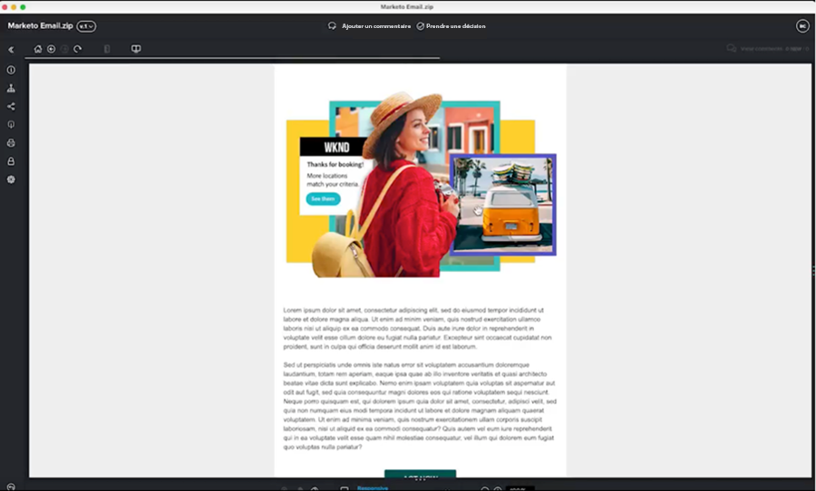

# Révision et approbation du plan directeur {#review-and-approve-blueprint}

S’assurer que les ressources et les campagnes marketing répondent aux attentes et aux normes d’une entreprise va au-delà de la diffusion de contenu et de messages adéquats vers la bonne audience. Les entreprises ont également la responsabilité de respecter les politiques internes, les règlementations du secteur et même les conditions juridiques préalables lors de la mise en place de nouvelles initiatives marketing. Intégrer les étapes de validation et d&#39;approbation dans leur processus de développement de campagne permet aux équipes marketing de s&#39;assurer que le contenu et les messages sont exacts et conformes aux normes de leur secteur, en particulier pour les secteurs de la finance, de la santé et des produits pharmaceutiques.

Avec Workfront et Marketo Engage, les équipes marketing ont la possibilité d’avoir un système de marketing étroitement connecté, avec des messages précis et conformes.

## Activer la vérification et les approbations avancées pour Marketo Engage avec Workfront {#unlock-proofing-and-advanced-approvals}

Lorsque nous envisageons de concevoir des campagnes marketing, nous devons tenir compte du fait que plusieurs systèmes prennent en charge les différentes étapes du processus, notamment : la planification, la création, la révision, les commentaires, l’approbation et l’exécution. Avec Workfront et Marketo Engage, les équipes disposent de tous les outils nécessaires pour réaliser le processus complet de planification et de lancement d’une nouvelle campagne marketing. En outre, les équipes peuvent rationaliser davantage leur processus de révision et d’approbation afin d’accélérer le développement des campagnes tout en veillant à ce que l’exactitude et la conformité obéissent aux normes les plus élevées.

### Vérification et approbation des cas pratiques déverrouillés avec Marketo Engage et Workfront {#review-and-approve-use-cases-unlocked-with-marketo-engage-and-workfront}

* Centralisez les commentaires et facilitez le travail collaboratif en utilisant les fonctionnalités de commentaires et d’annotation de Workfront sur les ressources de Marketo Engage.

* Centralisez vos validations en les déclenchant dans Marketo Engage à partir des workflows d’approbation Workfront.

* Prenez en charge et rationalisez les workflows d’approbation complexes des ressources marketing en utilisant les fonctionnalités avancées d’approbation qu’offre Workfront, couplées avec les ressources de Marketo Engage.

* Démocratisez l’accès aux brouillons marketing en extrayant par programmation des ressources Marketo dans Workfront pour examen par plusieurs parties prenantes.

* Effectuez le suivi des modifications et créez un journal écrit de ces modifications en centralisant tous les travaux de révision et de vérification des ressources de Marketo Engage dans Workfront.

## Planification de votre workflow de BAT et d’approbation {#planning-your-proof-and-approval-workflow}

Avant de configurer l’intégration du bon à tirer (BAT) et de l’approbation entre Marketo Engage et Workfront, tenez compte des aspects suivants :

* Quelles ressources doivent-elles être examinées et approuvées ?
* Qui doit être l’approbateur ?
* Plusieurs approbateurs seront-ils nécessaires pour qu’une ressource marketing puisse être activée ?
* À quel stade du processus de développement de campagne les ressources marketing seront-elles assemblées et prêtes à être examinées ?

Répondre à ces questions vous aidera à obtenir une ligne de base pour définir votre flux d’approbation et commencer à réfléchir à la configuration de votre instance Workfront.

## Création d’un workflow de BAT et d’approbation entre Marketo Engage et Workfront {#building-a-proof-and-approval-workflow}

Pour rationaliser le processus de BAT et d’approbation entre Workfront et Marketo Engage, vous pouvez intégrer les deux solutions à l’aide de Workfront Fusion. Workfront Fusion fournit une interface de workflow pour déclencher des actions et transmettre des informations entre vos instances Workfront et Marketo Engage.

Pour ce faire, tenez compte des étapes ci-dessous pour réaliser une intégration aboutie des processus de révision et d’approbation.

1. Configurez votre projet Workfront avec une tâche Prêt pour la révision.
1. Programmez le déclenchement de l’e-mail de votre Marketo Engage en synchronisation avec un changement de statut de la tâche dans Workfront.
1. Convertissez votre fichier d’email de Marketo Engage en BAT révisable dans Workfront.
1. Utilisez la retouche Workfront pour collaborer au moyen de commentaires et d’annotations.
1. Approuvez le BAT Workfront pour déclencher l’approbation des ressources en Marketo Engage, puis marquez la tâche comme étant terminée.

### Configuration d’un projet Workfront avec une tâche Prêt pour la révision {#configure-a-workfront-project-with-a-ready-for-review-task}

Utilisez des [modèles de projet](https://experienceleague.adobe.com/docs/workfront/using/manage-work/projects/create-and-manage-project-templates/project-template-overview.html){target="_blank"} pour capturer la plupart des processus, informations et paramètres répétables associés aux projets de votre entreprise. Vous pouvez définir des tâches, des rubriques de file d’attente, créer des formulaires personnalisés et joindre des documents à votre modèle.

Dans votre modèle de projet dans Workfront, incluez des tâches pour examiner les ressources qui font partie de votre campagne marketing. De plus, vous pouvez ajouter un processus d’approbation pour gérer les approbations uniques ou les approbations à plusieurs niveaux plus complexes.

Si vous souhaitez lancer une nouvelle campagne par e-mail, vous devez disposer d’un modèle de projet qui inclut une tâche de révision de l’e-mail, ainsi qu’un processus d’approbation pour vous assurer que l’e-mail est approuvé par le bon partenaire avant d’être envoyé.

{zoomable=&quot;yes&quot;}

### Programmez le déclenchement de l’e-mail de votre Marketo Engage en synchronisation avec un changement de statut de la tâche dans Workfront {#trigger-your-marketo-engage-email-to-sync-to-workfront}

Dans le cadre de votre processus de révision, vous pourriez vouloir synchroniser les e-mails avec votre projet Workfront une fois qu’ils seront prêts à être examinés par votre équipe marketing. Pour ce faire, nous vous recommandons de configurer une tâche Prêt pour la révision avec un [statut de la tâche](https://experienceleague.adobe.com/docs/workfront/using/manage-work/projects/update-work-on-a-project/update-task-status.html){target="_blank"} qui indique le moment où l’e-mail est prêt à être examiné. Dans notre exemple, nous avons ajouté à notre tâche le statut Réviser l’e-mail Marketo qui peut être sélectionné lorsque le brouillon d’e-mail est prêt à être examiné par les parties prenantes.

Lorsque ce statut est inclus dans votre projet Workfront, vous pouvez configurer votre scénario de fusion Workfront pour voir la tâche Prêt pour la révision être mise à jour et devenir &quot;Réviser l’e-mail Marketo&quot;. Une fois la tâche mise à jour, votre scénario peut récupérer l’e-mail de Marketo Engage sous la forme d’un fichier HTML, le compresser et en enregistrer une copie dans les documents du projet Workfront à réviser.

{zoomable=&quot;yes&quot;}

### Convertir votre e-mail de Marketo Engage en BAT révisable dans Workfront {#convert-your-marketo-engage-email-to-reviewable-proof-in-workfront}

Une fois que le statut de votre tâche Prêt pour la révision est mis à jour et indique &quot;Réviser l’e-mail Marketo&quot; et que l’e-mail de Marketo Engage est enregistré dans Workfront, vous pouvez configurer votre scénario de fusion Workfront pour convertir l’e-mail en BAT Workfront.

### Utilisation de la vérification de Workfront pour collaborer au moyen de commentaires et d’annotations {#use-workfront-proofing-to-collaborate}

[Vérification du Workfront](https://experienceleague.adobe.com/docs/workfront/using/review-and-approve-work/proofing/proofing-overview/proofing-basics.html){target="_blank"} Les fonctionnalités permettent à votre équipe marketing de prendre une nouvelle ressource, telle qu’une image ou un email, et de collaborer par l’intermédiaire de commentaires et d’annotations. Une fois qu’un BAT est prêt à être mis en service, les décideurs peuvent approuver la ressource à partir de l’outil de vérification.

{zoomable=&quot;yes&quot;}

### Approuver Workfront BAT et déclencher l’approbation des ressources dans Marketo Engage, marquer la tâche comme terminée {#approve-workfront-proof-and-trigger-asset-approval-in-marketo-engage}

Workfront Fusion peut détecter si le courrier électronique a été approuvé par les parties prenantes et envoyer une demande à Marketo Engage pour l’approuver dans Marketo.

Une fois l’email validé/approuvé par les membres de l’équipe appropriée, l’email est prêt à être mis en ligne en Marketo Engage !

## Modèles de scénario Fusion {#fusion-scenario-templates}

Pour vous aider à rationaliser votre développement de workflows de révision et d’approbation dans votre instance Workfront et Marketo Engage, nous avons créé des modèles Fusion qui vous aideront à prendre en main l’intégration. Vous pouvez utiliser ces modèles en recherchant &quot;Marketo&quot; dans la section Modèles publics de Fusion et en les téléchargeant sur votre instance.

### Vérification d’un BAT pour votre brouillon d’e-mail de Marketo Engage dans Workfront {#review-an-email-proof-of-your-marketo-engage-email-draft-in-workfront}

Le scénario de fusion ci-dessous vous présente la première moitié du flux de révision et d’approbation, dans laquelle le brouillon d’e-mail peut être extrait de Marketo Engage et enregistré dans Workfront en tant que BAT. Une fois enregistré en tant que BAT dans les documents du projet Workfront, il peut être examiné par les parties prenantes marketing, commenté et annoté dans le cadre du processus de révision.

{zoomable=&quot;yes&quot;}

### Approuver un e-mail dans Workfront qui déclenche l’approbation de la ressource dans Marketo Engage {#approve-an-email-in-workfront-that-triggers-approval}

Le scénario de fusion ci-dessous peut être utilisé pour détecter lorsqu’un BAT dans Workfront a été approuvé, et acheminer cette approbation vers Marketo Engage pour mettre à jour le brouillon de l’e-mail afin qu’il soit prêt à être utilisé dans un programme de Marketo Engage.

{zoomable=&quot;yes&quot;}

Ensemble, ces deux scénarios peuvent être utilisés pour créer un chemin bidirectionnel pour, d’une part, extraire des ressources marketing de Marketo Engage vers les workflows robustes de révision et d’approbation de Workfront et, d’autre part, renvoyer les approbations vers Marketo Engage à partir de Workfront.
