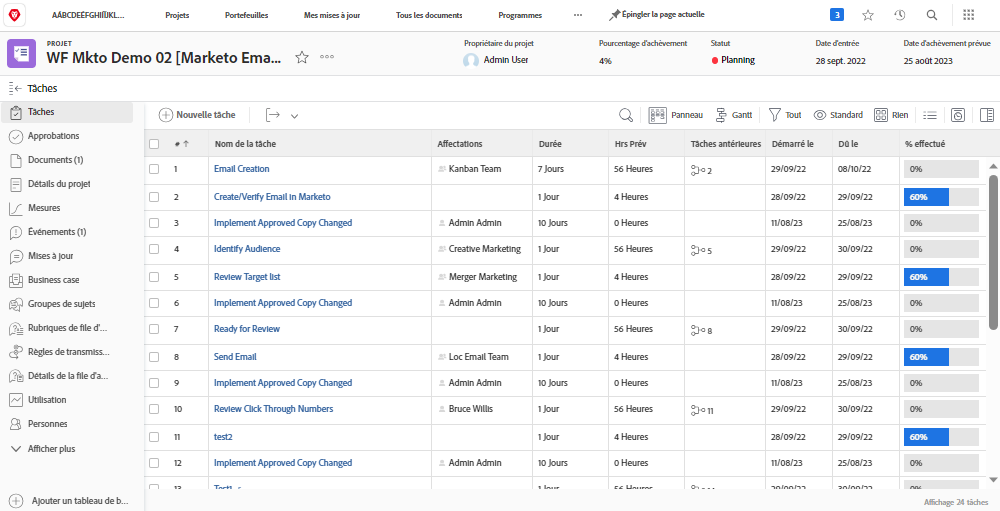

# Réviser et approuver le plan directeur {#review-and-approve-blueprint}

S’assurer que les ressources et les campagnes marketing répondent aux attentes et aux normes d’une entreprise va au-delà de la diffusion du contenu et des messages adéquats vers la bonne audience. Les entreprises ont également la responsabilité de respecter les politiques internes, les règlementations de l&#39;industrie et même les conditions juridiques préalables lors de la mise en place de nouvelles initiatives marketing. En intégrant les étapes de validation et d&#39;approbation dans leur processus de développement de campagne, les équipes marketing peuvent s&#39;assurer que le contenu et la messagerie sont exacts et conformes aux normes de leur secteur, en particulier pour les secteurs de la finance, de la santé et des produits pharmaceutiques.

Avec Workfront et Marketo Engage, les équipes marketing ont la possibilité d’avoir un système de marketing étroitement connecté, avec des messages précis et conformes.

## Déverrouiller la vérification et les approbations avancées pour Marketo Engage avec Workfront {#unlock-proofing-and-advanced-approvals}

Lorsque nous réfléchissons à la création de campagnes marketing, nous devons tenir compte du fait que plusieurs systèmes prennent en charge les différentes étapes impliquées, notamment : la planification, la création, la révision, le retour, l’approbation et l’exécution. Avec Workfront et Marketo Engage, les équipes disposent de tous les outils nécessaires pour passer par le processus complet de planification et de lancement d’une nouvelle campagne marketing. En outre, les équipes peuvent rationaliser davantage leur processus de révision et d’approbation afin d’accélérer le développement des campagnes tout en veillant à ce que l’exactitude et la conformité soient conformes aux normes les plus élevées.

{zoomable=&quot;yes&quot;}

### Cas pratiques de connexion de Workfront et de Marketo Engage {#use-cases-for-connecting-workfront-and-marketo-engage}

* Éliminez les commentaires disparates et augmentez la collaboration dans un endroit centralisé en utilisant les fonctionnalités de commentaires et d’annotation de Workfront sur les ressources du Marketo Engage.

* Centralisez vos validations en les déclenchant dans Marketo Engage à partir des workflows d’approbation Workfront.

* prendre en charge et rationaliser les workflows d’approbation complexes des ressources marketing en utilisant Workfront pour  des fonctionnalités avancées d’approbation avec les ressources du Marketo Engage.

* Démocratisez l’accès aux brouillons marketing en extrayant par programmation des ressources Marketo dans Workfront pour examen par plusieurs parties prenantes.

* Effectuez le suivi des modifications et créez un journal papier en centralisant tous les travaux de révision et de vérification des ressources de Marketo Engage dans Workfront.

## Planification de votre workflow de BAT et d’approbation {#planning-your-proof-and-approval-workflow}

Avant de configurer l’intégration du BAT et de l’approbation entre Marketo Engage et Workfront, tenez compte des aspects suivants :

* Quelles ressources devront-elles être examinées et approuvées ?
* Qui doit être l’approbateur ?
* Plusieurs approbateurs seront-ils nécessaires pour qu’une ressource marketing puisse être activée ?
* À quel stade du processus de développement de campagne les ressources marketing seront-elles assemblées et prêtes à être examinées ?

Répondre à ces questions vous aidera à obtenir une ligne de base pour connaître votre flux d’approbation et commencer à réfléchir à la configuration de votre instance Workfront.

## Création d’un workflow de BAT et d’approbation entre Marketo Engage et Workfront {#building-a-proof-and-approval-workflow}

Pour rationaliser le processus de BAT et d’approbation entre Workfront et Marketo Engage, vous pouvez intégrer les deux solutions à l’aide de Workfront Fusion. Workfront Fusion fournit une interface de workflow pour déclencher des actions et transmettre des informations entre vos instances Workfront et Marketo Engage.

Pour ce faire, tenez compte des étapes ci-dessous dans le cadre du processus pour une expérience intégrée de révision et d’approbation.

1. Configurez votre projet Workfront avec une tâche Prêt pour la révision .
1. Déclenchez l’e-mail de votre Marketo Engage à synchroniser avec Workfront avec un changement d’état de la tâche.
1. Convertissez votre fichier d’email de Marketo Engage en BAT révisable dans Workfront.
1. Utilisez la vérification Workfront pour collaborer par le biais de commentaires et d’annotations.
1. Approuvez le BAT Workfront pour déclencher l’approbation des ressources en Marketo Engage, puis marquez la tâche comme étant terminée.

### Configuration d’un projet Workfront avec une tâche Prêt pour la révision {#configure-a-workfront-project-with-a-ready-for-review-task}

Utilisation [modèles de projet](https://experienceleague.adobe.com/docs/workfront/using/manage-work/projects/create-and-manage-project-templates/project-template-overview.html){target="_blank"} pour capturer la plupart des processus, informations et paramètres répétables associés aux projets de votre entreprise. Vous pouvez définir des tâches, des rubriques de file d’attente, créer des formulaires personnalisés et joindre des documents à votre modèle.

Dans votre modèle de projet dans Workfront, incluez des tâches pour examiner les ressources qui font partie de votre campagne marketing. De plus, vous pouvez ajouter un processus d’approbation pour gérer les approbations uniques ou les approbations à plusieurs niveaux plus complexes.

Si vous souhaitez lancer une nouvelle campagne par e-mail, vous devez disposer d’un modèle de projet qui inclut une tâche de révision de l’e-mail, ainsi qu’un processus d’approbation pour vous assurer que l’e-mail est approuvé par le bon partenaire avant de pouvoir être envoyé.

{zoomable=&quot;yes&quot;}

### Déclenchez l’adresse électronique de votre Marketo Engage pour la synchronisation avec Workfront avec le changement d’état de la tâche. {#trigger-your-marketo-engage-email-to-sync-to-workfront}

Dans le cadre de votre processus de révision, vous souhaiterez pouvoir synchroniser les emails avec votre projet Workfront une fois qu’ils seront prêts à être examinés par votre équipe marketing. Pour ce faire, nous vous recommandons de configurer une tâche Prêt à réviser avec une [état de la tâche](https://experienceleague.adobe.com/docs/workfront/using/manage-work/projects/update-work-on-a-project/update-task-status.html){target="_blank"} qui signifie le moment où le courrier électronique est prêt à être examiné. Dans notre exemple, nous avons ajouté à notre tâche l’état Réviser le courrier électronique Marketo qui peut être sélectionné lorsque le brouillon de courrier électronique est prêt à être examiné par les parties prenantes.

Lorsque cet état est en place dans votre projet Workfront, vous pouvez configurer votre scénario de fusion Workfront pour écouter la tâche Prêt à réviser à mettre à jour en &quot;Réviser le courrier électronique Marketo&quot;. Une fois la mise à jour effectuée, votre scénario peut récupérer l’email du Marketo Engage sous forme de fichier de HTML, le compresser et en enregistrer une copie dans les documents du projet Workfront à réviser.

{zoomable=&quot;yes&quot;}

### Convertir votre email de Marketo Engage en BAT révisable dans Workfront {#convert-your-marketo-engage-email-to-reviewable-proof-in-workfront}

Une fois que votre tâche Prêt pour la révision est déplacée à l’état &quot;Réviser le courrier électronique Marketo&quot; et que le courrier électronique du Marketo Engage est enregistré dans Workfront, vous pouvez configurer votre scénario de fusion Workfront pour convertir le courrier électronique en bon à tirer Workfront.

{zoomable=&quot;yes&quot;}

## Modèles de scénario de fusion {#fusion-scenario-templates}

Pour vous aider à rationaliser votre développement de workflows de révision et d’approbation dans votre propre instance Workfront et Marketo Engage, nous avons créé des modèles de fusion qui vous aideront à prendre en main l’intégration. Vous pouvez utiliser ces modèles en recherchant &quot;Marketo&quot; dans la section Modèles publics de Fusion et en les téléchargeant sur votre instance.

### Vérification d’un BAT de courrier électronique de votre brouillon de courrier électronique de Marketo Engage dans Workfront {#review-an-email-proof-of-your-marketo-engage-email-draft-in-workfront}

Le scénario de fusion ci-dessous vous emmène à travers la première moitié du flux de révision et d’approbation, dans laquelle le brouillon de courrier électronique peut être extrait du Marketo Engage et enregistré dans Workfront en tant que bon à tirer. Une fois enregistré en tant que BAT dans les documents du projet Workfront, il peut être examiné par les parties prenantes marketing, commenté et annoté dans le cadre du processus de révision.

{zoomable=&quot;yes&quot;}

### Approuver un courrier électronique dans Workfront qui déclenche l’approbation de la ressource dans Marketo Engage {#approve-an-email-in-workfront-that-triggers-approval}

Le scénario de fusion ci-dessous peut être utilisé pour détecter lorsqu’un Bon à tirer dans Workfront a été approuvé, et acheminer cette approbation vers Marketo Engage pour mettre à jour le brouillon de l’email afin qu’il soit actif et prêt à être utilisé dans un programme de Marketo Engage.

{zoomable=&quot;yes&quot;}

Ensemble, ces deux scénarios peuvent être utilisés pour créer un chemin bidirectionnel pour extraire des ressources marketing de Marketo Engage vers Workfront afin de  des processus robustes de révision et d’approbation et de repousser les approbations vers Marketo Engage à partir de Workfront.
