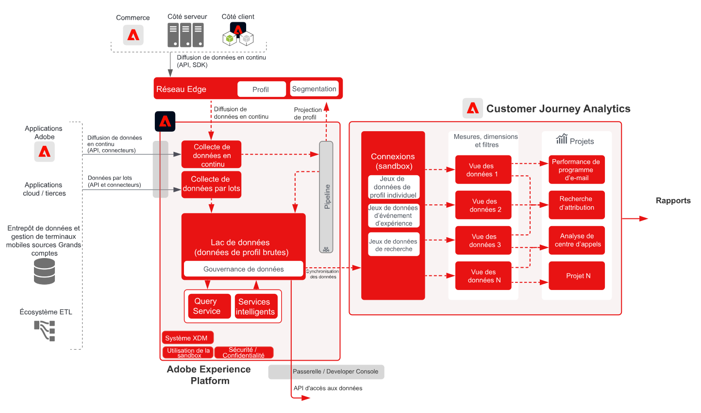

<!-- markdownlint-disable-next-line MD025 -->
# Plan directeur B2B Customer Journey Analytics

Customer Journey Analytics B2B edition permet la création de rapports et l’analyse basés sur les comptes pour les organisations B2B. Contrairement à l’analyse B2C centrée sur la personne, ce plan directeur place le **compte** au centre du modèle de données afin que vous puissiez analyser des parcours d’achat B2B complexes sur plusieurs parties prenantes, groupes d’achat et cycles de vente. Utilisez [!DNL Customer Journey Analytics] pour unifier les données comportementales avec les dimensions B2B (comptes, opportunités, campagnes et listes marketing) afin d’obtenir des informations basées sur le parcours et de créer des audiences.

## Applications

* Adobe [!DNL Customer Journey Analytics] (B2B edition)
* Adobe Experience Platform (pour les données B2B et d’événement)

## Cas d’utilisation

* **Optimiser le marketing de compte** — Analysez l’impact marketing sur les campagnes, les canaux et le contenu des groupes d’achats dans les comptes, la progression du pipeline et les opportunités de vente incitative et de vente croisée.
* **Développer les comptes clés** — Identifiez les points de contact à forte valeur ajoutée entre les groupes d&#39;achats au sein des comptes clés afin d&#39;éclairer les actions marketing et commerciales, et de calculer la valeur de la durée de vie du client au niveau du compte.
* **Créer de la valeur pour les produits** — Mesurez l’impact des versions et de l’utilisation des produits sur la satisfaction client au niveau du compte et de l’utilisateur afin d’optimiser les fonctionnalités et d’informer le développement.
* **Analyse B2B basée sur les personnes** - Associez le contexte du compte et de l’opportunité au comportement individuel de l’utilisateur pour la notation des prospects, l’engagement et l’analyse du parcours.

## Conditions préalables

* Droits d’[!DNL Customer Journey Analytics] B2B edition.
* Données B2B et comportementales dans Adobe Experience Platform : jeux de données B2B (comptes, opportunités, personnes, campagnes, listes marketing, activités B2B) et données d’événement (web, mobile ou autres canaux) disponibles dans une [connexion CJA](https://experienceleague.adobe.com/docs/analytics-platform/using/cja-connections/create-connection.html).
* [Dénomination B2B pour CJA](https://experienceleague.adobe.com/docs/analytics-platform/using/cja-dataviews/b2b.html) : paramètres de vue de données spécifiques au B2B (identifiant de compte, identifiant d’opportunité et dimensions associées) configurés pour la connexion.

## Architecture

Architecture de {zoomable="yes"}

Les flux de données d’Experience Platform (jeux de données B2B et d’événements) vers [!DNL Customer Journey Analytics] via une connexion CJA. Les dimensions B2B sont exposées dans les vues de données afin que l’analyse et les audiences puissent être créées au niveau du compte, de l’opportunité et de la personne.

## Garde-fous

* Pour connaître les limites et les droits du produit B2B edition, consultez la description du produit B2B [Customer Journey Analytics](https://helpx.adobe.com/legal/product-descriptions/customer-journey-analytics-b2b.html).
* Pour les limites techniques d’Analytics Platform et de CJA, voir [&#x200B; Mécanismes de sécurisation d’Analytics Platform &#x200B;](https://experienceleague.adobe.com/en/docs/analytics-platform/using/technotes/guardrails).
* Pour les limites d’ingestion de données et de connexion de CJA, consultez [Mécanismes de sécurisation d’ingestion de données de Customer Journey Analytics](https://experienceleague.adobe.com/docs/experience-platform/sources/connectors/adobe-applications/analytics.html#what-is-the-expected-latency-for-analytics-data-on-platform%3F).
* Si vous publiez des audiences CJA sur Real-time Customer Data Platform, consultez [Mécanismes de sécurisation du partage d’audiences Customer Journey Analytics](https://experienceleague.adobe.com/docs/analytics-platform/using/cja-components/audiences/publish.html#latency).
* Pour connaître les latences de bout en bout et les mécanismes de sécurisation de plateforme, reportez-vous au document [&#x200B; Mécanismes de sécurisation du déploiement &#x200B;](../experience-platform/guardrails.md).

## Étapes de mise en œuvre

1. **Ingérer des données B2B et d’événement dans Experience Platform** — Intégrez des données relatives aux comptes, aux opportunités, aux personnes, aux campagnes et aux activités, ainsi que des événements comportementaux, à l’aide de [sources](https://experienceleague.adobe.com/docs/experience-platform/sources/home.html?lang=fr) (par exemple, [!DNL Marketo Engage], CRM ou autres connecteurs B2B).
2. **Créer une connexion CJA** — [Ajoutez les jeux de données Experience Platform pertinents](https://experienceleague.adobe.com/docs/analytics-platform/using/cja-connections/create-connection.html) (B2B et événement) à une connexion Customer Journey Analytics.
3. **Configurer B2B dans la vue de données** — Activer [dénomination B2B et dimensions clés](https://experienceleague.adobe.com/docs/analytics-platform/using/cja-dataviews/b2b.html) (identifiant de compte, identifiant d’opportunité, etc.) dans la ou les vues de données de la connexion.
4. **Créer des audiences et des analyses basées sur les comptes** — Utilisez les [cas d’utilisation et rapports B2B de CJA](https://experienceleague.adobe.com/docs/analytics-platform/using/cja-usecases/b2b.html?lang=fr) pour créer des rapports, des répartitions et des audiences au niveau du compte et de l’opportunité. Vous pouvez également [publier des audiences sur Real-time CDP](https://experienceleague.adobe.com/docs/analytics-platform/using/cja-components/audiences/publish.html?lang=fr) pour activation.

## Documentation connexe

### Customer Journey Analytics B2B edition

* [Customer Journey Analytics B2B edition](https://experienceleague.adobe.com/docs/analytics-platform/using/cja-overview/cja-b2b/cja-b2b-edition.html)
* [Cas d’utilisation B2B](https://experienceleague.adobe.com/docs/analytics-platform/using/cja-usecases/b2b.html?lang=fr)
* [Présentation des cas d’utilisation de B2B edition](https://experienceleague.adobe.com/docs/analytics-platform/using/cja-usecases/b2b/b2b-edition/use-cases-overview.html)
* [Exemple de projet B2B basé sur les personnes](https://experienceleague.adobe.com/docs/analytics-platform/using/cja-usecases/b2b/example.html)

### Connexions et vues de données

* [Créer une connexion](https://experienceleague.adobe.com/docs/analytics-platform/using/cja-connections/create-connection.html)
* [Paramètres des vues de données B2B](https://experienceleague.adobe.com/docs/analytics-platform/using/cja-dataviews/b2b.html)

### Audiences et mécanismes de sécurisation

* [Publication d’audiences CJA sur Real-Time CDP](https://experienceleague.adobe.com/docs/analytics-platform/using/cja-components/audiences/publish.html?lang=fr)
* [Mécanismes de sécurisation d’Experience Platform et des applications](../experience-platform/guardrails.md)
