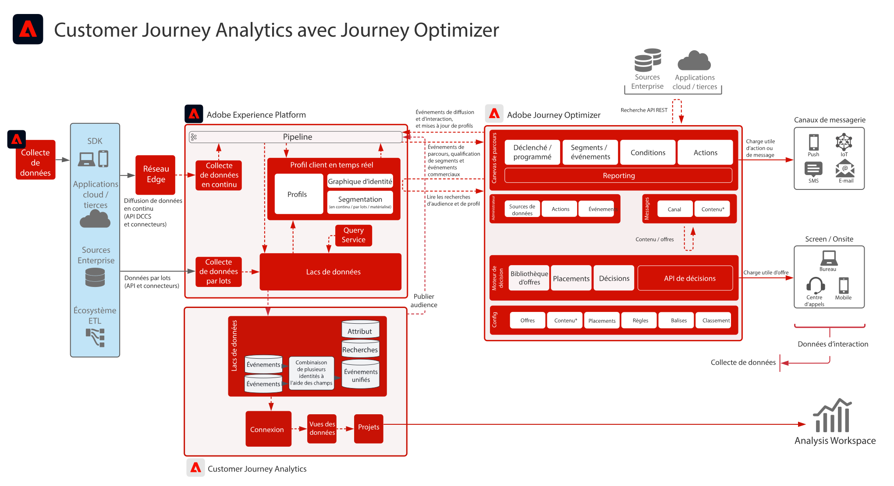

# Customer Journey Analytics avec Journey Optimizer

Les données de Journey Optimizer sont partagées avec le lac de données d’Experience Platform et sont disponibles pour l’ingestion, l’analyse et la création de rapports dans Customer Journey Analytics. La diffusion, l’interaction et l’efficacité des parcours peuvent être analysées et consignées dans Customer Journey Analytics.

En outre, les audiences créées dans Customer Journey Analytics peuvent être publiées dans le profil client en temps réel Experience Platform et sont disponibles pour l’exécution de parcours dans Journey Optimizer.

## Guide de mise en œuvre

Consultez la documentation suivante pour obtenir des conseils sur la mise en œuvre et la configuration des données Journey Optimizer dans Customer Journey Analytics. [Documentation](https://experienceleague.adobe.com/docs/journey-optimizer/using/reporting/reports/sharing-overview.html?lang=fr)

## Architecture de Customer Journey Analytics avec Journey Optimizer

