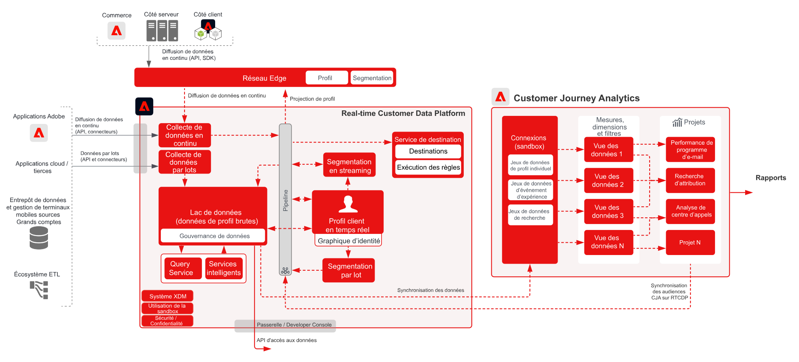

# Customer Journey Analytics avec Real-time Customer Data Platform

Créez et publiez des audiences identifiées dans Customer Journey Analytics (CJA) vers le profil client en temps réel dans Adobe Experience Platform, pour le ciblage et la personnalisation des clients. Idéal pour créer des audiences à l’aide de données historiques ou des audiences plus affinées à partir d’un filtrage granulaire et de champs calculés dans Customer Journey Analytics.

## Guide de publication d’audiences Customer Journey Analytics

Consultez la documentation suivante pour obtenir des conseils sur la mise en œuvre et la configuration de la publication des audiences de Customer Journey Analytics vers Real-time Customer Data Platform. [Documentation](https://experienceleague.adobe.com/docs/analytics-platform/using/cja-components/audiences/publish.html?lang=fr)

## Garde-fous pour les plans directeurs de Customer Journey Analytics

## Diagramme des garde-fous pour les plans directeurs de Customer Journey Analytics

* Pour des garde-fous détaillés et des latences de bout en bout, reportez-vous à la section [document des protections de déploiement](../experience-platform/deployment/guardrails.md)

## Questions fréquentes

* Si un profil correspondant n’existe pas dans la plateforme RTCDP que CJA a envoyée, un nouveau profil sera-t-il créé ou les audiences sont-elles enregistrées uniquement à partir de CJA pour les profils déjà présents ? Oui, un nouveau profil sera créé. Par conséquent, si votre implémentation RTCDP est destinée aux clients connus uniquement, les règles d’audience CJA doivent être écrites pour filtrer uniquement les profils avec des identités connues. Cela permet de s’assurer que le nombre de profils RTCDP n’augmente pas à partir des profils anonymes si vous ne le souhaitez pas.

* CJA envoie-t-il les données d’audience sous la forme d’événements de pipeline ou d’un fichier plat qui va également au lac de données ? Les audiences CJA sont diffusées en continu sur le pipeline vers le service de profil RTCDP, mais les données sont également stockées dans le lac de données en tant que jeu de données.

* Quelles identités CJA envoie-t-il ? CJA envoie les identités qui ont été configurées en tant qu’&quot;ID de personne&quot; lors de la configuration CJA.

* Qu&#39;est-ce qui est défini comme la Principale identité ? Quelle que soit l’identité que l’utilisateur a sélectionnée lorsqu’il configure CJA en tant qu’Principal identifiant &quot;personne&quot;.

* Le service d’identité traite-t-il également les messages CJA ? En d’autres termes, CJA peut-il ajouter des identités à un graphique d’identités de profil par le biais du partage d’audience ? Non, le service d’identité ne traite pas les messages CJA.

## Articles de blog connexes

* [[!DNL Blueprint for Multi-Channel Orchestration in Adobe Experience Platform]](https://medium.com/adobetech/blueprint-for-multi-channel-orchestration-in-adobe-experience-platform-c68317e94184)
* [[!DNL Leveraging External Data Platforms in Adobe Experience Platform Journey Orchestration]](https://medium.com/adobetech/leveraging-external-data-platforms-in-adobe-experience-platform-journey-orchestration-54fc6134fe17)
* [[!DNL Event-Based Triggering on Adobe Experience Platform Orchestration Service using Apache Airflow]](https://medium.com/adobetech/event-based-triggering-on-adobe-experience-platform-orchestration-service-using-apache-airflow-8607b28251f1)
* [[!DNL Adobe Campaign Classic Integration with Journey Orchestration]](https://medium.com/adobetech/adobe-campaign-classic-integration-with-journey-orchestration-ae577653281)
* [[!DNL Demonstrating the Power of Adobe’s New Journey Orchestration Service to Build Personalized Omnichannel Experiences in Real-Time]](https://medium.com/adobetech/demonstrating-the-power-of-adobes-new-journey-orchestration-service-to-build-personalized-aa60d88cd34)
* [[!DNL Journey Orchestration in an Omnichannel World]](https://medium.com/adobetech/journey-orchestration-in-an-omnichannel-world-3a2d32d556d9)
