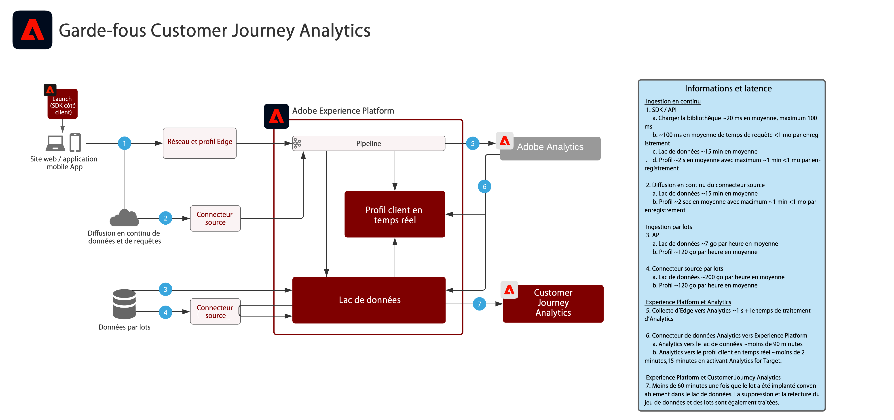

# Customer Journey Analytics

Customer Journey Analytics montre comment les entreprises peuvent unifier les données et le comportement des clients à partir de divers canaux et sources d’interaction pour créer une vue d’ensemble basée sur le parcours client de toutes les interactions client. La création de rapports et d’analyses peut être réalisée dans le service applicatif Customer Journey Analytics pour évaluer et obtenir un aperçu sur les interactions client et les modèles de comportement des clients.

Les analyses courantes comprennent :

* Les chemins de conversion vers le haut ou le bas
* Le niveau d’engagement et de conversion sur les différents canaux
* Les contenus les plus consultés
* Les catégories et les produits les plus populaires
* Quelles campagnes ont généré une conversion et un engagement accrus
* Analyse de l’utilisation des outils pour optimiser les expériences en libre-service

| Plan directeur | Description | Applications Experience Cloud |
|---|---|---|
| **[Analyse de parcours cross-canal](https://experienceleague.adobe.com/docs/analytics-platform/using/cja-usecases/cross-channel.html)** | <ul><li>Ayez une vue consolidée unique du comportement des clients sur différents canaux en unifiant les données de diverses propriétés web, mobiles et hors ligne.</li></ul> | <ul><li>Adobe Experience Platform</li><li>Customer Journey Analytics</li><li>Adobe Analytics (facultatif)</li></ul> |
| **[Analyse du parcours de déviation des appels](https://experienceleague.adobe.com/docs/analytics-platform/using/cja-usecases/call-center.html)** | <ul><li>Déterminez les comportements les plus révélateurs pour aboutir à des appels assistés par un agent en regroupant les données du centre d’appel avec des données d’interaction web, mobiles et autres.</li><li>Ces informations peuvent ensuite être utilisées pour optimiser l’expérience client et réduire le chemin vers les interactions assistées par agent grâce à un contenu et des outils en libre-service optimisés.  </li></ul> | <ul><li>Adobe Experience Platform</li><li>Customer Journey Analytics</li> |

## Diagramme de sécurité pour les plans directeurs de Customer Journey Analytics

## Articles de blog connexes

* [[!DNL Blueprint for Multi-Channel Orchestration in Adobe Experience Platform]](https://medium.com/adobetech/blueprint-for-multi-channel-orchestration-in-adobe-experience-platform-c68317e94184)
* [[!DNL Leveraging External Data Platforms in Adobe Experience Platform Journey Orchestration]](https://medium.com/adobetech/leveraging-external-data-platforms-in-adobe-experience-platform-journey-orchestration-54fc6134fe17)
* [[!DNL Event-Based Triggering on Adobe Experience Platform Orchestration Service using Apache Airflow]](https://medium.com/adobetech/event-based-triggering-on-adobe-experience-platform-orchestration-service-using-apache-airflow-8607b28251f1)
* [[!DNL Adobe Campaign Classic Integration with Journey Orchestration]](https://medium.com/adobetech/adobe-campaign-classic-integration-with-journey-orchestration-ae577653281)
* [[!DNL Demonstrating the Power of Adobe’s New Journey Orchestration Service to Build Personalized Omnichannel Experiences in Real-Time]](https://medium.com/adobetech/demonstrating-the-power-of-adobes-new-journey-orchestration-service-to-build-personalized-aa60d88cd34)
* [[!DNL Journey Orchestration in an Omnichannel World]](https://medium.com/adobetech/journey-orchestration-in-an-omnichannel-world-3a2d32d556d9)
