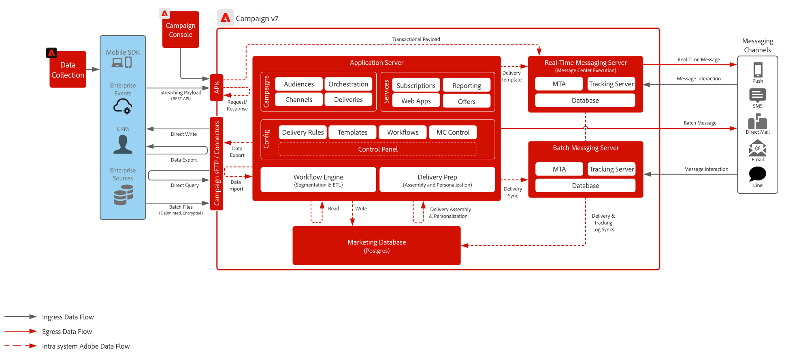

# Plan directeur de Campaign v7

>[!IMPORTANT]
>
> Ce plan directeur pour Adobe Campaign v7 est obsolète et n’est plus pris en charge. Pour obtenir les conseils, l’architecture et les bonnes pratiques les plus récents, reportez-vous au plan directeur d’Adobe Campaign v8.
> 
> 👉 Afficher le [plan directeur d’Adobe [!DNL Campaign] v8](../campaign-v8/campaign-v8-overview.md))

 

## Architecture

 

## Documentation connexe

* [Documentation de Campaign v7](https://experienceleague.adobe.com/docs/campaign-classic.html?lang=fr)
* [Description du produit Campaign v7](https://helpx.adobe.com/fr/legal/product-descriptions/adobe-campaign-managed-cloud-services.html)
* [Documentation pour les balises Experience Platform](https://experienceleague.adobe.com/docs/launch.html?lang=fr)
* [Documentation pour le SDK mobile d’Adobe Experience Platform](https://experienceleague.adobe.com/docs/mobile.html?lang=fr)
