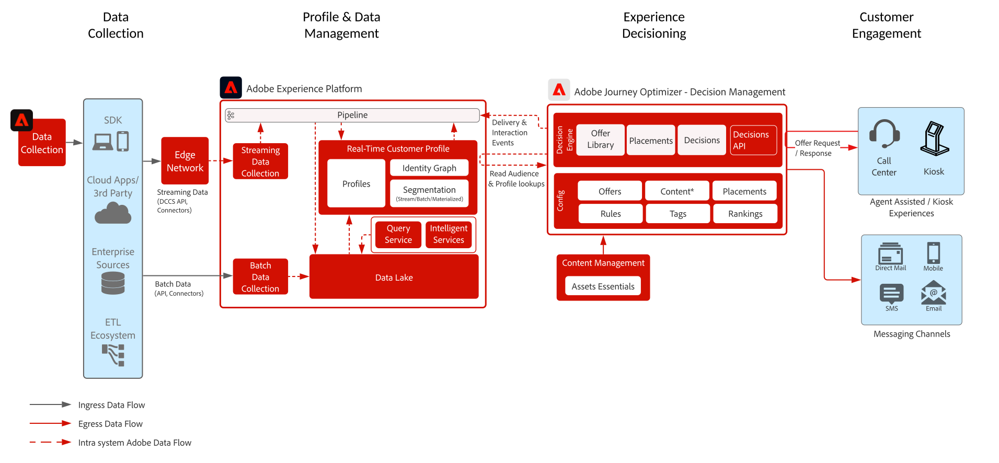

# Gestion des décisions sur le plan directeur du hub

>[!TIP]
>Ce plan directeur est également disponible en tant que [&#x200B; modèle de cas d’utilisation &#x200B;](/help/blueprints/use-case-patterns/personalization/offer-decisioning.md) sous Personalization.

Pour en savoir plus sur la gestion des décisions, consultez la documentation du produit [ICI](https://experienceleague.adobe.com/docs/journey-optimizer/using/offer-decisioniong/get-started-decision/starting-offer-decisioning.html?lang=fr) et la présentation de la gestion des décisions [ICI](decision-management-overview.md).

La gestion des décisions Adobe est un service fourni dans le cadre d’Adobe Journey Optimizer. Ce plan directeur décrit les cas d’utilisation et les fonctionnalités techniques de l’application et fournit une analyse approfondie des différents composants architecturaux et des considérations qui entrent en compte dans la gestion des décisions.

Journey Optimizer vous permet de proposer la meilleure offre et la meilleure expérience à vos clients sur tous les points de contact au bon moment. La gestion des décisions facilite la personnalisation avec une bibliothèque centralisée d’offres marketing et un moteur de décision qui applique des règles et des contraintes aux profils en temps réel riches créés par Adobe Experience Platform, pour vous aider à envoyer à vos clients la bonne offre au bon moment.

La gestion des décisions peut être déployée de deux façons. La première par le biais du hub Adobe Experience Platform, qui est une architecture centrale de centre de données. L’approche « hub » permet d’exécuter, de personnaliser et de diffuser les offres avec une latence supérieure à 500 ms. L’architecture du hub est donc mieux adaptée aux expériences client qui ne demandent pas de latence inférieure à une seconde, par exemple pour les prises de décisions sur les offres pour les kiosques ou les expériences assistées par agent, telles que dans les centres d’appel ou les interactions en personne. Les offres insérées dans les e-mails et les campagnes sortantes sont également alimentées par l’approche hub.

La deuxième approche passe par l’Experience [!DNL [!DNL Edge Network]], qui est une infrastructure géographiquement distribuée à l’échelle mondiale permettant de fournir des expériences rapides pendant moins d’une seconde et pendant des millisecondes. L’expérience client finale est exécutée par l’infrastructure Edge au plus proche de la localisation géographique des consommateurs afin de minimiser la latence. La gestion des décisions sur Edge est conçue pour fournir des expériences client en temps réel, telles que des demandes de personnalisation entrantes web ou mobile.

Ce plan directeur couvre les détails de la gestion des décisions sur le hub.

Pour en savoir plus sur la gestion des décisions sur Edge, reportez-vous au plan directeur [Gestion des décisions sur Edge](decision-management-edge.md).

## Cas d’utilisation de la gestion des décisions sur le hub

* Cas d’utilisation de diffusion en continu où la latence du contexte de profil n’est pas stricte : latence de 15 minutes ou plus.
* Offres personnalisées dans les kiosques et dans les expériences en magasin
* Offres personnalisées par le biais d’une expérience assistée par agent, telles que des centres d’appel ou des interactions commerciales
* Offres incluses dans les e-mails, SMS, notifications push mobiles ou autres interactions sortantes
* Proposez des offres pouvant être diffusées par le biais de systèmes de messagerie et ESP externes
* Exécution de parcours cross-canal : offre une cohérence entre les canaux web, mobile, par e-mail et les autres canaux d’interaction par le biais d’Adobe Journey Optimizer

>[!IMPORTANT]
>
>Pour les cas d’utilisation d’offres et de parcours qui nécessitent un accès au profil pour plus d’informations et de contexte. Il est important de prendre en compte la latence associée à l’ingestion de données vers le profil sur le hub pour vous assurer qu’elles sont disponibles au moment de la décision. Pour les scénarios où le contexte est en flux continu ou ingéré dans le profil et où l’offre ou le parcours doit disposer de ce contexte dans les secondes ou minutes suivant la décision d’offre, ces scénarios sont mieux pris en charge avec la gestion des décisions sur Edge.

## Architecture

## Garde-fous

* Pour en savoir plus sur les garde-fous Journey Optimizer, consultez [Garde-fous Journey Optimizer](https://experienceleague.adobe.com/docs/journey-optimizer/using/get-started/limitations.html?lang=fr).
* Pour en savoir plus sur les garde-fous de la gestion des décisions, consultez la [description du produit de gestion des décisions](https://helpx.adobe.com/fr/legal/product-descriptions/offer-decisioning-app-service.html).

[Mécanismes de sécurisation et conseils sur la latence de bout en bout](/help/blueprints/experience-platform/guardrails.md)

## Modèles de mise en œuvre

* Mise en œuvre dans les canaux par e-mail, par SMS et sortants via l’intégration directe dans [Adobe Journey Optimizer](https://experienceleague.adobe.com/docs/journey-optimizer/using/offer-decisioniong/get-started-decision/offers-e2e.html?lang=fr).
* Pour une mise en œuvre de la gestion des décisions basée sur l’API de serveur, utilisez l’[API de prise de décision](https://experienceleague.adobe.com/docs/journey-optimizer/using/offer-decisioniong/api-reference/offer-delivery/decisioning-vs-edge-apis.html?lang=fr).
* Pour la mise en œuvre de la prise de décision par lots afin de diffuser des offres en bloc vers une application de diffusion de messages, utilisez l’[API de prise de décisions par lots](https://experienceleague.adobe.com/docs/journey-optimizer/using/offer-decisioniong/api-reference/offer-delivery/batch-decisioning-api.html?lang=fr).
* Pour les expériences en temps réel basées sur Edge, utilisez le SDK Web/Mobile ou l’API Edge Decisioning comme indiqué dans la [Gestion des décisions sur le plan directeur Edge](decision-management-edge.md)

## Documentation connexe

* [Adobe Experience Platform](https://experienceleague.adobe.com/docs/experience-platform.html?lang=fr)
* [Adobe Journey Optimizer](https://experienceleague.adobe.com/docs/journey-optimizer.html?lang=fr)
* [Gestion des décisions Adobe Journey Optimizer](https://experienceleague.adobe.com/docs/journey-optimizer/using/offer-decisioniong/get-started-decision/starting-offer-decisioning.html?lang=fr)
* [Description du produit Adobe Journey Optimizer](https://helpx.adobe.com/fr/legal/product-descriptions/adobe-journey-optimizer.html)
* [Description du produit Gestion des décisions Adobe](https://helpx.adobe.com/fr/legal/product-descriptions/offer-decisioning-app-service.html)
