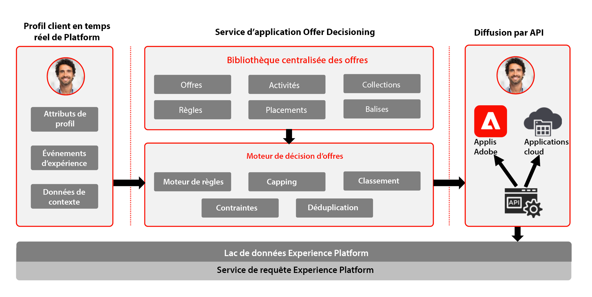

# Journey Optimizer - Aperçu de la gestion des décisions

Pour en savoir plus sur la gestion des décision, consultez la documentation produit [ICI](https://experienceleague.adobe.com/docs/journey-optimizer/using/offer-decisioniong/get-started-decision/starting-offer-decisioning.html?lang=fr).

La gestion des décisions Adobe est un service fourni dans le cadre d’Adobe Journey Optimizer. Ce plan directeur décrit les cas d’utilisation et les fonctionnalités techniques de l’application et fournit une analyse approfondie des différents composants architecturaux et des considérations qui entrent en compte dans la gestion des décisions.

Journey Optimizer vous permet de proposer la meilleure offre et la meilleure expérience à vos clients sur tous les points de contact au bon moment. La gestion des décisions facilite la personnalisation avec une bibliothèque centralisée d’offres marketing et un moteur de décision qui applique des règles et des contraintes aux profils en temps réel riches créés par Adobe Experience Platform, pour vous aider à envoyer à vos clients la bonne offre au bon moment.

La fonctionnalité de gestion des décisions comprend principalement deux éléments :

* La bibliothèque centralisée des offres, c’est-à-dire l’interface dans laquelle vous créez et gérez les différents éléments qui composent vos offres, et définissez leurs règles et contraintes
* Le moteur de décision d’offre qui tire parti des données Adobe Experience Platform et des profils clients en temps réel, ainsi que de la bibliothèque des offres, qui permet de sélectionner l’heure, le client et le canal de diffusion de l’offre

La gestion des décisions peut être déployée de deux façons, sur Edge ou sur le hub. Chacune de ces méthodes présente un ensemble d’interfaces et de protocoles spécifiques pour le fonctionnement du service, comme indiqué dans les plans directeurs respectifs référencés ci-dessous. Vous trouverez des informations supplémentaires dans la documentation sur la gestion des décisions [ICI](https://experienceleague.adobe.com/docs/journey-optimizer/using/offer-decisioniong/api-reference/offer-delivery-api/decisioning-vs-edge-apis.html?lang=fr).

## Gestion des décisions sur le hub

La première par le biais du hub Adobe Experience Platform, qui est une architecture centrale de centre de données. L’approche « hub » permet d’exécuter, de personnaliser et de diffuser les offres avec une latence supérieure à 500 ms. L’architecture du hub est donc mieux adaptée aux expériences client qui ne demandent pas de latence inférieure à une seconde, par exemple pour les prises de décisions sur les offres pour les kiosques ou les expériences assistées par agent, telles que dans les centres d’appel ou les interactions en personne. Les offres insérées dans les emails, les SMS ou les notifications push et autres campagnes sortantes sont également alimentées par l’approche « hub ». Pour en savoir plus sur la gestion des décisions sur le hub, reportez-vous au plan directeur [Gestion des décisions sur le hub](https://experienceleague.adobe.com/docs/blueprints-learn/architecture/customer-journeys/journey-optimizer/offer-decisioning/decision-management-hub.html?lang=fr).

* L’éligibilité des offres peut prendre en compte le profil client en temps réel complet, y compris tous les attributs et événements d’expérience.

### Cas d’utilisation de la gestion des décisions sur le hub

* Offres personnalisées dans les kiosques et dans les expériences en magasin
* Offres personnalisées par le biais d’une expérience assistée par agent, telles que des centres d’appel ou des interactions commerciales
* Offres incluses dans les e-mails ou SMS, ou autres interactions sortantes
* Exécution de parcours cross-canal : offre une cohérence entre les canaux web, mobile, par e-mail et les autres canaux d’interaction par le biais d’Adobe Journey Optimizer

### Considérations techniques de la gestion des décisions sur le hub

* Demandes par seconde = 2000.
* Latence de la réponse &lt; 500 ms.
* Accès au profil client en temps réel complet, y compris aux abonnements, aux attributs et aux événements d’expérience de l’audience.

## Gestion des décisions sur Edge

La seconde approche consiste à utiliser Experience Edge Network, qui est une infrastructure répartie géographiquement dans le monde pour fournir des expériences avec une latence inférieure à une seconde ou en milliseconde. L’expérience client finale est exécutée par l’infrastructure Edge au plus proche de la localisation géographique des consommateurs afin de minimiser la latence. La gestion des décisions sur Edge est conçue pour fournir des expériences client en temps réel, telles que des demandes de personnalisation entrantes web ou mobile. Pour en savoir plus sur la gestion des décisions sur Edge, reportez-vous au plan directeur [Gestion des décisions sur Edge](https://experienceleague.adobe.com/docs/blueprints-learn/architecture/customer-journeys/journey-optimizer/offer-decisioning/decision-management-edge.html?lang=fr).

### Cas d’utilisation de la gestion des décisions sur Edge

* Personnalisation en ligne via des expériences entrantes web ou mobiles
* Exécution de parcours cross-canal : offre une cohérence entre les canaux web, mobile, par e-mail et les autres canaux d’interaction par le biais d’Adobe Journey Optimizer

### Gestion des décisions sur Edge  Considérations techniques

* Demandes par seconde = 5000.
* Latence de la réponse &lt; 250 ms.
* Accès au profil en temps réel Edge. Seules les audiences projetées et les attributs de profil sur Edge seront disponibles dans le profil.
* Si la personnalisation est requise au cours des premières expériences, le hub sera la solution idéale car le profil complet est disponible. Le profil Edge doit être synchronisé à partir du hub pour la première expérience sur Edge. Par conséquent, la toute première expérience à partir du serveur Edge n’inclut pas les données de profil transférées au préalable vers le hub.

## Documentation connexe

* [Adobe Experience Platform](https://experienceleague.adobe.com/docs/experience-platform.html?lang=fr)
* [Adobe Journey Optimizer](https://experienceleague.adobe.com/docs/journey-optimizer.html?lang=fr)
* [Gestion des décisions Adobe Journey Optimizer](https://experienceleague.adobe.com/docs/journey-optimizer/using/offer-decisioniong/get-started-decision/starting-offer-decisioning.html?lang=fr)
* [Description du produit Adobe Journey Optimizer](https://helpx.adobe.com/fr/legal/product-descriptions/adobe-journey-optimizer.html)
* [Description du produit de gestion des décisions Adobe](https://helpx.adobe.com/fr/legal/product-descriptions/offer-decisioning-app-service.html)
