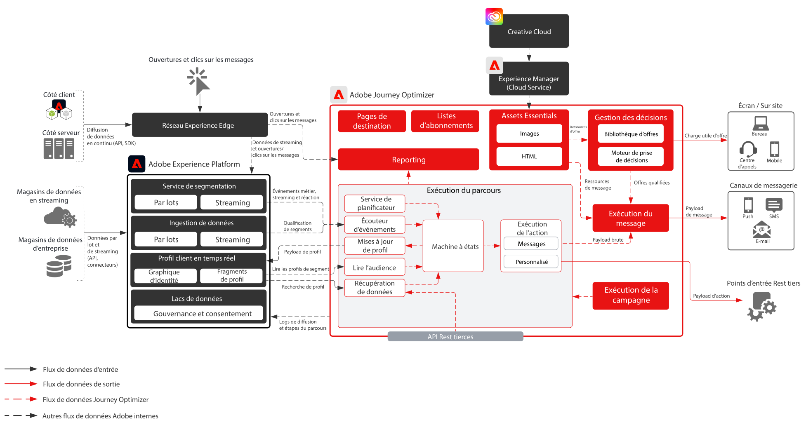

# Journey Optimizer

Adobe Journey Optimizer est un système conçu spécifiquement pour permettre aux équipes marketing de réagir en temps réel aux comportements des clients et de s’adapter à leurs besoins en fonction de leur localisation. Les fonctionnalités de gestion des données ont été déplacées vers Adobe Experience Platform, ce qui permet aux équipes marketing de se concentrer sur ce qu’elles font le mieux : créer un parcours client de haute qualité et des conversations personnalisées.  Ce plan directeur décrit les fonctionnalités techniques de l’application et présente en détail les différents composants architecturaux qui constituent Adobe Journey Optimizer.

 

## Cas d’utilisation

* Messages déclenchés
* Confirmations de bienvenue et d’enregistrement
* Abandon de panier et de formulaire de demande
* Messages déclenchés par l’emplacement
* Expériences dans un stade
* Voyage et hospitalité avant l’arrivée et pendant le séjour

 

## Architecture

 

## Scénarios de plan directeur

| Scénario | Description | Fonctionnalités |
| :-- | :--- | :--- |
| [Messagerie tierce](3rd-party-messaging.md) | Illustre comment Adobe Journey Optimizer peut être utilisé avec des systèmes de messagerie tiers pour orchestrer et envoyer des communications personnalisées. | Diffusez des communications personnalisées aux clients dès qu’ils interagissent avec votre marque ou votre entreprise.  Remarques : <ul><li>Le système tiers doit prendre en charge les jetons porteur pour l’authentification.</li><li>Les adresses IP statiques ne sont pas prises en charge en raison d’une architecture multi-locataire.</li><li>Prenez en compte les contraintes architecturales concernant le système tiers lorsqu’il s’agit d’appels API par seconde.  Le client peut avoir besoin d’acheter du volume supplémentaire auprès du fournisseur tiers pour prendre en charge le volume provenant de Journey Optimizer.</li><li>Gestion des décisions non prise en charge dans les messages ou les payloads</li></ul> |

 

## Modèles d’intégration

| Intégration | Description | Fonctionnalités |
| :-- | :--- | :--- |
| [Journey Optimizer avec Adobe Campaign](ajo-and-campaign.md) | Indique comment utiliser Adobe Journey Optimizer pour orchestrer des expériences 1:1 à l’aide du profil client en temps réel et utiliser le système de messagerie transactionnelle Adobe Campaign natif pour envoyer le message. | Exploite les profils clients en temps réel et la puissance de Journey Optimizer pour orchestrer les expériences en temps réel tout en utilisant les fonctionnalités natives de messagerie en temps réel d’Adobe Campaign pour effectuer la communication du « dernier kilomètre ».  Remarques : <ul><li>L’application Campaign doit être soit la version v7 build >21.1, soit la v8.</li><li>Débit des messages</li><ul><li>Campaign v7 : jusqu’à 50 000 par heure</li><li>Campaign v8 : jusqu’à 1 million par heure</li><li>Campaign Standard : jusqu’à 50 000 par heure</li></ul><li>Aucune limitation n’est effectuée, de sorte que les cas d’utilisation doivent être vérifiés par un architecte d’entreprise.</li><li>Utilisation de la gestion des décisions non prise en charge dans les messages envoyés par Campaign</li></ul> |

 

## Conditions préalables

Adobe Experience Platform

* Les schémas et les jeux de données doivent être configurés dans le système avant de pouvoir configurer les sources de données Journey Optimizer.
* Pour les schémas basés sur la classe Événement d’expérience, ajoutez le groupe de champs « Orchestration eventID » lorsque vous souhaitez qu’un événement déclenché ne soit pas basé sur des règles.
* Pour les schémas basés sur une classe Profil individuel, ajoutez le groupe de champs « Détails du test de profil » pour pouvoir charger des profils de test à utiliser avec Journey Optimizer.

E-mail

* Vous devez disposer d’un sous-domaine prêt à être utilisé pour l’envoi de messages.
* Le sous-domaine peut être entièrement délégué à Adobe (recommandé) ou les CNAME peuvent être utilisés pour pointer vers des serveurs DNS spécifiques à Adobe (personnalisés).
* Un enregistrement TXT Google est nécessaire pour chaque sous-domaine afin de garantir une bonne délivrabilité.

Push mobile

* Le client doit disposer des services d’un développeur mobile pour créer l’application
* SDK mobile Adobe Experience Platform

 

## Garde-fous

[Lien de produit pour les garde-fous de Journey Optimizer](https://experienceleague.adobe.com/docs/journeys/using/starting-with-journeys/limitations.html?lang=fr)

Veuillez noter que ces informations ne sont pas répertoriées dans le lien ci-dessus :

* Segments par lot : veillez à connaître le volume quotidien des utilisateurs qualifiés et à garantir que le système de destination peut gérer les pics de débit par parcours et sur tous les parcours.
* Segments en diffusion en continu : veillez à ce que le pic initial des qualifications de profil puisse être traité en même temps que le volume de qualification des diffusion en continu quotidien par parcours et sur tous les parcours
* Gestion des décisions prise en charge de façon native uniquement dans les messages (et non dans les actions personnalisées)
* Types de message pris en charge :
   * E-mail
   * Push (FCM/APNS)
   * Actions personnalisées (via l’API REST)
* Intégrations sortantes vers des systèmes tiers :
   * Pas de prise en charge d’une seule adresse IP statique, car notre infrastructure est définie pour plusieurs clients (doit mettre en liste autorisée toutes les adresses IP du centre de données).
   * Seules les méthodes de POST et de PUT sont prises en charge pour les actions personnalisées.
   * Authentification par utilisateur/passage ou jeton d’autorisation
* Il n’est pas possible de regrouper et de déplacer des composants individuels d’Adobe Experience Platform ou de Journey Optimizer entre différents environnements de test. Vous devez les réimplémenter dans les nouveaux environnements.

### Garde-fous de l’ingestion des données

 

### Garde-fous d’activation

 

## Étapes d’implémentation

### Adobe Experience Platform

#### Schéma / jeux de données

1. [Configurez des profils individuels, des événements d’expérience et des schémas multi-entités](https://experienceleague.adobe.com/?recommended=ExperiencePlatform-D-1-2021.1.xdm) dans Experience Platform, en fonction des données fournies par le client.
1. [Créez des jeux de données](https://experienceleague.adobe.com/docs/platform-learn/tutorials/data-ingestion/create-datasets-and-ingest-data.html?lang=fr) dans Experience Platform pour les données à ingérer.
1. [Ajoutez des libellés d’utilisation des données](https://experienceleague.adobe.com/docs/platform-learn/tutorials/data-governance/classify-data-using-governance-labels.html?lang=fr) dans Experience Platform au jeu de données pour votre gouvernance.
1. [Créez des stratégies](https://experienceleague.adobe.com/docs/platform-learn/tutorials/data-governance/create-data-usage-policies.html?lang=fr) pour appliquer la gouvernance sur les destinations.

#### Profil / identité

1. [Créez des espaces de noms spécifiques au client](https://experienceleague.adobe.com/docs/platform-learn/tutorials/identities/label-ingest-and-verify-identity-data.html?lang=fr).
1. [Ajoutez des identités aux schémas](https://experienceleague.adobe.com/docs/platform-learn/tutorials/identities/label-ingest-and-verify-identity-data.html?lang=fr).
1. [Activez les schémas et les jeux de données pour le profil](https://experienceleague.adobe.com/docs/platform-learn/tutorials/profiles/bring-data-into-the-real-time-customer-profile.html?lang=fr).
1. [Configurez des stratégies de fusion](https://experienceleague.adobe.com/docs/platform-learn/tutorials/profiles/create-merge-policies.html?lang=fr) pour les différentes vues de [!UICONTROL profil client en temps réel] (facultatif).
1. Créez des segments pour utilisation dans Journey.

#### Sources / destinations

1. [Ingérez des données dans Experience Platform](https://experienceleague.adobe.com/?recommended=ExperiencePlatform-D-1-2020.1.dataingestion&amp;lang=fr) à l’aide d’API de diffusion en continu et de connecteurs sources.

### Journey Optimizer

1. Configurez votre source de données Experience Platform et déterminez les champs à mettre en cache dans le cadre des données profileStreaming utilisées pour lancer un parcours client. Vous devez d’abord configurer Journey Optimizer pour obtenir un ID d’orchestration. Cet ID d’orchestration est ensuite fourni au développeur pour l’utiliser lors de l’ingestion.
1. Configurez des sources de données externes.
1. Configurez des actions personnalisées.

### Configuration push mobile

1. Implémentez le SDK Mobile Experience Platform pour collecter des jetons push et des informations de connexion afin de les lier à des profils clients connus.
1. Tirez parti des balises Adobe et créez une propriété mobile avec l’extension suivante :
1. Adobe Journey Optimizer
1. Adobe Experience Platform Edge Network
1. Identité  pour Edge Network
1. Mobile Core
1. Assurez-vous que vous disposez d’un flux de données dédié pour les déploiements d’applications mobiles par rapport aux déploiements web.
1. Pour plus d’informations, reportez-vous à la section [Guide d’Adobe Journey Optimizer Mobile](https://aep-sdks.gitbook.io/docs/using-mobile-extensions/adobe-journey-optimizer).

## Documentation connexe

* [Documentation pour Adobe Experience Platform ](https://experienceleague.adobe.com/docs/experience-platform.html?lang=fr)
* [Documentation pour les balises Experience Platform](https://experienceleague.adobe.com/docs/experience-platform/tags/home.html?lang=fr)
* [Documentation pour le SDK mobile d’Adobe Experience Platform](https://experienceleague.adobe.com/docs/mobile.html?lang=fr)
* [Documentation Journey Optimizer](https://experienceleague.adobe.com/docs/journey-optimizer/using/ajo-home.html?lang=fr)
* [Description du produit Journey Optimizer](https://helpx.adobe.com/fr/legal/product-descriptions/adobe-journey-optimizer.html)
