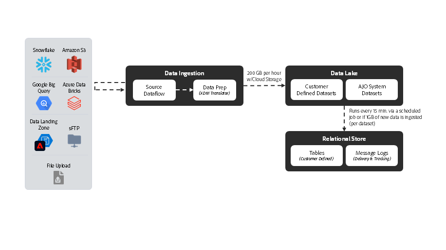

# [!DNL Journey Optimizer] - Plan directeur d’orchestration de Campaign

L’orchestration des campagnes d’AJO permet aux spécialistes marketing de concevoir et d’exécuter des communications planifiées, basées sur l’audience et à plusieurs étapes sur les canaux sortants tels que les e-mails, les SMS, les notifications push et le publipostage direct. Contrairement aux Parcours AJO, qui réagissent aux comportements individuels des clients à l’aide de données en temps réel du profil client en temps réel, les campagnes sont des efforts marketing coordonnés qui ciblent les audiences à intervalles planifiés. Ensemble, les campagnes et les parcours offrent des approches complémentaires : les campagnes pilotent les stratégies d’engagement de la marque, tandis que les parcours offrent des expériences personnalisées et réactives.

 

## Architecture

 

### Architecture D’Exécution Des Messages

 

### Magasin Relationnel - Latence D’Ingestion Des Données

 

## Considérations architecturales pour les Parcours

- **Architecture des données** : l’orchestration d’AJO Campaign utilise une base de données relationnelle sous-jacente pour la création et l’orchestration d’audiences
- **Intégration d’Audience Portal** : intégré de manière native à Audience Portal dans le profil client en temps réel pour lire les audiences existantes et enregistrer de nouvelles audiences dans lors de la création de campagnes
- **Création d’une audience à la demande** : créez, évaluez et exécutez immédiatement une audience pour les cas d’utilisation marketing urgents
- **Intégration du profil client en temps réel :** source de vérité pour l’historique de consentement et de communication ; prend en charge la conception de « profil maigre » pour la personnalisation.
- **Envoi de messages à entités multiples :** possibilité d’envoyer plusieurs messages par profil dans une seule diffusion (par exemple, envoyer un message par réservation à l’adresse e-mail du client)
- **Segmentation d’entités multiples** : commencez à créer une audience à partir de n’importe quelle entité du magasin relationnel (c’est-à-dire produit, inventaire, plan, etc.)

 

## Garde-fous

[Lien du produit Campagnes orchestrées](https://experienceleague.adobe.com/en/docs/journey-optimizer/using/campaigns/orchestrated-campaigns/guardrails)

[Mécanismes de sécurisation et conseils sur la latence de bout en bout](https://experienceleague.adobe.com/docs/blueprints-learn/architecture/architecture-overview/deployment/guardrails)

 

## Documentation connexe

- [[!DNL Journey Optimizer] Campagnes orchestrées](https://experienceleague.adobe.com/en/docs/journey-optimizer/using/campaigns/orchestrated-campaigns/orchestrated-campaigns-landing-page.html)
- [[!DNL Experience Platform] documentation ](https://experienceleague.adobe.com/docs/experience-platform.html?lang=fr)
- [[!DNL Experience Platform] Documentation des balises](https://experienceleague.adobe.com/docs/experience-platform/tags/home.html?lang=fr)
- [[!DNL Experience Platform Mobile SDK] documentation ](https://experienceleague.adobe.com/docs/mobile.html)
- [[!DNL Journey Optimizer] documentation ](https://experienceleague.adobe.com/docs/journey-optimizer/using/ajo-home.html)
- [[!DNL Journey Optimizer] description du produit](https://helpx.adobe.com/fr/legal/product-descriptions/adobe-journey-optimizer.html)