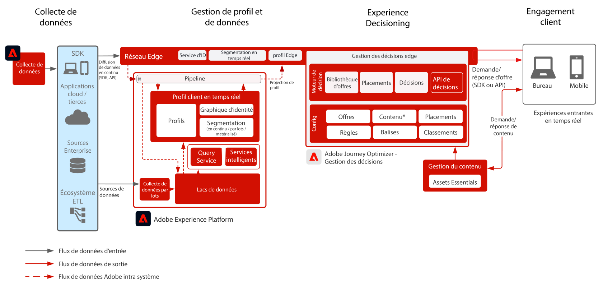

# Journey Optimizer : Offer decisioning sur le serveur Edge

Adobe Decision Management est un service fourni dans le cadre de Adobe Journey Optimizer. Ce plan directeur décrit les cas d’utilisation et les fonctionnalités techniques de l’application et fournit une analyse approfondie des différents composants architecturaux et des considérations qui constituent l’Offer decisioning.

La gestion des décisions peut être déployée de deux façons. La première est via Adobe Experience Platform Hub, qui est une architecture de centre de données unique. Dans l’approche &quot;hub&quot;, les offres sont exécutées, personnalisées et diffusées en seconde latence. L’architecture du hub est donc mieux adaptée aux expériences client qui ne demandent pas de latence inférieure à une seconde. Par exemple, les décisions d’offre sont fournies pour les kiosques ou les expériences d’assistance d’agent, telles que dans les centres d’appel ou les interactions personnelles.

La seconde approche consiste à utiliser le réseau Experience Edge, qui est une infrastructure géographiquement répartie mondialement et qui sert des expériences de sous-seconde et de milliseconde rapides. Expérience client finale exécutée par l’infrastructure de périphérie la plus proche de la géolocalisation des consommateurs afin de minimiser la latence. La gestion des décisions sur le périphérique est conçue pour offrir des expériences client en temps réel. Il s’agit notamment des expériences telles que les demandes de personnalisation entrantes web ou mobiles.

Ce plan directeur couvrira les détails de la gestion de la décision sur l’Edge.

Pour en savoir plus sur la gestion des décisions sur le hub, reportez-vous à la section [Gestion des décisions sur le hub](https://experienceleague.adobe.com/docs/blueprints-learn/architecture/customer-journeys/journey-optimizer/offer-decisioning/offers-hub.html?lang=en) plan directeur.

Pour en savoir plus sur la gestion de la décision, consultez la documentation du produit. [ICI](https://experienceleague.adobe.com/docs/journey-optimizer/using/offer-decisioniong/get-started-decision/starting-offer-decisioning.html)

## Cas d’utilisation

* Personnalisation en ligne via le web ou mobile.
* Offer decisioning entrant et propositions d&#39;offres.
* Exécution de parcours cross-canal : offre une cohérence entre les canaux web, mobile, email et autres canaux d’interaction via Adobe Journey Optimizer.

 

## Architecture

 

## Modèles d’intégration

| d’intégration | Description |
| :-- | :--- |
| [offer decisioning avec Adobe Target](https://experienceleague.adobe.com/docs/target/using/integrate/ajo/offer-decision.html) | Offer Decisioning peut être intégré à Adobe Target afin que les offres puissent être testées et diffusées en tant qu’expériences Target. |

## Conditions préalables

Adobe Experience Platform

* Les schémas et les jeux de données doivent être configurés dans le système avant de pouvoir configurer les sources de données Journey Optimizer.
* Pour les schémas basés sur la classe Événement d’expérience, ajoutez le groupe de champs « Orchestration eventID » lorsque vous souhaitez qu’un événement déclenché ne soit pas basé sur des règles.
* Pour les schémas basés sur une classe Profil individuel, ajoutez le groupe de champs « Détails du test de profil » pour pouvoir charger des profils de test à utiliser avec Journey Optimizer.

 

## Garde-fous

[Lien de produit pour les garde-fous de Journey Optimizer](https://experienceleague.adobe.com/docs/journey-optimizer/using/get-started/limitations.html)

### Garde-fous de l’ingestion des données

 

### Garde-fous d’activation

 

## Modèles d’implémentation

* Utilisez le SDK Web ou mobile pour le déploiement sur des sites web et des applications mobiles afin de mettre en oeuvre l’Offer decisioning dans lequel le SDK a été déployé.
   * [Plan directeur SDK Web/Mobile](https://experienceleague.adobe.com/docs/blueprints-learn/architecture/data-ingestion/websdk.html?lang=fr)
   * [WebSDK](https://experienceleague.adobe.com/docs/experience-platform/edge/personalization/offer-decisioning/offer-decisioning-overview.html)
   * [MobileSDK](https://aep-sdks.gitbook.io/docs/)

Ou

* Pour une mise en oeuvre serveur à serveur, utilisez l’API Edge Network Service pour mettre en oeuvre directement serveur à serveur Offer Decisioning.
   * [API du serveur réseau Edge](https://experienceleague.adobe.com/docs/journey-optimizer/using/offer-decisioniong/api-reference/offer-delivery/deliver-offers.html)
   * [API de prise de décision](https://experienceleague.adobe.com/docs/journey-optimizer/using/offer-decisioniong/api-reference/offer-delivery/decisioning-vs-edge-apis.html)

 

## Étapes d’implémentation

### Adobe Experience Platform

#### Schéma / jeux de données

1. [Configurez des profils individuels, des événements d’expérience et des schémas multi-entités](https://experienceleague.adobe.com/?recommended=ExperiencePlatform-D-1-2021.1.xdm) dans Experience Platform, en fonction des données fournies par le client.
1. [Créez des jeux de données](https://experienceleague.adobe.com/docs/platform-learn/tutorials/data-ingestion/create-datasets-and-ingest-data.html?lang=fr) dans Experience Platform pour les données à ingérer.
1. [Ajoutez des libellés d’utilisation des données](https://experienceleague.adobe.com/docs/platform-learn/tutorials/data-governance/classify-data-using-governance-labels.html?lang=fr) dans Experience Platform au jeu de données pour votre gouvernance.
1. [Créez des stratégies](https://experienceleague.adobe.com/docs/platform-learn/tutorials/data-governance/create-data-usage-policies.html?lang=fr) pour appliquer la gouvernance sur les destinations.

#### Profil / identité

1. [Créez des espaces de noms spécifiques au client](https://experienceleague.adobe.com/docs/platform-learn/tutorials/identities/label-ingest-and-verify-identity-data.html?lang=fr).
1. [Ajoutez des identités aux schémas](https://experienceleague.adobe.com/docs/platform-learn/tutorials/identities/label-ingest-and-verify-identity-data.html).
1. [Activez les schémas et les jeux de données pour le profil](https://experienceleague.adobe.com/docs/platform-learn/tutorials/profiles/bring-data-into-the-real-time-customer-profile.html?lang=fr).
1. [Configurez des stratégies de fusion](https://experienceleague.adobe.com/docs/platform-learn/tutorials/profiles/create-merge-policies.html?lang=fr) pour les différentes vues de [!UICONTROL profil client en temps réel] (facultatif).
1. Créez des segments pour utilisation dans Journey.

#### Sources / destinations

1. [Ingérez des données dans Experience Platform](https://experienceleague.adobe.com/?recommended=ExperiencePlatform-D-1-2020.1.dataingestion&amp;lang=fr) à l’aide d’API de diffusion en continu et de connecteurs sources.

## Documentation connexe

* [Adobe Experience Platform](https://experienceleague.adobe.com/docs/experience-platform.html)
* [Adobe Journey Optimizer](https://experienceleague.adobe.com/docs/journey-optimizer.html)
* [Gestion des décisions Adobe Journey Optimizer](https://experienceleague.adobe.com/docs/journey-optimizer/using/offer-decisioniong/get-started-decision/starting-offer-decisioning.html)
* [Description du produit Adobe Journey Optimizer](https://helpx.adobe.com/fr/legal/product-descriptions/adobe-journey-optimizer.html)
* [Description du produit Adobe Offer Decisioning](https://helpx.adobe.com/legal/product-descriptions/offer-decisioning-app-service.html)
