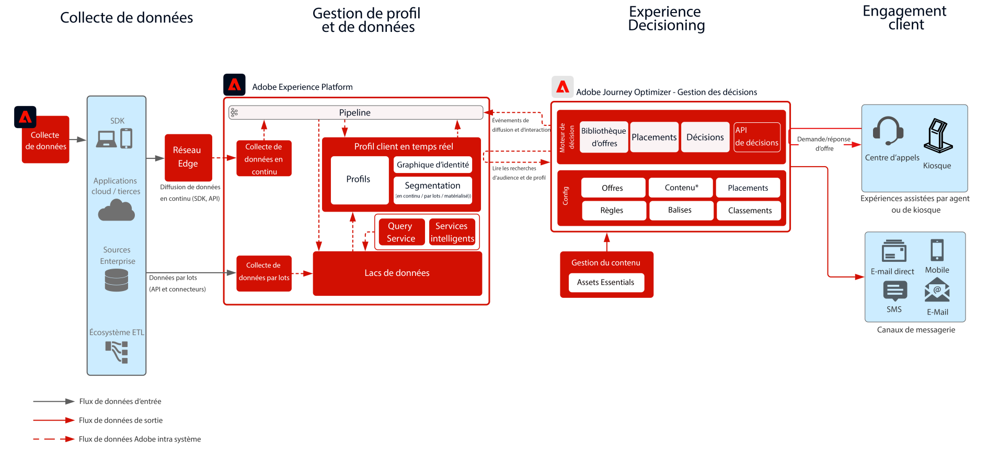

# Journey Optimizer - Offer Decisioning sur le hub

Pour en savoir plus sur la gestion de la décision, consultez la documentation du produit. [ICI](https://experienceleague.adobe.com/docs/journey-optimizer/using/offer-decisioniong/get-started-decision/starting-offer-decisioning.html?lang=fr) et Aperçu de l’Offer decisioning [ICI](https://experienceleague.adobe.com/docs/blueprints-learn/architecture/customer-journeys/journey-optimizer/offer-decisioning/offers-overview.html)

La gestion des décisions Adobe est un service fourni dans le cadre d’Adobe Journey Optimizer. Ce plan directeur décrit les cas d’utilisation et les fonctionnalités techniques de l’application et fournit une analyse approfondie des différents composants architecturaux et des considérations qui entrent en compte dans Offer Decisioning.

Journey Optimizer est utilisé pour offrir la meilleure offre et la meilleure expérience à vos clients sur tous les points de contact au bon moment. Offer Decisioning facilite la personnalisation avec une bibliothèque centrale d’offres marketing et un moteur de décision qui applique des règles et des contraintes aux profils en temps réel riches créés par Adobe Experience Platform pour vous aider à envoyer à vos clients la bonne offre au bon moment.

La gestion des décisions peut être déployée de deux façons. La première par le biais du hub Adobe Experience Platform, qui est une architecture centrale de centre de données. L’approche « hub » permet d’exécuter, de personnaliser et de diffuser les offres avec une latence supérieure à 500 ms. L’architecture du hub est donc mieux adaptée aux expériences client qui ne demandent pas de latence inférieure à une seconde, par exemple pour les prises de décisions sur les offres pour les kiosques ou les expériences assistées par agent, telles que dans les centres d’appel ou les interactions en personne. Les offres insérées dans les e-mails et les campagnes sortantes sont également alimentées par l’approche hub.

La seconde approche consiste à utiliser Experience Edge Network, qui est une infrastructure répartie géographiquement dans le monde pour fournir des expériences avec une latence inférieure à une seconde ou en milliseconde. L’expérience client finale est exécutée par l’infrastructure Edge au plus proche de la localisation géographique des consommateurs afin de minimiser la latence. La gestion des décisions sur Edge est conçue pour fournir des expériences client en temps réel, telles que des demandes de personnalisation entrantes web ou mobile.

Ce plan directeur couvre les détails de la gestion des décisions sur le hub.

Pour en savoir plus sur la gestion des décisions sur Edge, reportez-vous au plan directeur [Gestion des décisions sur Edge](https://experienceleague.adobe.com/docs/blueprints-learn/architecture/customer-journeys/journey-optimizer/offer-decisioning/offers-edge.html).

## Cas d’utilisation de la gestion des décisions sur le hub

* Offres personnalisées dans les kiosques et dans les expériences en magasin
* Offres personnalisées par le biais d’une expérience assistée par agent, telles que des centres d’appel ou des interactions commerciales
* Offres incluses dans les emails, SMS, notifications push mobiles ou autres interactions sortantes.
* Offrir des offres à des systèmes de messagerie et ESP externes pour la diffusion.
* Exécution de parcours cross-canal : offre une cohérence entre les canaux web, mobile, par e-mail et les autres canaux d’interaction par le biais d’Adobe Journey Optimizer

 

## Architecture

 

## Conditions préalables

Adobe Experience Platform

* Les schémas et les jeux de données doivent être configurés dans le système avant de pouvoir configurer les sources de données Journey Optimizer.
* Pour les schémas basés sur la classe Événement d’expérience, ajoutez le groupe de champs « Orchestration eventID » lorsque vous souhaitez qu’un événement déclenché ne soit pas basé sur des règles.
* Pour les schémas basés sur une classe Profil individuel, ajoutez le groupe de champs « Détails du test de profil » pour pouvoir charger des profils de test à utiliser avec Journey Optimizer.

 

## Garde-fous

* Pour en savoir plus sur les garde-fous Journey Optimizer, consultez [Garde-fous Journey Optimizer](https://experienceleague.adobe.com/docs/journey-optimizer/using/get-started/limitations.html?lang=fr).
* Pour les garde-fous d’Offer Decisioning, reportez-vous à la [Description du produit Offer Decisioning](https://helpx.adobe.com/fr/legal/product-descriptions/offer-decisioning-app-service.html).

### Garde-fous de l’ingestion des données

 

### Garde-fous d’activation

 

## Modèles d’implémentation

* Mise en œuvre dans les canaux par e-mail, par SMS et sortants via l’intégration directe avec [Adobe Journey Optimizer](https://experienceleague.adobe.com/docs/journey-optimizer/using/offer-decisioniong/get-started-decision/offers-e2e.html?lang=fr).
* Pour une mise en œuvre d’Offer Decisioning basée sur l’API de serveur, utilisez l’[API de prise de décision](https://experienceleague.adobe.com/docs/journey-optimizer/using/offer-decisioniong/api-reference/offer-delivery/decisioning-vs-edge-apis.html?lang=fr).
* Pour la mise en œuvre de la prise de décision par lots afin de diffuser des offres en bloc vers une application de diffusion de messages, utilisez l’[API de prise de décisions par lots](https://experienceleague.adobe.com/docs/journey-optimizer/using/offer-decisioniong/api-reference/offer-delivery/batch-decisioning-api.html?lang=fr).
* Pour les expériences en temps réel basées sur Edge, utilisez le SDK web / mobile ou l’API de prise de décisions Edge, comme indiqué dans le [plan directeur d’Offer Decisioning sur Edge](https://experienceleague.adobe.com/docs/blueprints-learn/architecture/customer-journeys/journey-optimizer/offer-decisioning/offers-edge.html).
 

## Étapes d’implémentation

### Adobe Experience Platform

#### Schéma / jeux de données

1. [Configurez des profils individuels, des événements d’expérience et des schémas multi-entités](https://experienceleague.adobe.com/?recommended=ExperiencePlatform-D-1-2021.1.xdm) dans Experience Platform, en fonction des données fournies par le client.
1. [Créez des jeux de données](https://experienceleague.adobe.com/docs/platform-learn/tutorials/data-ingestion/create-datasets-and-ingest-data.html?lang=fr) dans Experience Platform pour les données à ingérer.
1. [Ajoutez des libellés d’utilisation des données](https://experienceleague.adobe.com/docs/platform-learn/tutorials/data-governance/classify-data-using-governance-labels.html?lang=fr) dans Experience Platform au jeu de données pour votre gouvernance.
1. [Créez des stratégies](https://experienceleague.adobe.com/docs/platform-learn/tutorials/data-governance/create-data-usage-policies.html?lang=fr) pour appliquer la gouvernance sur les destinations.

#### Profil / identité

1. [Créez des espaces de noms spécifiques au client](https://experienceleague.adobe.com/docs/platform-learn/tutorials/identities/label-ingest-and-verify-identity-data.html?lang=fr).
1. [Ajoutez des identités aux schémas](https://experienceleague.adobe.com/docs/platform-learn/tutorials/identities/label-ingest-and-verify-identity-data.html).
1. [Activez les schémas et les jeux de données pour le profil](https://experienceleague.adobe.com/docs/platform-learn/tutorials/profiles/bring-data-into-the-real-time-customer-profile.html?lang=fr).
1. [Configurez des stratégies de fusion](https://experienceleague.adobe.com/docs/platform-learn/tutorials/profiles/create-merge-policies.html?lang=fr) pour les différentes vues de [!UICONTROL profil client en temps réel] (facultatif).
1. Créez des segments pour utilisation dans Journey.

#### Sources / destinations

1. [Ingérez des données dans Experience Platform](https://experienceleague.adobe.com/?recommended=ExperiencePlatform-D-1-2020.1.dataingestion&amp;lang=fr) à l’aide d’API de diffusion en continu et de connecteurs sources.

## Documentation connexe

* [Adobe Experience Platform](https://experienceleague.adobe.com/docs/experience-platform.html?lang=fr)
* [Adobe Journey Optimizer](https://experienceleague.adobe.com/docs/journey-optimizer.html?lang=fr)
* [Gestion des décisions Adobe Journey Optimizer](https://experienceleague.adobe.com/docs/journey-optimizer/using/offer-decisioniong/get-started-decision/starting-offer-decisioning.html)
* [Description du produit Adobe Journey Optimizer](https://helpx.adobe.com/fr/legal/product-descriptions/adobe-journey-optimizer.html)
* [Description du produit Adobe Offer Decisioning](https://helpx.adobe.com/legal/product-descriptions/offer-decisioning-app-service.html)
