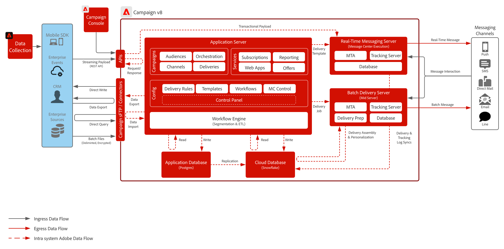

# Plans directeurs du parcours client

Les équipes marketing modernes ont besoin de plateformes capables de prendre en charge à la fois l’engagement réactif (en répondant aux comportements individuels des clients) et la sensibilisation proactive (en initiant des campagnes qui guident les audiences dans des entonnoirs de conversion). Ces cas d’utilisation s’étendent sur des canaux tels que les e-mails, les SMS, les notifications push et, de plus en plus, les expériences web et in-app.

Adobe Journey Optimizer et Adobe Campaign v8 prennent tous deux en charge deux modèles fondamentaux pour l’engagement des clients :

- Parcours déclenchés par le client ou la cliente : orchestration en temps réel pilotée par les événements en fonction des comportements et des signaux individuels.
- Campagnes lancées par la marque : notifications push planifiées de manière stratégique qui introduisent des audiences dans les entonnoirs d’engagement en fonction de la segmentation ou de la logique commerciale.

Les deux solutions permettent la communication sortante sur les canaux traditionnels et numériques. AJO prend également en charge l’intégration aux canaux entrants (par exemple, les applications web et mobiles) par le biais du partage de l’état de l’audience et des services de prise de décision, ce qui permet une personnalisation cross-canal unifiée.

Le choix entre ces outils dépend de considérations architecturales telles que la tolérance à la latence, les exigences des canaux, la stratégie d’intégration des données et l’évolutivité.

 

| Plan directeur | Description | Architecture |
|---|---|:---:|
| **[Adobe Journey Optimizer](journey-optimizer/journey-optimizer-overview.md)** | Associe une orchestration de profil 1:1 basée sur les événements à des communications de marque basées sur l’audience sur plusieurs canaux tels que les e-mails, les sms, le web, les notifications push, les messages in-app, les postes de travail, etc. |  |
| **[Adobe [!DNL Campaign] v8](campaign-v8/campaign-v8-overview.md)** | Axé sur la gestion de campagnes multicanal par lots, idéal pour les canaux marketing traditionnels tels que les e-mails, les SMS et le publipostage direct. |  |

 

## Plans directeurs obsolètes

| Plan directeur | Architecture |
|---|:---:|
| **[Adobe [!DNL Campaign] v7](campaign-v7/campaign-v7-overview.md)** |  |