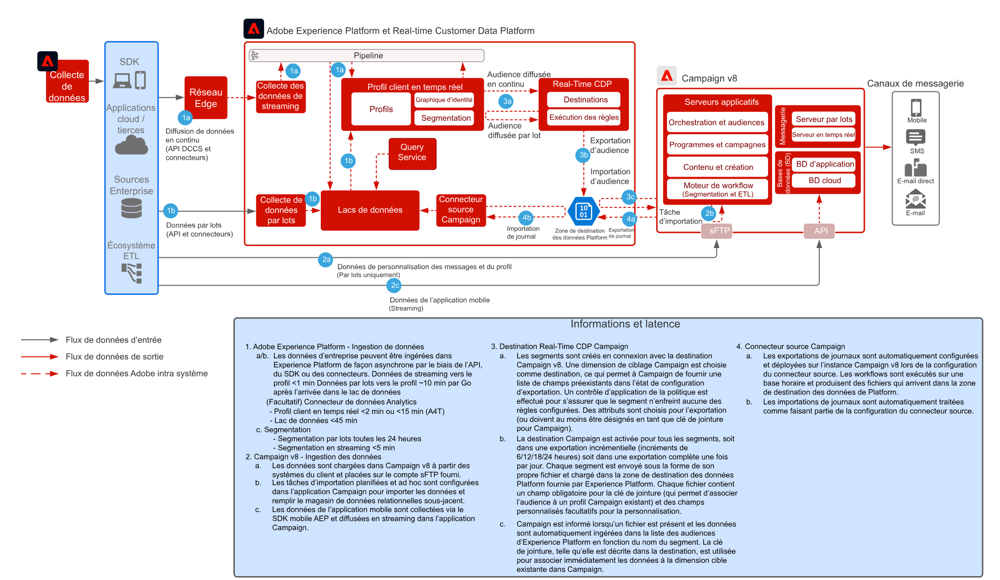

# Modèle d’intégration de Real-Time CDP avec Adobe Campaign v8

Présente comment Adobe Experience Platform, le profil client en temps réel et son outil de segmentation centralisé peuvent être utilisés avec Adobe Campaign pour diffuser des conversations personnalisées.

 

## Applications

* Adobe Experience Platform Real-Time CDP
* Adobe Campaign v8

 

## Architecture

 

## Conditions préalables

* Le client doit disposer d’une session Experience Cloud configurée avec une organisation IMS valide
* Il est recommandé d’allouer Adobe Experience Platform et Campaign dans la même organisation IMS pour une URL de connexion unique.
* Le client doit se voir allouer l’instance V8 de Campaign.
* Le client doit être éligible et avoir accès à RTCDP, aux sources et aux destinations.
* Le contexte du produit Adobe Campaign doit exister

 

## Étapes de mise en œuvre

Reportez-vous à la documentation suivante sur la configuration du connecteur source Campaign v8 vers Adobe Experience Platform et du connecteur de destination Real-time Customer Data Platform vers Campaign v8.
[Connecteurs Campaign et AEP](https://experienceleague.adobe.com/docs/campaign/campaign-v8/connect/ac-aep.html?lang=fr)

## Garde-fous

### Adobe Campaign

* Reportez-vous à la documentation du connecteur source Campaign : [Connecteur source Campaign](https://experienceleague.adobe.com/docs/experience-platform/sources/ui-tutorials/create/adobe-applications/campaign.html?lang=fr)
* Ne prend en charge que les déploiements d’une seule unité organisationnelle d’Adobe Campaign.
* Adobe Campaign est une source de confirmation pour tous les profils actifs, c’est-à-dire que les profils doivent exister dans Adobe Campaign et que de nouveaux profils ne doivent pas être créés en fonction des segments Experience Platform.

### Partage de segments Real-time Customer Data Platform Experience Platform

* Reportez-vous au connecteur de destination RTCDP Campaign : [Connexion à RTCDP Campaign](https://experienceleague.adobe.com/docs/experience-platform/destinations/catalog/email-marketing/adobe-campaign-managed-services.html?lang=fr)
* Limite de 50 segments recommandée
* Notez que la réalisation de l’appartenance à un segment à partir d’AEP est latente pour le lot (1 par jour) et le streaming (~5 min), en fonction du planning d’évaluation du segment.
* La latence d’activation est de 3 heures au minimum
* Seuls les attributs de schéma d’union sont disponibles pour l’activation (pas de prise en charge des événements de tableau / mappage / expérience)
* Limite de 20 attributs par segment recommandée
* Un fichier par segment de tous les profils avec des segments d’appartenance « réalisés » OU, si l’appartenance au segment est ajoutée en tant qu’attribut dans le fichier, les profils « réalisés » et « sortis ».
* Les exportations de segments incrémentielles et complètes sont prises en charge.
* Le cryptage des fichiers n’est pas pris en charge
* Voir les garde-fous concernant l’ingestion des données et les profils pour AEP - [Lien](https://experienceleague.adobe.com/docs/experience-platform/profile/guardrails.html?lang=fr)
