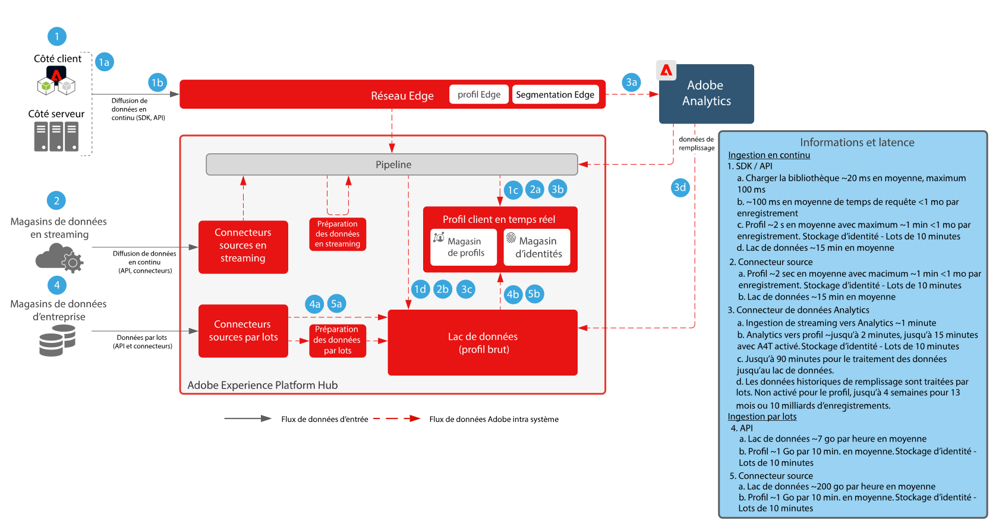

# Préparation des données et plan directeur d’ingestion

Le plan directeur pour la préparation et l’ingestion des données englobe toutes les méthodes par lesquelles les données peuvent être préparées et ingérées dans Adobe. [!DNL Experience Platform].

La préparation des données inclut le mapping de données sources vers un schéma du Modèle de données d’expérience (XDM). Elle inclut également la réalisation de transformations sur les données, y compris le formatage de la date ; le fractionnement, la concaténation ou les conversions de champ ; et la jonction, la fusion ou la ressaisie d’informations. La préparation des données permet d’unifier les données clients pour fournir une analyse agrégée / filtrée, y compris la création de rapports ou la préparation de données pour l’assemblage d’un profil client, la data science, l’activation.

## Architecture

## Mécanismes de sécurisation de l’ingestion des données

Le diagramme ci-dessous illustre les barrières de performance moyennes et la latence pour l’ingestion de données dans Adobe [!DNL Experience Platform].

## Méthodes d’ingestion de données

<table cellspacing="0" class="Table" style="border-collapse:collapse; width:1123px">
<tbody>
<tr>
<td colspan="4" style="background-color:#308fff; border-bottom:4px solid white; border-left:1px solid white; border-right:1px solid white; border-top:1px solid white; height:31px; vertical-align:top; width:1123px">

<strong>Sources de diffusion</strong>

</td>
</tr>
<tr>
<td style="background-color:#969696; border-bottom:1px solid white; border-left:1px solid white; border-right:1px solid white; border-top:none; height:20px; vertical-align:top; width:222px">

Méthode

</td>
<td style="background-color:#969696; border-bottom:1px solid white; border-left:none; border-right:1px solid white; border-top:none; height:20px; vertical-align:top; width:401px">

Cas d’utilisation courants

</td>
<td style="background-color:#969696; border-bottom:1px solid white; border-left:none; border-right:1px solid white; border-top:none; height:20px; vertical-align:top; width:218px">

Protocoles

</td>
<td style="background-color:#969696; border-bottom:1px solid white; border-left:none; border-right:1px solid white; border-top:none; height:20px; vertical-align:top; width:282px">

Considérations

</td>
</tr>
<tr>
<td style="background-color:#e8eeff; border-bottom:1px solid white; border-left:1px solid white; border-right:1px solid white; border-top:none; height:39px; vertical-align:top; width:222px">

<a href="https://experienceleague.adobe.com/docs/experience-platform/edge/home.html?lang=fr" style="color:#0563c1; text-decoration:underline">Adobe Web / SDK mobile</a>

</td>
<td style="background-color:#e8eeff; border-bottom:1px solid white; border-left:none; border-right:1px solid white; border-top:none; height:39px; vertical-align:top; width:401px">
<ul style="list-style-type:square">
<li>Collecte de données à partir de sites web et d’applications mobiles.</li>
<li>Méthode préférée pour la collecte côté client.</li>
</ul>
</td>
<td style="background-color:#e8eeff; border-bottom:1px solid white; border-left:none; border-right:1px solid white; border-top:none; height:39px; vertical-align:top; width:218px">

Push, HTTP, JSON

</td>
<td style="background-color:#e8eeff; border-bottom:1px solid white; border-left:none; border-right:1px solid white; border-top:none; height:39px; vertical-align:top; width:282px">
<ul>
<li>Implémentez plusieurs applications Adobe à l’aide d’un seul SDK.</li>
</ul>
</td>
</tr>
<tr>
<td style="background-color:#cddbff; border-bottom:1px solid white; border-left:1px solid white; border-right:1px solid white; border-top:none; height:39px; vertical-align:top; width:222px">

<a href="https://experienceleague.adobe.com/docs/experience-platform/sources/ui-tutorials/create/streaming/http.html?lang=fr" style="color:#0563c1; text-decoration:underline">Connecteur API HTTP</a>

</td>
<td style="background-color:#cddbff; border-bottom:1px solid white; border-left:none; border-right:1px solid white; border-top:none; height:39px; vertical-align:top; width:401px">
<ul style="list-style-type:square">
<li>Collecte à partir de sources de diffusion en continu, de transactions, d’événements client pertinents et de signaux</li>
</ul>
</td>
<td style="background-color:#cddbff; border-bottom:1px solid white; border-left:none; border-right:1px solid white; border-top:none; height:39px; vertical-align:top; width:218px">

Push, API REST, JSON

</td>
<td style="background-color:#cddbff; border-bottom:1px solid white; border-left:none; border-right:1px solid white; border-top:none; height:39px; vertical-align:top; width:282px">
<ul>
<li>Les données sont diffusées directement vers le hub, de sorte qu’aucune segmentation Edge en temps réel ni transfert d’événement ne soit effectuée.</li>
</ul>
</td>
</tr>
<tr>
<td style="background-color:#e8eeff; border-bottom:1px solid white; border-left:1px solid white; border-right:1px solid white; border-top:none; height:39px; vertical-align:top; width:222px">

<a href="https://experienceleague.adobe.com/docs/experience-platform/edge-network-server-api/data-collection/interactive-data-collection.html?lang=fr" style="color:#0563c1; text-decoration:underline">[!DNL Edge Network] API</a>

</td>
<td style="background-color:#e8eeff; border-bottom:1px solid white; border-left:none; border-right:1px solid white; border-top:none; height:39px; vertical-align:top; width:401px">
<ul style="list-style-type:square">
<li>Collecte à partir de sources de diffusion en continu, de transactions, d’événements client pertinents et de signaux provenant de la distribution globale [!DNL Edge Network]</li>
</ul>
</td>
<td style="background-color:#e8eeff; border-bottom:1px solid white; border-left:none; border-right:1px solid white; border-top:none; height:39px; vertical-align:top; width:218px">

Push, API REST, JSON

</td>
<td style="background-color:#e8eeff; border-bottom:1px solid white; border-left:none; border-right:1px solid white; border-top:none; height:39px; vertical-align:top; width:282px">
<ul>
<li>Les données sont diffusées en continu via la variable [!DNL Edge Network]. Prise en charge de la segmentation en temps réel sur Edge. </li>
</ul>
</td>
</tr>
<tr>
<td style="background-color:#cddbff; border-bottom:1px solid white; border-left:1px solid white; border-right:1px solid white; border-top:none; height:39px; vertical-align:top; width:222px">

<a href="https://experienceleague.adobe.com/docs/experience-platform/sources/connectors/adobe-applications/analytics.html?lang=fr" style="color:#0563c1; text-decoration:underline">Applications Adobe</a>

</td>
<td style="background-color:#cddbff; border-bottom:1px solid white; border-left:none; border-right:1px solid white; border-top:none; height:39px; vertical-align:top; width:401px">
<ul style="list-style-type:square">
<li>Mise en œuvre préalable d’Adobe Analytics, Marketo, Campaign, Target, AAM</li>
</ul>
</td>
<td style="background-color:#cddbff; border-bottom:1px solid white; border-left:none; border-right:1px solid white; border-top:none; height:39px; vertical-align:top; width:218px">

Push, connecteurs source et API

</td>
<td style="background-color:#cddbff; border-bottom:1px solid white; border-left:none; border-right:1px solid white; border-top:none; height:39px; vertical-align:top; width:282px">
<ul>
<li>L’approche recommandée consiste à passer du SDK Web/Mobile aux SDK d’application traditionnels.</li>
</ul>
</td>
</tr>
<tr>
<td style="background-color:#e8eeff; border-bottom:1px solid white; border-left:1px solid white; border-right:1px solid white; border-top:none; height:39px; vertical-align:top; width:222px">

<a href="https://experienceleague.adobe.com/docs/experience-platform/ingestion/streaming/overview.html?lang=fr" style="color:#0563c1; text-decoration:underline">Connecteurs source de streaming</a>

</td>
<td style="background-color:#e8eeff; border-bottom:1px solid white; border-left:none; border-right:1px solid white; border-top:none; height:39px; vertical-align:top; width:401px">
<ul style="list-style-type:square">
<li>Ingestion d’un flux d’événements d’entreprise, généralement utilisé pour partager des données d’entreprise vers plusieurs applications de streaming. </li>
</ul>
</td>
<td style="background-color:#e8eeff; border-bottom:1px solid white; border-left:none; border-right:1px solid white; border-top:none; height:39px; vertical-align:top; width:218px">

Push, API REST, JSON

</td>
<td style="background-color:#e8eeff; border-bottom:1px solid white; border-left:none; border-right:1px solid white; border-top:none; height:39px; vertical-align:top; width:282px">
<ul>
<li>Doit être diffusé en continu au format XDM.</li>
</ul>
</td>
</tr>
<tr>
<td style="background-color:#cddbff; border-bottom:1px solid white; border-left:1px solid white; border-right:1px solid white; border-top:none; height:39px; vertical-align:top; width:222px">

SDK de sources de streaming

</td>
<td style="background-color:#cddbff; border-bottom:1px solid white; border-left:none; border-right:1px solid white; border-top:none; height:39px; vertical-align:top; width:401px">
<ul style="list-style-type:square">
<li>Tout comme HTTP API Connector, permet la carte de configuration en libre-service d’un flux de données externe.</li>
</ul>
</td>
<td style="background-color:#cddbff; border-bottom:1px solid white; border-left:none; border-right:1px solid white; border-top:none; height:39px; vertical-align:top; width:218px">

Push, API HTTP, JSON

</td>
<td style="background-color:#cddbff; border-bottom:1px solid white; border-left:none; border-right:1px solid white; border-top:none; height:39px; vertical-align:top; width:282px">
<ul>
<li>[!DNL Edge Network]</li>
</ul>
</td>
</tr>
</tbody>
</table>

<table cellspacing="0" class="Table" style="border-collapse:collapse; width:1105px">
<tbody>
<tr>
<td colspan="4" style="background-color:#308fff; border-bottom:4px solid white; border-left:1px solid white; border-right:1px solid white; border-top:1px solid white; height:37px; vertical-align:top; width:1105px">

<strong>Sources de lots</strong>

</td>
</tr>
<tr>
<td style="background-color:#969696; border-bottom:1px solid white; border-left:1px solid white; border-right:1px solid white; border-top:none; height:34px; vertical-align:top; width:217px">

Méthode

</td>
<td style="background-color:#969696; border-bottom:1px solid white; border-left:none; border-right:1px solid white; border-top:none; height:34px; vertical-align:top; width:397px">

Cas d’utilisation courants

</td>
<td style="background-color:#969696; border-bottom:1px solid white; border-left:none; border-right:1px solid white; border-top:none; height:34px; vertical-align:top; width:215px">

Protocoles

</td>
<td style="background-color:#969696; border-bottom:1px solid white; border-left:none; border-right:1px solid white; border-top:none; height:34px; vertical-align:top; width:277px">

Considérations

</td>
</tr>
<tr>
<td style="background-color:#e8eeff; border-bottom:1px solid white; border-left:1px solid white; border-right:1px solid white; border-top:none; height:62px; vertical-align:top; width:217px">

<a href="https://experienceleague.adobe.com/docs/experience-platform/ingestion/batch/getting-started.html?lang=fr" style="color:#0563c1; text-decoration:underline">API Batch Ingestion</a>

</td>
<td style="background-color:#e8eeff; border-bottom:1px solid white; border-left:none; border-right:1px solid white; border-top:none; height:62px; vertical-align:top; width:397px">
<ul style="list-style-type:square">
<li>Ingestion à partir d’une banque gérée par l’entreprise. Nettoyage et transformation des données avant ingestion.</li>
</ul>
</td>
<td style="background-color:#e8eeff; border-bottom:1px solid white; border-left:none; border-right:1px solid white; border-top:none; height:62px; vertical-align:top; width:215px">

Push, JSON ou Parquet

</td>
<td style="background-color:#e8eeff; border-bottom:1px solid white; border-left:none; border-right:1px solid white; border-top:none; height:62px; vertical-align:top; width:277px">
<ul>
<li>Doit gérer les lots et les fichiers pour l’ingestion</li>
</ul>
</td>
</tr>
<tr>
<td style="background-color:#cddbff; border-bottom:1px solid white; border-left:1px solid white; border-right:1px solid white; border-top:none; height:62px; vertical-align:top; width:217px">

<a href="https://experienceleague.adobe.com/docs/experience-platform/sources/connectors/cloud-storage/blob-s3.html?lang=fr" style="color:#0563c1; text-decoration:underline">Connecteurs source par lots</a>

</td>
<td style="background-color:#cddbff; border-bottom:1px solid white; border-left:none; border-right:1px solid white; border-top:none; height:62px; vertical-align:top; width:397px">
<ul style="list-style-type:square">
<li>Approche courante de l’ingestion de fichiers à partir d’emplacements de stockage dans le cloud.</li>
<li>Connecteurs vers les applications CRM et marketing courantes.</li>
<li>Idéal pour ingérer de grandes quantités de données historiques.</li>
</ul>
</td>
<td style="background-color:#cddbff; border-bottom:1px solid white; border-left:none; border-right:1px solid white; border-top:none; height:62px; vertical-align:top; width:215px">

Pull, CSV, JSON, Parquet

</td>
<td style="background-color:#cddbff; border-bottom:1px solid white; border-left:none; border-right:1px solid white; border-top:none; height:62px; vertical-align:top; width:277px">
<ul>
<li>Pas toujours activé, ingestion immédiate. </li>
<li>Vérifications de fréquence récurrentes pour ingérer les fichiers delta toutes les 15 minutes au minimum.</li>
</ul>
</td>
</tr>
<tr>
<td style="background-color:#e8eeff; border-bottom:1px solid white; border-left:1px solid white; border-right:1px solid white; border-top:none; height:62px; vertical-align:top; width:217px">

<a href="https://experienceleague.adobe.com/docs/experience-platform/sources/connectors/cloud-storage/data-landing-zone.html?lang=fr" style="color:#0563c1; text-decoration:underline">Zone de destination des données</a>

</td>
<td style="background-color:#e8eeff; border-bottom:1px solid white; border-left:none; border-right:1px solid white; border-top:none; height:62px; vertical-align:top; width:397px">
<ul style="list-style-type:square">
<li>Emplacement de stockage des fichiers approvisionné par Adobe pour envoyer les fichiers Push vers l’ingestion.</li>
</ul>
</td>
<td style="background-color:#e8eeff; border-bottom:1px solid white; border-left:none; border-right:1px solid white; border-top:none; height:62px; vertical-align:top; width:215px">

Push, CSV, JSON, Parquet

</td>
<td style="background-color:#e8eeff; border-bottom:1px solid white; border-left:none; border-right:1px solid white; border-top:none; height:62px; vertical-align:top; width:277px">

- Les fichiers sont fournis avec une durée de vie de 7 jours

</td>
</tr>
<tr>
<td style="background-color:#cddbff; border-bottom:1px solid white; border-left:1px solid white; border-right:1px solid white; border-top:none; height:62px; vertical-align:top; width:217px">

<a href="https://experienceleague.adobe.com/docs/experience-platform/sources/sdk/overview.html?lang=fr" style="color:#0563c1; text-decoration:underline">SDK de sources par lots</a>

</td>
<td style="background-color:#cddbff; border-bottom:1px solid white; border-left:none; border-right:1px solid white; border-top:none; height:62px; vertical-align:top; width:397px">
<ul style="list-style-type:square">
<li>Permet la carte de configuration en libre-service d’une source de données externe.</li>
<li>Idéal pour les connecteurs partenaires ou pour une expérience de workflow personnalisée afin de configurer un connecteur d’entreprise.</li>
</ul>
</td>
<td style="background-color:#cddbff; border-bottom:1px solid white; border-left:none; border-right:1px solid white; border-top:none; height:62px; vertical-align:top; width:215px">

Pull, API REST, fichiers CSV ou JSON

</td>
<td style="background-color:#cddbff; border-bottom:1px solid white; border-left:none; border-right:1px solid white; border-top:none; height:62px; vertical-align:top; width:277px">
<ul>
<li>Fréquence minimale de 15 min</li>
<li>Exemples : MailChimp, One Trust, Zendesk</li>
</ul>

 

</td>
</tr>
</tbody>
</table>

| Méthodes d’ingestion | Description |
|------------------------------|-----------------------------------------------------------------------------------------------------------------------------------------------------------------------------------------------------------------------------------------------------------------------------------------------------------------------------------------------------------------------------------------------------------------------------------------|
| SDK web / mobile | Latence :<ul><li>Temps réel : même collection de pages à [!DNL Edge Network]</li><li>Ingestion par flux vers Profile &lt; 15 minutes au 95e percentile</li><li>Ingestion en continu vers le lac de données (micro-lot ~ 15 minutes)</ul>Documentation : <ul><li>[SDK web](https://experienceleague.adobe.com/docs/web-sdk.html?lang=fr)</li><li>[Tutoriel sur la mise en œuvre d’Adobe Experience Cloud avec le SDK web](https://experienceleague.adobe.com/docs/platform-learn/implement-web-sdk/overview.html?lang=fr)</li><li>[SDK mobile](https://experienceleague.adobe.com/docs/mobile.html?lang=fr)</li><li>[Tutoriel sur la mise en œuvre d’Adobe Experience Cloud dans les applications mobiles](https://experienceleague.adobe.com/docs/platform-learn/implement-mobile-sdk/overview.html?lang=fr)</li></ul> |
| Sources de diffusion | [Sources de diffusion en continu](https://experienceleague.adobe.com/docs/experience-platform/sources/home.html?lang=fr#connectors) Latence :<ul><li>Temps réel : même collection de pages à [!DNL Edge Network]</li><li>Ingestion en continu vers le profil ~ 1 minute</li><li>Ingestion en continu vers le lac de données (micro-lot ~ 15 minutes)</li></ul> |
| API de diffusion | [[!DNL Edge Network] API serveur (préférée)](https://experienceleague.adobe.com/docs/experience-platform/edge-network-server-api/data-collection/interactive-data-collection.html?lang=fr) - prend en charge les services Edge, notamment la segmentation Edge et  [API Core Service de collecte de données](https://experienceleague.adobe.com/docs/experience-platform/sources/connectors/streaming/http.html?lang=fr) - ne prend pas en charge les services Edge, les itinéraires directement vers le hub. Latence :<ul><li>Temps réel : même collection de pages à [!DNL Edge Network]</li><li>Ingestion en continu vers le profil ~ 1 minute</li><li>Ingestion en continu vers le lac de données (micro-lot ~ 15 minutes)</li><li>7 Go/heure</li></ul>[Documentation](https://experienceleague.adobe.com/docs/experience-platform/ingestion/streaming/overview.html?lang=fr#what-can-you-do-with-streaming-ingestion%3F) |
| Outillage ETL | Utilisation des outils ETL pour modifier et transformer des données d’entreprise avant leur ingestion en [!DNL Experience Platform].  Latence :<ul><li>La synchronisation dépend du planning de l’outil ETL externe, puis les garde-fous d’ingestion standard s’appliquent en fonction de la méthode utilisée pour l’ingestion.</li></ul> |
| Sources de lots | Récupération planifiée à partir des sources Latence : ~ 200 Go/heure  [Documentation](https://experienceleague.adobe.com/docs/experience-platform/sources/home.html?lang=fr#connectors) [Tutoriels vidéo](https://experienceleague.adobe.com/docs/platform-learn/tutorials/sources/overview.html?lang=fr) |
| Lot API | Latence :<ul><li>Ingestion par lots dans le Profil en fonction de la taille et des charges de trafic ~ 45 minutes</li><li>Ingestion par lots dans le lac de données en fonction de la taille et des charges de trafic</li></ul>[Documentation](https://experienceleague.adobe.com/docs/experience-platform/ingestion/batch/overview.html?lang=fr#batch) |
| Connecteurs d’applications Adobe | Ingèrent automatiquement les données qui proviennent des applications Adobe Experience Cloud<ul><li>Adobe Analytics : [Documentation](https://experienceleague.adobe.com/docs/experience-platform/sources/connectors/adobe-applications/analytics.html?lang=fr#connectors) et [Tutoriel vidéo](https://experienceleague.adobe.com/docs/platform-learn/tutorials/sources/ingest-data-from-adobe-analytics.html?lang=fr)</li><li>Audience Manager : [Documentation](https://experienceleague.adobe.com/docs/experience-platform/sources/connectors/adobe-applications/audience-manager.html?lang=fr#connectors) et [Tutoriel vidéo](https://experienceleague.adobe.com/docs/platform-learn/tutorials/sources/ingest-data-from-aam.html?lang=fr)</li></ul> |

## Méthodes de préparation des données

| Méthodes de préparation des données | Description |
|------------------------------------------------------------|------------------------------------------------------------------------------------------------------------------------------------------------------------------------------------------------------------------------------------------------------------------------------------------------|
| Outil ETL externe ([!DNL Snaplogic], [!DNL Mulesoft], [!DNL Informatica], etc.) | Exécution de transformations complexes dans l’outil ETL et utilisation des normes [!DNL Experience Platform] [!UICONTROL Service de flux] API ou connecteurs source pour ingérer les données créées. |
| [!UICONTROL Service de requête] - Préparation des données | Associe, fractionne, fusionne, transforme, interroge et filtre des données dans un nouveau jeu de données.  [Documentation](https://experienceleague.adobe.com/docs/experience-platform/query/home.html?lang=fr#sql) pour l’utilisation de Create Table as Select (CTAS) |
| Fonctions XDM Mapper et Data Prep (en flux continu et par lots) | Mappage des attributs source au format CSV ou JSON dans les attributs XDM pendant [!DNL Experience Platform] ingestion. Calculent des fonctions sur les données au fur et à mesure qu’elles sont ingérées ; c’est-à-dire le formatage, le fractionnement, la concaténation des données, etc. [Documentation](https://experienceleague.adobe.com/docs/experience-platform/data-prep/home.html?lang=fr) |

## Articles de blog connexes

* [Utilisation des plateformes de données externes dans Adobe [!DNL Experience Platform] [!DNL Journey Orchestration]](https://medium.com/adobetech/leveraging-external-data-platforms-in-adobe-experience-platform-journey-orchestration-54fc6134fe17?source=your_stories_page)
* [Ingestion à haut débit avec Iceberg](https://medium.com/adobetech/high-throughput-ingestion-with-iceberg-ccf7877a413f?source=your_stories_page)
* [Astuces pour Query Service dans Adobe [!DNL Experience Platform] (Écriture de requêtes et stockage de jeux de données dérivés)](https://medium.com/adobetech/query-service-tricks-in-adobe-experience-platform-writing-queries-and-storing-derived-datasets-eaee0d6d683e?source=your_stories_page)
* [Creuser dans l&#39;Adobe [!DNL Experience Platform]Modèle de données d’expérience de pour mieux comprendre la puissance de Real-time Customer Profile](https://medium.com/adobetech/digging-into-adobe-experience-platforms-experience-data-model-to-more-fully-understand-the-power-3e109271e04f?source=your_stories_page)
* [Présentation de l’analyse des données exploratoires sur Adobe [!DNL Experience Platform]](https://medium.com/adobetech/an-introductory-look-at-exploratory-data-analysis-on-adobe-experience-platform-1bfce7501d9a?source=your_stories_page)
* [Modélisation des données XDM pour Data Science à l’échelle sur Adobe [!DNL Experience Platform]](https://medium.com/adobetech/modeling-xdm-data-for-data-science-at-scale-on-adobe-experience-platform-222bb2a6dbf7?source=your_stories_page)
