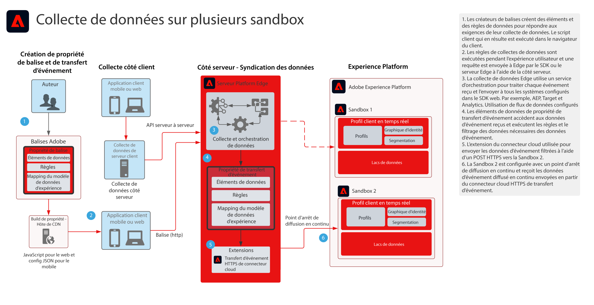

# Plan directeur de la collecte de données Transfert d’événements multi-sandbox

Le plan directeur de la collecte de données de transfert d’événements multi-sandbox indique comment les données collectées avec les SDK web et mobiles Adobe Experience Platform peuvent être configurées pour collecter un seul événement et les transférer vers plusieurs sandbox AEP. Ce plan directeur est un cas d’utilisation spécifique qui utilise la fonctionnalité de transfert d’événement des balises d’Adobe.

En plus de répliquer l’événement, à l’aide des fonctionnalités de transfert d’événement , vous pouvez ajouter, filtrer ou manipuler les données collectées d’origine qui répondent aux exigences d’autres environnements de test. Par exemple, l’environnement de test A doit recevoir tous les éléments de données d’événement et l’environnement de test B ne doit recevoir que des données autres que les informations d’identification personnelle.

Le transfert d’événements utilise une propriété Tag distincte qui contient les éléments de données, les règles et les extensions nécessaires à vos besoins de données. Avec un événement entrant, votre propriété de transfert d’événement peut collecter les données et les gérer selon les besoins avant le transfert.

La boîte de réception de votre destination nécessite un point de fin HTTP Streaming qui serait utilisé par l’extension HTTPS de transfert d’événement.

## Cas d’utilisation

* Création de rapports de données globales : lorsque vous utilisez plusieurs environnements de test pour isoler les environnements d’exploitation et la nécessité de consolider la collecte de données sur un environnement de test pour la création de rapports entre environnements de test. Le transfert d’événement à un environnement de test de création de rapports permet à chaque environnement d’exploitation de test d’envoyer des données telles qu’elles sont collectées en temps réel à un environnement de test de création de rapports.
* Gérez la collecte de données dans les environnements de test en fonction de différentes règles de données pour chaque environnement de test. Ces environnements d’exploitation qui nécessitent le filtrage de données sensibles telles que Health Care et Financial Services

## Applications

* Collecte Adobe Experience Platform

## Architecture

1. Les auteurs de balises définissent une propriété de balise ainsi qu’une propriété de transfert d’événement. Ici, les auteurs définissent les éléments de données, les règles et les actions qui gèrent la collecte de données. Pour rappel, le code de propriété de balise s’exécute sur le client et est distribué par un hôte CDN. Le code de propriété de transfert d’événement s’exécute sur le serveur Adobe Edge.

1. Les données collectées sur le client sont envoyées au serveur Edge. Les clients ont également la possibilité d’envoyer des données à leur propre serveur en premier lieu en tant que méthode de collecte côté serveur.
WebSDK peut fournir une fonctionnalité de collecte de serveur à serveur. Toutefois, cela nécessite un modèle de programmation différent à mettre en oeuvre. Consultez la documentation **Présentation de l’API du serveur réseau Edge** below

1. Platform Edge Server reçoit les payloads de collecte de données et orchestre le flux de données vers les systèmes requis tels que Target et Analytics.

1. Propriété de transfert d’événement Les éléments de données sont utilisés pour accéder aux données d’événement arrivant dans la payload. Des règles peuvent également être utilisées pour manipuler les données d’événement selon les besoins avant le transfert. Par exemple, formatage des données dans le fichier XDM requis pour l’ingestion de données par flux

1. Le transfert d’événements fournit l’extension HTTPS qui permet de transférer les données d’événement vers un point de terminaison HTTPS.

1. L’environnement de test 2 est configuré avec un point de fin de diffusion qui reçoit l’événement transféré.

## Documentation connexe

* [Documentation sur le transfert d’événement](https://experienceleague.adobe.com/docs/experience-platform/tags/event-forwarding/overview.html?lang=fr)
* [Vidéos sur le transfert d’événement](https://experienceleague.adobe.com/docs/launch-learn/tutorials/server-side/overview.html?lang=fr)
* Tutoriel relatif au [cours sur le transfert d’événement](https://experienceleague.adobe.com/docs/platform-learn/implement-web-sdk/event-forwarding/setup-event-forwarding.html?lang=fr) du SDK web
* [Présentation du SDK Web Experience Platform](https://experienceleague.adobe.com/docs/experience-platform/edge/home.html?lang=fr)
* [Présentation de l’API du serveur réseau Edge](https://experienceleague.adobe.com/docs/experience-platform/edge-network-server-api/overview.html?lang=fr)

## Articles de blog connexes

* [[!DNL Boosting Website Performance with Adobe Experience Platform Web SDK and Edge Network]](https://medium.com/adobetech/boosting-website-performance-with-adobe-experience-platform-web-sdk-and-edge-network-329fcf70fdf9)
* [[!DNL Solving Implementation Pain Points with Adobe Experience Platform Web SDK and Edge Network]](https://medium.com/adobetech/solving-implementation-pain-points-with-adobe-experience-platform-web-sdk-and-edge-network-880b635e6819)
* [[!DNL Adobe Experience Platform Web SDK for Audience Management]](https://medium.com/adobetech/adobe-experience-platform-web-sdk-for-audience-management-751fa6d063bc)
* [[!DNL Adobe Experience Platform Web SDK — Adobe Target]](https://medium.com/adobetech/adobe-experience-platform-web-sdk-adobe-target-9b9f621d271)
* [[!DNL Adobe Experience Platform Web SDK Migration Scenarios for Adobe Analytics]](https://medium.com/adobetech/adobe-experience-platform-web-sdk-migration-scenarios-for-adobe-analytics-91c255ec82b0)
* [[!DNL Unify Your Adobe Experience Platform Services with Adobe Experience Platform Web SDK]](https://medium.com/adobetech/unify-your-adobe-experience-platform-services-with-adobe-experience-platform-web-sdk-75cf6851a9fc)
* [[!DNL Accelerate Your Mobile Application Development with Adobe Experience Platform Mobile SDK and Launch]](https://medium.com/adobetech/accelerate-your-mobile-application-development-with-adobe-experience-platform-mobile-sdk-and-launch-ed023536d611)
* [[!DNL Simplifying Customer Workflows with Adobe Experience Platform Web SDK]](https://medium.com/adobetech/simplifying-customer-workflows-with-adobe-experience-platform-web-sdk-4e54fe134f4a)
