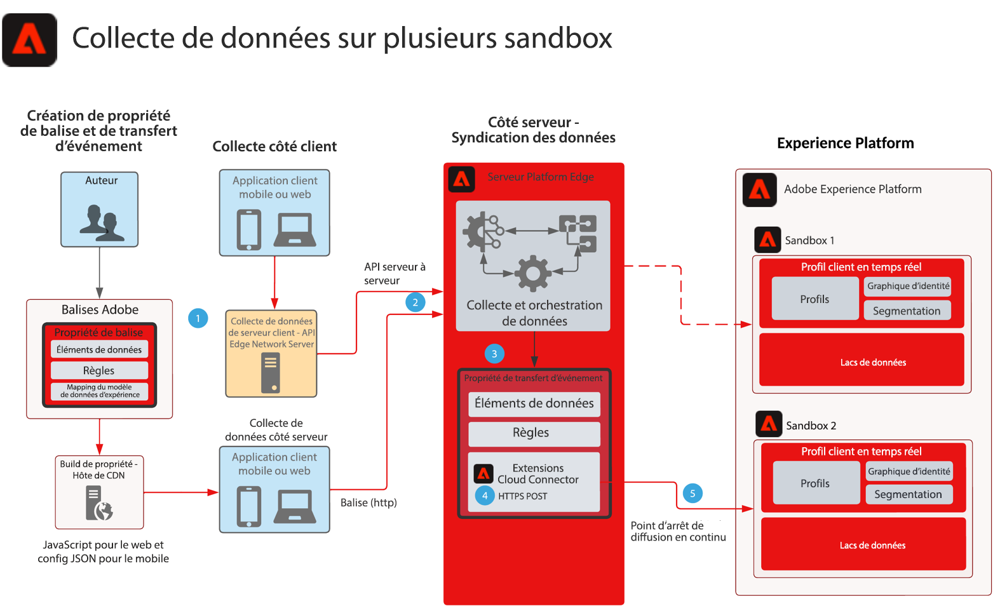

# Plan directeur de la collecte de données pour le transfert d’événement multi-sandbox

Ce plan directeur montre comment les données collectées avec les SDK Web et Mobile Experience Platform peuvent être configurées pour collecter un seul événement et les transférer vers plusieurs sandbox AEP. Ce plan directeur est un cas d’utilisation spécifique pour la collecte de données multi-sandbox qui utilise le transfert d’événement pour atteindre cet objectif.

Outre la réplication de l’événement avec les fonctionnalités de transfert d’événement, vous pouvez ajouter, filtrer ou manipuler les données collectées d’origine qui répondent aux exigences d’autres environnements de test.

Le transfert d’événements utilise une propriété distincte qui contient les éléments de données, les règles et les extensions nécessaires à vos besoins de données. Avec un événement entrant, la propriété Event Forwarding peut collecter les données et les gérer selon les besoins avant le transfert.

Votre environnement de test de destination nécessite un point de terminaison HTTP Streaming qui est utilisé par l’extension Adobe Cloud Connector.

## Cas d’utilisation

* Création de rapports de données globales : lorsque vous utilisez plusieurs sandbox pour isoler les environnements d’exploitation et la nécessité de consolider la collecte de données sur une sandbox pour la création de rapports entre sandbox. Le routage d’un événement Experience Edge à l’aide du transfert d’événement vers un environnement de test de création de rapports permet à chaque environnement de test d’envoyer des données lorsqu’elles sont collectées en temps réel vers un environnement de test de création de rapports.
* Gérez la collecte de données dans les sandbox en fonction de différentes règles de données pour chaque sandbox.

## Applications

* Collecte de données dʼAdobe Experience Platform
* Transfert d’événement
* Extension AEP
* Extension Cloud Connector

## Considérations

Le transfert d’événements étant la méthode d’envoi de données à plusieurs environnements de test, certaines considérations doivent être prises en compte avec votre architecture de solution.

### Aucune donnée HIPAA

Le transfert d’événement n’est pas considéré comme prêt pour HIPAA et ne doit pas être utilisé dans les cas d’utilisation HIPAA où des données HIPAA sont collectées. Cependant, l’infrastructure utilisée pour le transfert d’événement est considérée comme prête pour le HIPAA et est uniquement à la discrétion du client. Bien que la propriété Event Forwarding Tag (Balise de transfert d’événement) se trouve dans le système Event Forwarding, la charge utile de données entière collectée est envoyée au système Event Forwarding pour traitement. C’est ce processus qui rend le transfert d’événements concernant les cas pratiques HIPAA. Avec la charge utile entière fournie au système de transfert d’événements, cela inclut toutes les valeurs HIPAA. Même si les règles de transfert d’événements filtrent ces données avant de les envoyer à sa destination, ces données HIPAA sont toujours envoyées vers une infrastructure non compatible avec le HIPAA. Toutefois, les données de payload ne sont jamais stockées et ne sont qu’un passage à l’autre.

### Différents flux de données et points d’entrée en flux continu

Lorsque les données transitent par les flux de données de Platform Edge Network, lors de l’utilisation du transfert d’événement vers un autre environnement de test AEP, une exigence DURE est de NE JAMAIS utiliser le même flux de données ou point de terminaison de diffusion en continu que le flux de données qui crée la collection d’origine. Cela peut être préjudiciable à l’instance AEP et potentiellement déclencher une situation de déni de service.

### Volume de trafic estimé

Les volumes de trafic doivent être examinés dans chaque cas d’utilisation. Ceci est important, car des volumes élevés peuvent entraîner une situation de ralentissement et les clients seront avertis si cela se produit.

## Architecture

1. La collecte et l’envoi de données d’événement à Platform Edge Network sont nécessaires pour utiliser le transfert d’événement. Les clients peuvent utiliser les balises Adobe pour l’API côté client ou Platform Edge Network Server pour la collecte de données serveur à serveur. L’API Platform Edge Network peut fournir une fonctionnalité de collecte serveur à serveur. Cela nécessite toutefois la mise en œuvre d’un modèle de programmation différent. Voir [Présentation de l’API du serveur réseau Edge](https://experienceleague.adobe.com/docs/experience-platform/edge-network-server-api/overview.html?lang=en)

1. Les payloads collectées sont envoyées de l’implémentation des balises au réseau Platform Edge vers le service de transfert d’événements et traitées par ses propres éléments de données, règles et actions. Vous pouvez en savoir plus sur les différences entre les [Balises et transfert d’événements](https://experienceleague.adobe.com/docs/experience-platform/tags/event-forwarding/overview.html?lang=en#differences-from-tags).

1. Une propriété de transfert d’événement est également requise pour recevoir les données d’événement collectées du réseau Platform Edge. Si ces données d’événement ont été envoyées à Platform Edge Network par une implémentation de balises déployée ou une collection serveur à serveur. Les auteurs définissent les éléments de données, les règles et les actions utilisés pour enrichir les données d’événement avant le transfert vers le second environnement de test. Pensez à utiliser l’élément de données JavaScript Custom Code pour faciliter la structuration de vos données pour l’ingestion des environnements de test. Combinées aux fonctionnalités de préparation de données AEP, vous disposez de plusieurs options pour gérer votre structure de données.

1. Actuellement, l’utilisation de l’extension Adobe Cloud Connector est requise dans la propriété Event Forwarding. Une fois que les règles traitent ou enrichissent les données d’événement, Cloud Connector est utilisé dans un appel de récupération configuré pour un POST qui envoie la charge utile au second environnement de test.

1. Un point de fin de diffusion pour l’ingestion des données est requis pour le second environnement de test. Vous pouvez également tenir compte des fonctionnalités de préparation des données dans AEP pour faciliter l’ingestion et le mappage des payloads de transfert d’événements vers XDM. Reportez-vous à la documentation AEP Création d’un [Connexion en continu via l’API HTTP à l’aide de l’interface utilisateur](https://experienceleague.adobe.com/docs/experience-platform/sources/ui-tutorials/create/streaming/http.html?lang=fr)
