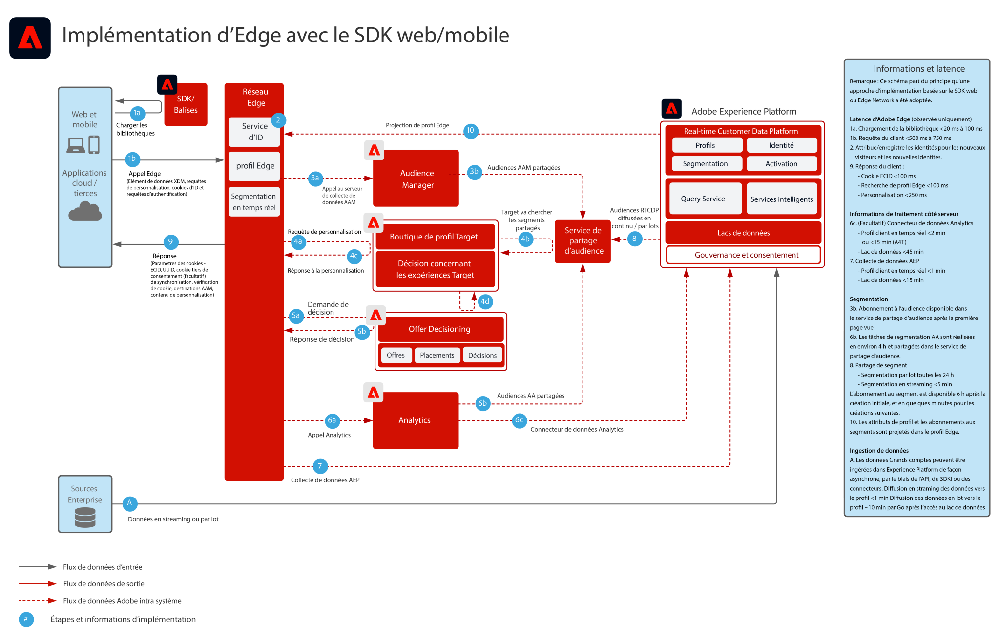

# Collecte de données dans le SDK web et mobile d’Experience Platform

Le diagramme d’architecture ci-dessous illustre les chemins d’intégration et la collecte de données à l’aide du SDK web d’Experience Platform.

Diagramme de séquence

## Documentation de référence

* [Présentation du SDK web et mobile d’Experience Platform](https://experienceleague.adobe.com/docs/experience-platform/edge/home.html?lang=fr)
* [Tutoriel sur la mise en œuvre d’Adobe Experience Cloud avec le SDK web](https://experienceleague.adobe.com/docs/platform-learn/implement-web-sdk/overview.html?lang=fr)
* [Tutoriel sur la mise en œuvre d’Adobe Experience Cloud dans les applications mobiles](https://experienceleague.adobe.com/docs/platform-learn/implement-mobile-sdk/overview.html?lang=fr)