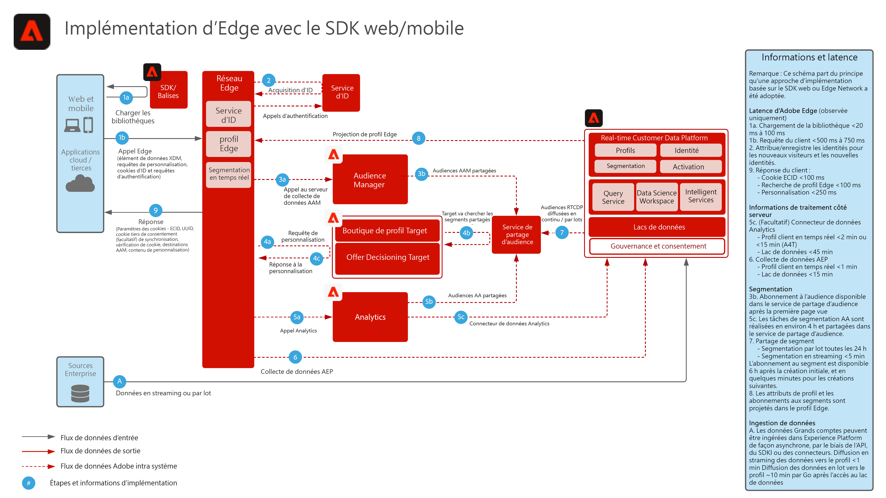

# Collecte de données dans le SDK web et mobile d’Experience Platform

Le diagramme d’architecture ci-dessous illustre les chemins d’intégration et la collecte de données à l’aide du SDK web d’Experience Platform.

## Documentation de référence

* [Présentation du SDK web et mobile d’Experience Platform](https://experienceleague.adobe.com/docs/experience-platform/edge/home.html?lang=fr)
* [Tutoriel sur la mise en oeuvre de Adobe Experience Cloud avec le SDK Web](https://experienceleague.adobe.com/docs/blueprints-learn/architecture/data-ingestion/websdk.html)
