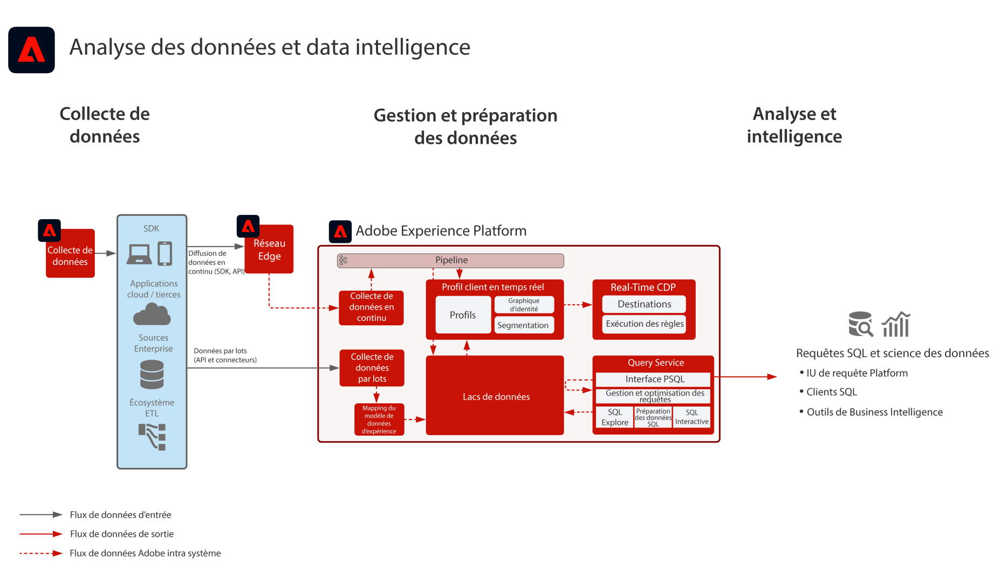

# Plan directeur pour l’analyse des données et la Data Intelligence

L’analyse des données et la Data Intelligence montre la capacité d’Adobe Experience Platform à effectuer des requêtes exploratoires et une analyse des données qui existent dans un lac de données.

Le service de requête [!UICONTROL Query Service] d’Experience Platform permet d’effectuer des requêtes SQL sur les données.

Experience Platform permet des connexions avec des clients SQL tiers, des interfaces et des outils de Business Intelligence (BI), leur donnant la possibilité d’accéder et d’interroger directement les données dans Experience Platform, par le biais du protocole [!DNL PostgreSQL].

## Cas d’utilisation

* Requête interactive et agrégation de données
* Accès aux lignes et colonnes des données ingérées pour exploration et validation
* Tableau de bord et visualisation des données via les outils de Business Intelligence

D’autres cas d’utilisation courants pour le Query Service sont décrits ici : [Cas d’utilisation de Query Service](https://experienceleague.adobe.com/docs/experience-platform/query/use-cases/abandoned-browse.html?lang=fr)

## Applications

* Adobe Experience Platform 

## Architecture

## Garde-fous

Reportez-vous à la documentation du produit Query Service pour plus d’informations sur les bonnes pratiques et les garde-fous.
[Conseils d’utilisation de Query Service](https://experienceleague.adobe.com/docs/experience-platform/query/guardrails.html?lang=fr)

## Étapes d’implémentation

1. [Créez des schémas](https://experienceleague.adobe.com/?recommended=ExperiencePlatform-D-1-2021.1.xdm) pour les données à ingérer.
1. [Créez des jeux de données](https://experienceleague.adobe.com/docs/platform-learn/tutorials/data-ingestion/create-datasets-and-ingest-data.html?lang=fr) pour les données à ingérer.
1. [Ingérez des données](https://experienceleague.adobe.com/?recommended=ExperiencePlatform-D-1-2020.1.dataingestion&amp;lang=fr) dans Experience Platform.
1. Vérifiez que les données sont disponibles pour [[!UICONTROL Query Service]](https://experienceleague.adobe.com/docs/platform-learn/tutorials/queries/explore-data.html?lang=fr).
1. [Connectez les outils de Business Intelligence et les clients SQL au [!UICONTROL Query Service]](https://experienceleague.adobe.com/docs/experience-platform/query/clients/overview.html?lang=fr) pour la visualisation, les requêtes de données et l’exploration.

## Documentation connexe

* [Description d’Adobe Experience Platform Intelligence](https://helpx.adobe.com/fr/legal/product-descriptions/adobe-experience-platform-intelligence---product-description.html)
* Documentation sur [[!UICONTROL Query Service]](https://experienceleague.adobe.com/docs/experience-platform/query/home.html?lang=fr)
