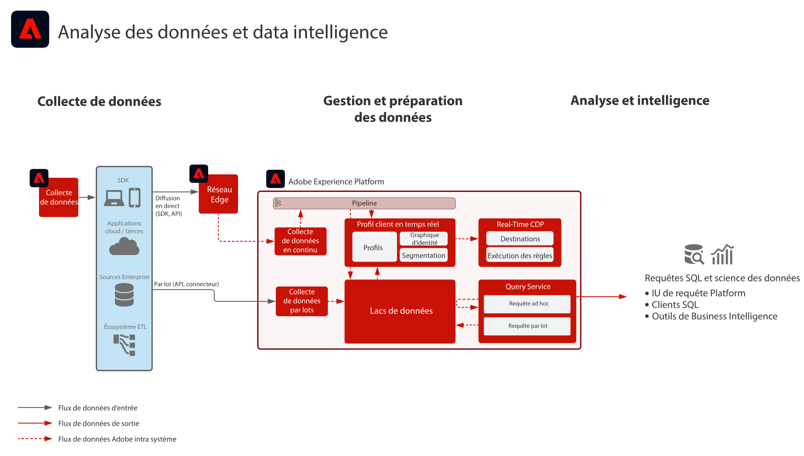

# Analyse des données et plan directeur du renseignement

L&#39;analyse des données et le renseignement constituent la capacité de la fonction [!DNL Experience Platform] pour effectuer des requêtes exploratoires et des analyses des données existant dans le lac de données.

[!DNL Experience Platform]&#39;s [!UICONTROL Query Service] permet d’exécuter des requêtes SQL sur les données.

[!DNL Experience Platform] permet des connexions avec des clients SQL tiers, des interfaces et des outils Business Intelligence (BI) pour se connecter directement aux données dans , y accéder et les interroger dans [!DNL Experience Platform], à l’aide de la fonction [!DNL PostgreSQL] protocole .

## Cas d’utilisation

* Requête interactive et agrégation de données
* Accès aux lignes et colonnes des données ingérées pour exploration et validation
* Tableau de bord et visualisation des données via les outils de Business Intelligence

D’autres cas d’utilisation courants pour le Query Service sont décrits ici : [Cas d’utilisation de Query Service](https://experienceleague.adobe.com/docs/experience-platform/query/use-cases/abandoned-browse.html?lang=fr)

## Applications

* Adobe [!DNL Experience Platform]

## Architecture

## Garde-fous

Reportez-vous à la documentation du produit Query Service pour plus d’informations sur les bonnes pratiques et les garde-fous.
[Conseils d’utilisation de Query Service](https://experienceleague.adobe.com/docs/experience-platform/query/guardrails.html?lang=fr)

## Étapes de mise en œuvre

1. [Créez des schémas](https://experienceleague.adobe.com/?recommended=ExperiencePlatform-D-1-2021.1.xdm&amp;lang=fr) pour les données à ingérer.
1. [Créez des jeux de données](https://experienceleague.adobe.com/docs/platform-learn/tutorials/data-ingestion/create-datasets-and-ingest-data.html?lang=fr) pour les données à ingérer.
1. [Ingestion de données](https://experienceleague.adobe.com/?recommended=ExperiencePlatform-D-1-2020.1.dataingestion&amp;lang=fr) into [!DNL Experience Platform].
1. Vérifiez que les données sont disponibles pour [[!UICONTROL Query Service]](https://experienceleague.adobe.com/docs/platform-learn/tutorials/queries/explore-data.html?lang=fr).
1. [Connectez les outils de Business Intelligence et les clients SQL au [!UICONTROL Query Service]](https://experienceleague.adobe.com/docs/experience-platform/query/clients/overview.html?lang=fr) pour la visualisation, les requêtes de données et l’exploration.

## Documentation connexe

* [Adobe [!DNL Experience Platform] Description du produit Intelligence](https://helpx.adobe.com/fr/legal/product-descriptions/adobe-experience-platform-intelligence---product-description.html)
* Documentation sur [[!UICONTROL Query Service]](https://experienceleague.adobe.com/docs/experience-platform/query/home.html?lang=fr)
