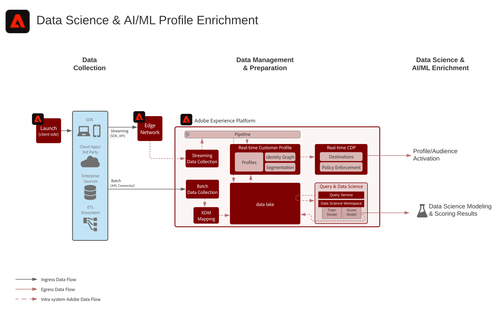

# Science des données personnalisées pour le schéma directeur des Enrichissements Profils

Ce plan indique comment les données de Adobe Experience Platform sont utilisées par Data Science Workspace pour former, déployer et marquer des modèles afin de fournir des informations d’apprentissage automatique. Ces modèles peuvent directement être générés dans un jeu de données activé pour le Profil client en temps réel. Parmi les exemples d’informations d’apprentissage automatique, citons la valeur de durée de vie, l’affinité de produit et de catégorie, la propension à la conversion ou la propension à l’activité.

## Cas d’utilisation

* Extrayez des informations et découvrez des modèles à partir des données client dans l’Experience Platform. Former et marquer des modèles à partir de ces données.
* Enrichissez le Profil client en temps réel avec des informations et des attributs basés sur le modèle pour une personnalisation plus granulaire et une optimisation du parcours.
* Formez et évaluez des modèles afin de déterminer les connaissances des clients, telles que la valeur de durée de vie des clients, la propension à convertir ou générer, les affinités de produits et de contenu et les scores d’engagement.

## Scénarios

| Scénario | Description du scénario | Applications Experience Cloud |
|---|---|---|
| Science des données exploratoires | <ul><li>Signaux de découverte, exhaustivité, exactitude des données</li><li>Découvrez de nouvelles informations à l&#39;aide de l&#39;outil de science des données</li></ul> | <ul><li>Intelligence Experience Platform</li></ul> |
| Enrichissement de profil avec IA/ML  - lot | <ul><li>Découvrir, créer, former, déployer, marquer et opérationnaliser des modèles.</li><li>Poussez la prédiction du modèle au profil ou au lac de données pour une activation par lot.</li></ul> | <ul><li>Intelligence Experience Platform</li></ul> |

## Architecture

## Etapes de mise en oeuvre

1. Créez des schémas et des jeux de données.
1. Envoi de données dans l’Experience Platform.
1. Créez un bloc-notes DSW.
1. Choisissez une langue. Python et PySpark sont pris en charge.
1. Modèle d&#39;auteur dans un bloc-notes.
1. Entraînez le modèle.
1. Score le modèle pour générer des prédictions avec les données de cible.
1. Activez le jeu de données des résultats du modèle pour le profil si vous placez les résultats du modèle sur le Profil client en temps réel.

## Documentation connexe

* [Description du produit Adobe Experience Platform Intelligence](https://helpx.adobe.com/legal/product-descriptions/adobe-experience-platform-intelligence---product-description.html)
* [Documentation de Data Science Workspace](https://experienceleague.adobe.com/docs/experience-platform/data-science-workspace/home.html?lang=en)
* [Didacticiels sur l’espace de travail Data Science](https://experienceleague.adobe.com/docs/platform-learn/tutorials/data-science-workspace/understanding-data-science-workspace.html)

## Publications de blog connexes

* [Simplification du cycle de vie des sciences des données grâce à l&#39;expérience des plateformes d&#39;Adobe](https://medium.com/adobetech/simplifying-the-data-science-lifecycle-with-adobe-platform-experience-8ea4f056d82f)
* [Content and Commerce AI : Personnalisation de vos interactions avec les clients à l’aide de Content Intelligence](https://medium.com/adobetech/content-and-commerce-ai-personalizing-your-interactions-with-customers-through-content-intelligence-dc182601deab)
* [Apprendre à mieux comprendre l&#39;utilisation de Data Science Workspace](https://medium.com/adobetech/gaining-a-deeper-understanding-of-churn-using-data-science-workspace-18a2190e0cf3)
* [Comprendre la science des données au Adobe Experience Platform](https://medium.com/adobetech/understanding-data-science-in-adobe-experience-platform-5bce5a17b42)
* [Un aperçu de l&#39;Analyse des données exploratoires sur Adobe Experience Platform](https://medium.com/adobetech/an-introductory-look-at-exploratory-data-analysis-on-adobe-experience-platform-1bfce7501d9a)
* [Réduire les produits Adobe Experience avec l’apprentissage automatique pour améliorer l’expérience utilisateur](https://medium.com/adobetech/cutting-across-adobe-experience-products-with-machine-learning-to-elevated-user-experience-7c85000510d1)
* [Modélisation des données XDM pour la science des données à l&#39;échelle de Adobe Experience Platform](https://medium.com/adobetech/modeling-xdm-data-for-data-science-at-scale-on-adobe-experience-platform-222bb2a6dbf7)
* [Segmentation.AI : Mise en grappe automatisée des Audiences en tant que service à Adobe Experience Platform](https://medium.com/adobetech/segmentation-ai-automated-audience-clustering-as-a-service-in-adobe-experience-platform-261f4099462c)
* [Réinvention des portables Jupyter pour l&#39;entreprise](https://medium.com/adobetech/reimagining-jupyter-notebooks-for-enterprise-scale-8bc6340d504a)
* [Accélérer les connaissances intelligentes grâce à Adobe Experience Platform Data Science Workspace](https://medium.com/adobetech/accelerate-intelligent-insights-with-adobe-experience-platform-data-science-workspace-89538bacbbea)
* [Prévisualisation des prévisions des séries chronologiques avec Adobe Experience Platform](https://medium.com/adobetech/preview-of-time-series-forecasting-with-adobe-experience-platform-38a2fc778e89)
* [Réduire les produits Adobe Experience avec l’apprentissage automatique pour améliorer l’expérience utilisateur](https://medium.com/adobetech/cutting-across-adobe-experience-products-with-machine-learning-to-elevated-user-experience-7c85000510d1)

