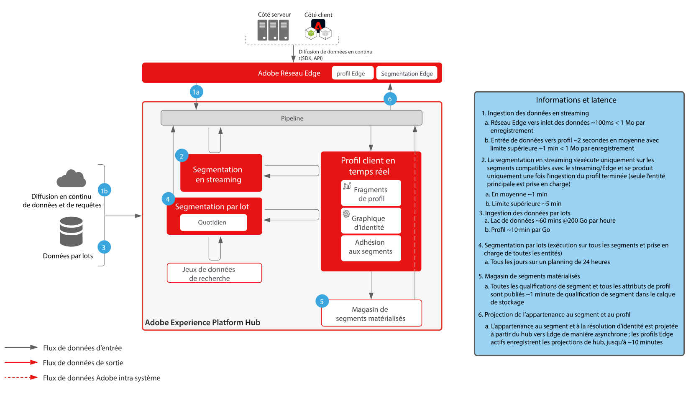
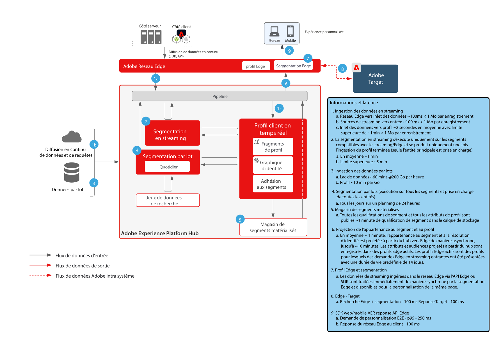
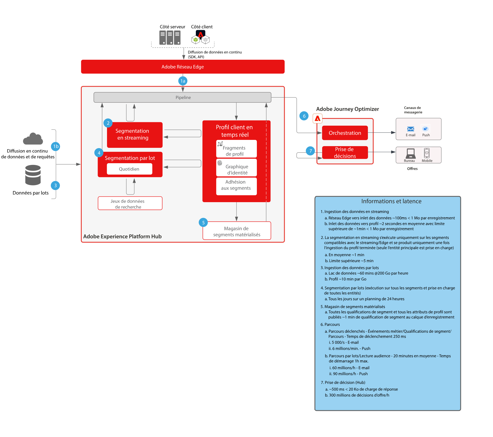

# Garde-fous

Les garde-fous sont des seuils recommandés qui fournissent des conseils pour l’utilisation des données et du système, l’optimisation des performances et la prévention des erreurs ou des résultats inattendus dans Adobe Experience Platform et les applications. Les garde-fous sont conçus pour refléter les contraintes du système et les attentes en matière de performances afin de faciliter l’architecture et l’optimisation des performances des cas d’utilisation. Les barrières de sécurité ne sont pas destinées à être des contrats de niveau de service. Pour plus d’informations sur les contrats de niveau de service spécifiques à un produit, reportez-vous à la documentation sur les descriptions de produit disponible dans les liens ci-dessous.

## Garde-fous pour Adobe Experience Platform et les applications

[Mécanismes de sécurisation de l’ingestion des données](https://experienceleague.adobe.com/docs/experience-platform/ingestion/guardrails.html?lang=fr)

[Garde-fous de l’API réseau Edge](https://experienceleague.adobe.com/docs/experience-platform/edge-network-server-api/guardrails.html?lang=fr)

[Garde-fous du profil client en temps réel](https://experienceleague.adobe.com/docs/experience-platform/profile/guardrails.html?lang=fr)

[Garde-fous des identités](https://experienceleague.adobe.com/docs/experience-platform/identity/guardrails.html?lang=fr)

[Barrières de sécurité du partage des audiences Customer Journey Analytics](https://experienceleague.adobe.com/docs/analytics-platform/using/cja-components/audiences/publish.html?lang=en#latency)

[Barrières de sécurité de l’ingestion des données du Customer Journey Analytics](https://experienceleague.adobe.com/docs/experience-platform/sources/connectors/adobe-applications/analytics.html?lang=en#what-is-the-expected-latency-for-analytics-data-on-platform%3F)

[Garde-fous de Query Service](https://experienceleague.adobe.com/docs/experience-platform/query/guardrails.html?lang=fr)

[Garde-fous de l’activation de la destination](https://experienceleague.adobe.com/docs/experience-platform/destinations/guardrails.html?lang=fr)

[Garde-fous Journey Optimizer](https://experienceleague.adobe.com/docs/journey-optimizer/using/get-started/guardrails.html?lang=fr)

 

## Diagrammes de latence de bout en bout

### Ingestion de données

 

### Segmentation

 

### Real-time Customer Data Platform et Adobe Target

 

### Customer Journey Analytics

 

### Journey Optimizer

 

## Descriptions du produit

[Experience Platform Collection Enterprise](https://helpx.adobe.com/fr/legal/product-descriptions/adobe-experience-platform-collection-enterprise.html)

[Real-time Customer Data Platform](https://helpx.adobe.com/fr/legal/product-descriptions/real-time-customer-data-platform.html)

[Plateforme de données clients B2B](https://helpx.adobe.com/fr/legal/product-descriptions/adobe-experience-platform-b2b.html)

[Experience Platform Activation](https://helpx.adobe.com/fr/legal/product-descriptions/adobe-experience-platform0.html)

[Experience Platform Intelligence](https://helpx.adobe.com/fr/legal/product-descriptions/adobe-experience-platform-intelligence---product-description.html)

[Intelligent Services](https://helpx.adobe.com/fr/legal/product-descriptions/intelligent-services.html)

[Data Distiller](https://helpx.adobe.com/fr/legal/product-descriptions/data-distiller.html)

[Customer Journey Analytics](https://helpx.adobe.com/fr/legal/product-descriptions/customer-journey-analytics.html)

[Journey Optimizer](https://helpx.adobe.com/fr/legal/product-descriptions/adobe-journey-optimizer.html)

[Adobe Journey Orchestration](https://helpx.adobe.com/fr/legal/product-descriptions/journey-orchestration.html)

[Offer Decisioning](https://helpx.adobe.com/fr/legal/product-descriptions/offer-decisioning-app-service.html)
