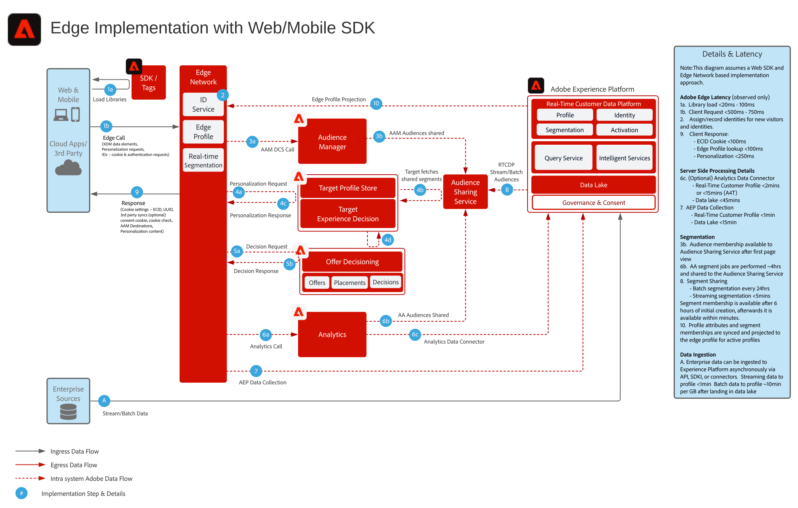

# Diagramme de l’architecture de [!DNL Edge Network] et de SDK Web Experience Platform

Pour obtenir une présentation et des détails sur le SDK web et mobile, ainsi que sur l’API [!DNL Edge Network] Server, reportez-vous aux sections suivantes.

* [Présentation du SDK web](https://experienceleague.adobe.com/fr/docs/experience-platform/web-sdk/home)
* [Présentation du SDK mobile](https://developer.adobe.com/client-sdks/documentation/)
* [[!DNL Edge Network] API du serveur](https://experienceleague.adobe.com/docs/experience-platform/edge-network-server-api/overview.html?lang=fr)

Pour une description détaillée des fonctionnalités de l’application prises en charge dans le SDK web, consultez la documentation suivante.

* [Prise en charge des fonctionnalités de l’application Web SDK](https://github.com/orgs/adobe/projects/18/views/1)

Pour plus d’informations sur la migration des SDK spécifiques aux applications vers les SDK web et mobile, consultez la documentation suivante.

* [Identity Services](https://experienceleague.adobe.com/docs/experience-platform/edge/identity/overview.html?lang=fr)
* [Analytics](https://experienceleague.adobe.com/docs/experience-platform/edge/data-collection/adobe-analytics/analytics-overview.html?lang=fr)
* [Target](https://experienceleague.adobe.com/docs/experience-platform/edge/personalization/adobe-target/target-overview.html?lang=fr)
* [Analytics for Target](https://experienceleague.adobe.com/docs/experience-platform/edge/personalization/adobe-target/a4t/overview.html?lang=fr)

## Déploiement de l’API Experience Platform Web/Mobile SDK ou [!DNL Edge Network] Server

Le diagramme d’architecture ci-dessous illustre les processus de déploiement et de collecte de données à l’aide du SDK web d’Experience Platform.

Diagramme de séquences d’Experience Edge et des services et applications Experience Platform

## Documentation de référence

* [Tutoriel sur la mise en œuvre d’Adobe Experience Cloud avec le SDK web](https://experienceleague.adobe.com/docs/platform-learn/implement-web-sdk/overview.html?lang=fr)
* [Tutoriel sur la mise en œuvre d’Adobe Experience Cloud dans les applications mobiles](https://experienceleague.adobe.com/docs/platform-learn/implement-mobile-sdk/overview.html?lang=fr)
