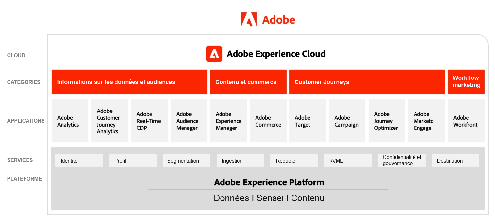

# Schémas d’architecture d’Adobe Experience Cloud

Ces diagrammes montrent comment les applications, les services d’application et les Experience Platform Experience Cloud s’intègrent dans une architecture marketing d’entreprise.

## Architecture marketing d’Adobe Experience Cloud

Le diagramme suivant illustre les différents composants d’Adobe Experience Cloud à travers les insights de données et audiences, le contenu et le commerce, les parcours client, le workflow marketing, créés et intégrés sur la base d’Adobe Experience Platform.

## Architecture d’intégration des données et informations, du contenu et du commerce, et de la diffusion d’expérience

Le diagramme d’architecture ci-dessous illustre la manière dont les différents composants d’Adobe Experience Cloud se connectent et s’intègrent pour atteindre la personnalisation à l’échelle entre les données, le contenu et la diffusion d’expérience.

## Adobe Experience Cloud dans le paysage de l’entreprise

Le diagramme d’architecture ci-dessous illustre la manière dont les applications Adobe Experience Cloud et Adobe Experience Platform s’intègrent à l’architecture de l’expérience client d’entreprise dans les quatre catégories que sont les données, les statistiques, l’orchestration et l’engagement.

