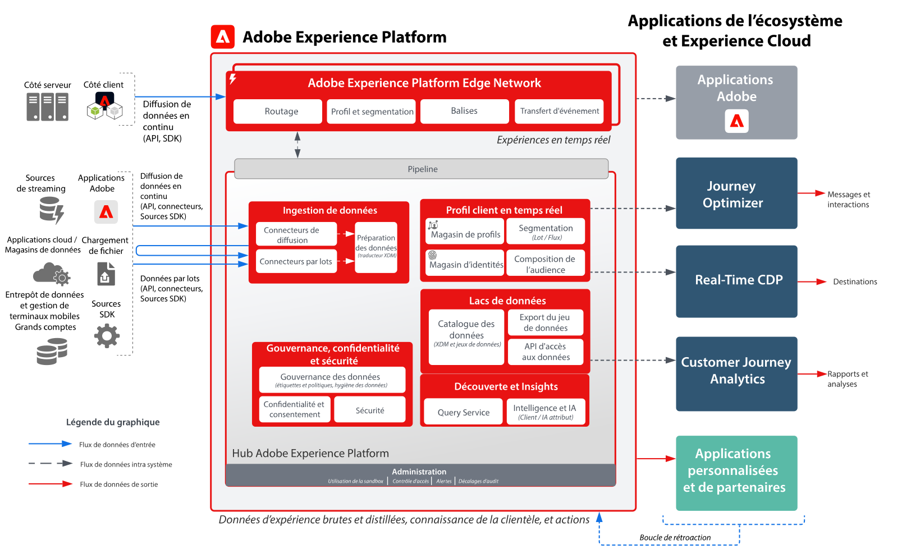
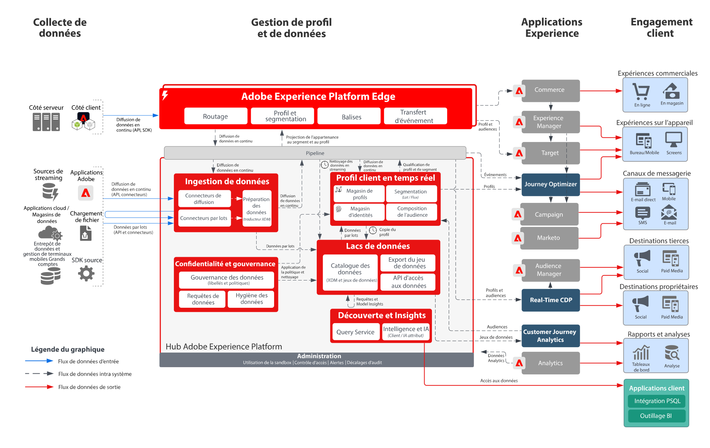

# Diagrammes de l’architecture d’Adobe Experience Platform et des autres applications Adobe

## Schéma de l’architecture d’Adobe Experience Platform et des autres applications Adobe

Ce schéma d’architecture montre comment Adobe Experience Platform se rattache aux autres applications et services applicatifs Adobe Experience Cloud.

## Schéma d’aperçu d’Adobe Experience Platform et des autres applications Adobe

## Schéma détaillé d’architecture d’Adobe Experience Platform et des autres applications Adobe

>[!VIDEO](https://video.tv.adobe.com/v/32456/?quality=12&learn=on)

## Intégrations des applications Adobe Experience Platform et Experience Cloud

<table class="relative-table wrapped" style="width: 100%;">
<colgroup>
<col style="width: 16.0202%;" />
<col style="width: 29.3423%;" />
<col style="width: 33.5582%;" />
<col style="width: 21.0793%;" />
</colgroup>
<tbody>
<tr>
<th>Application</th>
<th>D’Experience Platform vers l’application</th>
<th>De l’application vers Experience Platform</th>
<th>Plans directeurs associés</th>
</tr>
<tr>
<td colspan="1">Ad Cloud</td>
<td colspan="1">
<ul>
<li>Les audiences définies dans Real-time Customer Data Platform peuvent être partagées avec Ad Cloud à des fins de ciblage par le biais d’Audience Manager.</li>
</ul>
</td>
<td colspan="1">
<ul>
<li>Aucune intégration en cours</li>
</ul>
</td>
<td colspan="1">
<ul>
<li><a href="https://experienceleague.adobe.com/docs/blueprints-learn/architecture/audience-activation/anonymous.html?lang=fr">Activation d’audience anonyme</a></li>
<li><a href="https://experienceleague.adobe.com/docs/blueprints-learn/architecture/audience-activation/known-customer-audience-activation/known.html?lang=fr">Activation du client connu</a></li>
<li><a href="https://experienceleague.adobe.com/docs/blueprints-learn/architecture/architecture-overview/platform-applications.html?lang=fr">Activation avec Experience Platform et les applications</a></li>
</ul>
</td>
</tr>
<tr>
<td>Analytics</td>
<td>
<ul>
<li>Les données collectées via le SDK web/Mobile peuvent être transférées vers Adobe Analytics.</li>
</ul>
</td>
<td>
<ul>
<li>Les données collectées par Analytics peuvent être envoyées au lac de données et à la banque de profils Experience Platform. <a href="https://experienceleague.adobe.com/docs/experience-platform/sources/connectors/adobe-applications/analytics.html?lang=fr">Connecteur de données Analytics</a></li>
</ul>
</td>
<td>
<ul>
<li><a href="https://experienceleague.adobe.com/docs/blueprints-learn/architecture/architecture-overview/platform-data-flow.html?lang=fr">Flux de données d’Experience Platform</a></li>
</ul>
</td>
</tr>
<tr>
<td>Audience Manager</td>
<td>
<ul>
<li>Les audiences définies dans Real-time Customer Data Platform peuvent être partagées dans Audience Manager pour permettre leur activation vers des destinations de cookies tiers.</li>
</ul>
</td>
<td>
<ul>
<li>Les données collectées et évaluées avec l’appartenance à une audience à partir d’Audience Manager peuvent être partagées avec le magasin de profils et le lac de données Experience Platform. <a href="https://experienceleague.adobe.com/docs/experience-platform/sources/connectors/adobe-applications/audience-manager.html?lang=fr">Connecteur source Audience Manager</a></li>
</ul>
</td>
<td>
<ul>
<li><a href="https://experienceleague.adobe.com/docs/blueprints-learn/architecture/audience-activation/anonymous.html?lang=fr">Activation d’audience anonyme</a></li>
<li><a href="https://experienceleague.adobe.com/docs/blueprints-learn/architecture/audience-activation/known-customer-audience-activation/known.html?lang=fr">Activation du client connu</a></li>
<li><a href="https://experienceleague.adobe.com/docs/blueprints-learn/architecture/audience-activation/platform-and-applications.html?lang=fr">Activation avec Experience Platform et les applications</a></li>
</ul>
</td>
</tr>
<tr>
<td colspan="1">Campaign Classic</td>
<td colspan="1">
<ul>
<li>Les audiences définies dans Real-time Customer Data Platform peuvent être partagées avec Campaign Classic et permettront en tant qu’audience de lancer des campagnes.</li>
</ul>
</td>
<td colspan="1">
<ul>
<li>Les données d’interaction et de campagne collectées par Adobe Campaign peuvent être ingérées par Experience Platform et serviront en tant que source de données pour être ensuite utilisées pour créer des audiences par le biais de Real-time Customer Data Platform et pour les analyser à l’aide de Customer Journey Analytics et Experience Platform Query Service.</li>
</ul>
</td>
<td colspan="1">
<ul>
<li><a href="https://experienceleague.adobe.com/docs/blueprints-learn/architecture/customer-journeys/overview.html?lang=fr">Parcours clients</a></li>
</ul>
</td>
</tr>
<tr>
<td colspan="1">Campaign Standard</td>
<td colspan="1">
<ul>
<li>Les audiences définies dans Real-time Customer Data Platform peuvent être partagées avec Campaign Standard et permettront en tant qu’audience de lancer des campagnes.</li>
</ul>
</td>
<td colspan="1">
<ul>
<li>Les données d’interaction et de campagne collectées par Adobe Campaign peuvent être ingérées par Experience Platform et serviront en tant que source de données pour être ensuite utilisées pour créer des audiences par le biais de Real-time Customer Data Platform et pour les analyser à l’aide de Customer Journey Analytics et Experience Platform Query Service.</li>
</ul>
</td>
<td colspan="1">
<ul>
<li><a href="https://experienceleague.adobe.com/docs/blueprints-learn/architecture/customer-journeys/overview.html?lang=fr">Parcours clients</a></li>
</ul>
</td>
</tr>
<tr>
<td colspan="1">Customer Journey Analytics</td>
<td colspan="1">
<ul>
<li>Les données collectées et ingérées dans un lac de données Experience Platform sont disponibles pour être traitées dans Customer Journey Analytics. </li>
<li>Les données de profil et d’audience de Real-time Customer Data Platform peuvent être ingérées dans CJA. <a href="https://experienceleague.adobe.com/docs/analytics-platform/using/cja-usecases/ingest-aep-segments.html?lang=fr">Intégration de RTCDP dans CJA</a>.
</li>
</ul>
</ul>
</td>
<td colspan="1">
<ul>
<li>Créez des audiences dans Customer Journey Analytics et partagez les résultats d’audience avec Real-time Customer Data Platform. <a href="https://experienceleague.adobe.com/docs/analytics-platform/using/cja-components/audiences/publish.html?lang=fr">Publication d’audience CJA</a></li>
</ul>
</td>
<td colspan="1">
<ul>
<li><a href="https://experienceleague.adobe.com/docs/blueprints-learn/architecture/customer-journey-analytics/overview.html?lang=fr">Customer Journey Analytics</a></li>
</ul>
</td>
</tr>
<tr>
<td colspan="1">Experience Manager</td>
<td colspan="1">
<ul>
<li>Le profil Experience Platform est directement accessible côté serveur pour alimenter les expériences personnalisées diffusées par Experience Manager. Notez que les activités de personnalisation sont le plus souvent diffusées par Experience Manager à l’aide de l’intégration de Target. </li>
</ul>
</td>
<td colspan="1">
<ul>
<li>Les intégrations, les comportements et les interactions actuellement réalisés sur les sites d’Experience Manager ne sont jamais collectés directement par le biais des SDK web et mobile d’Experience Platform.</li>
</ul>
</td>
<td colspan="1">
<ul>
<li><a href="https://experienceleague.adobe.com/docs/blueprints-learn/architecture/audience-activation/known-customer-audience-activation/known.html?lang=fr">Activation du client connu</a></li>
</ul>
</td>
</tr>
<tr>
<td colspan="1">Journey Optimizer</td>
<td colspan="1">
<ul>
<li>Les événements de données et les profils ingérés dans Experience Platform sont mis à la disposition de Journey Optimizer pour lancer et alimenter les parcours dans celui-ci.</li>
</ul>
</td>
<td colspan="1">
<ul>
<li>Les données d’interaction et de campagne générées par Journey Optimizer sont collectées dans Experience Platform pour être ensuite utilisées pour créer des audiences par le biais de Real-time Customer Data Platform et les analyser à l’aide de Customer Journey Analytics et Experience Platform Query Service.</li>
</ul>
</td>
<td colspan="1">
<ul>
<li><a href="https://experienceleague.adobe.com/docs/blueprints-learn/architecture/customer-journeys/journey-optimizer.html?lang=fr">Journey Optimizer</a></li>
</ul>
</td>
</tr>
<tr>
<td colspan="1">Adobe Commerce</td>
<td colspan="1">
<ul>
<li>Les profils et audiences intégrés dans Real-time Customer Data Platform peuvent être mis à disposition en vue d’une personnalisation dans Adobe Commerce. </li>
</ul>
</td>
<td colspan="1">
<ul>
<li>Les données natives d’Adobe Commerce peuvent être envoyées à Experience Platform via un connecteur source Adobe Commerce. </li>
</ul>
</td>
<td colspan="1">Aucune intégration en cours</td>
</tr>
<tr>
<td colspan="1">Marketo</td>
<td colspan="1">
<ul>
<li>Les audiences définies dans Real-time Customer Data Platform peuvent être partagées avec Marketo et permettront en tant qu’audience de lancer des campagnes Marketo et de mettre à jour des objets Marketo.</li>
</ul>
</td>
<td colspan="1">
<ul>
<li>Les comptes, les contacts et les données d’opportunité Marketo, ainsi que les données d’interaction et de campagne produites par Marketo, sont ingérés dans Experience Platform pour être ensuite utilisées pour créer des audiences sur la plateforme de données clients B2B et les analyser à l’aide de Customer Journey Analytics et Experience Platform Query Service. <a href="https://experienceleague.adobe.com/docs/experience-platform/sources/connectors/adobe-applications/marketo/marketo.html?lang=fr">Connecteur Marketo Engage</a></li>
</ul>
</td>
<td colspan="1">
<ul>
<li><a href="https://experienceleague.adobe.com/docs/blueprints-learn/architecture/b2b-activation/b2bactivation.html?lang=fr">Plan directeur d’activation B2B</a></li>
</ul>
</td>
</tr>
<tr>
<td colspan="1">Real-time CDP</td>
<td colspan="1">
<ul>
<li>Les données ingérées et collectées dans Experience Platform servent de source de données permettant d’assembler les profils clients en temps réel qui alimentent Real-time Customer Data Platform.</li>
</ul>
</td>
<td colspan="1">
<ul>
<li>Les mesures d’audience et de profil sont envoyées au lac de données d’Experience Platform pour alimenter les tableaux de bord de rapports des informations sur les profils.</li>
<li>Les données d’audience et de profil du lac de données peuvent être utilisées pour obtenir des informations supplémentaires par le biais de Query Service et Customer Journey Analytics.</li>
</ul>
</td>
<td colspan="1">
<ul>
<li><a href="https://experienceleague.adobe.com/docs/blueprints-learn/architecture/audience-activation/known-customer-audience-activation/known.html?lang=fr">Activation du client connu</a></li>
<li><a href="https://experienceleague.adobe.com/docs/blueprints-learn/architecture/audience-activation/platform-and-applications.html?lang=fr">Activation avec Experience Platform et les applications</a></li>
</ul>
</td>
</tr>
<tr>
<td colspan="1">Target</td>
<td colspan="1">
<ul>
<li>Les audiences et les attributs de profil définis dans Real-time Customer Data Platform peuvent être partagés avec Target et utilisés dans les expériences de personnalisation et de ciblage fournies par Target.</li>
</ul>
</td>
<td colspan="1">
<ul>
<li>Les données collectées pour les expériences et interactions Target peuvent être collectées pour Experience Platform à l’aide du SDK web/mobile d’Experience Platform. Ces données peuvent être utilisées pour créer des audiences dans Real-time Customer Data Platform et pour les analyser à l’aide de Customer Journey Analytics et Experience Platform Query Service.</li>
</ul>
</td>
<td colspan="1">
<ul>
<li><a href="https://experienceleague.adobe.com/docs/blueprints-learn/architecture/audience-activation/known-customer-audience-activation/known.html?lang=fr">Activation du client connu</a></li>
<li><a href="https://experienceleague.adobe.com/docs/blueprints-learn/architecture/audience-activation/platform-and-applications.html?lang=fr">Activation avec Experience Platform et les applications</a></li>
</ul>
</td>
</tr>
</tbody>
</table>